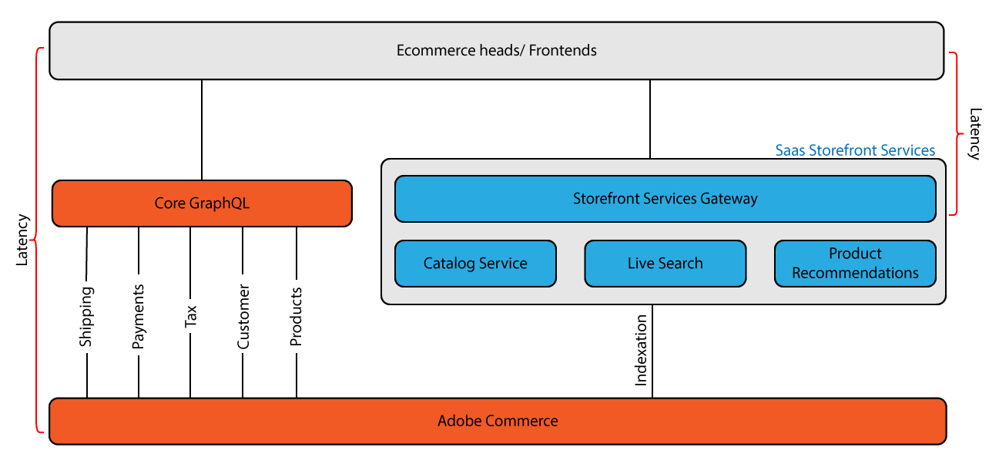

# [!DNL Catalog Service] para Adobe Commerce

{{catalog-service-beta}}

O [!DNL Catalog Service] A extensão para Adobe Commerce fornece dados de catálogo do modelo de visualização avançada (somente leitura) para renderizar rápida e totalmente as experiências de vitrine relacionadas ao produto, incluindo:

* Páginas de detalhes do produto
* Lista de produtos e páginas de categorias
* Pesquisar páginas de resultados
* Carrosséis de produtos
* Páginas de comparação do produto
* Quaisquer outras páginas que renderizem dados do produto, como páginas de carrinho, pedido e lista de desejos

O [!DNL Catalog Service] uses [GraphQL](https://graphql.org/) para solicitar e receber dados do produto. GraphQL é uma linguagem de consulta que um cliente front-end usa para se comunicar com a API (interface de programação de aplicativos) definida em um back-end como o Adobe Commerce. GraphQL é um método popular de comunicação porque é leve e permite que um integrador de sistemas especifique o conteúdo e a ordem de cada resposta.

A Adobe Commerce tem dois sistemas GraphQL. O sistema GraphQL principal fornece uma grande variedade de consultas (operações de leitura) e mutações (operações de gravação) que permitem ao comprador interagir com muitos tipos de páginas, incluindo produto, conta do cliente, carrinho, check-out e muito mais. No entanto, as consultas que retornam informações do produto não são otimizadas para agilizar. O sistema GraphQL de serviços só pode realizar consultas sobre produtos e informações relacionadas. Essas consultas têm mais desempenho do que consultas principais semelhantes.

## Arquitetura

O diagrama a seguir mostra os dois sistemas GraphQL:

No sistema GraphQL principal, o PWA envia uma solicitação ao aplicativo do Commerce, que recebe cada solicitação, a processa, possivelmente enviando uma solicitação por meio de vários subsistemas, e depois retorna uma resposta à loja. Esse caminho de ida e volta pode causar tempos lentos de carregamento de página, resultando possivelmente em taxas de conversão mais baixas.

[!DNL Catalog Service] envia consultas para um gateway GraphQL separado. O serviço acessa um banco de dados separado que contém detalhes do produto e informações relacionadas, como atributos do produto, variantes, preços e categorias. O serviço mantém o banco de dados sincronizado com a Adobe Commerce por meio da indexação.
Como o serviço ignora a comunicação direta com o aplicativo, ele pode reduzir a latência do ciclo de solicitação e resposta.

>[!NOTE]
>
>O gateway é para integração futura com o [!DNL Live Search] e [!DNL Product Recommendations]. Nesta versão, você pode acessar [!DNL Catalog Service] e consultas do Live Search a partir do mesmo endpoint, se você tiver uma chave de licença válida para ambos os produtos. No entanto, as consultas dos dois produtos atualmente não compartilham dados de resposta.

Os sistemas GraphQL principal e de serviço não se comunicam diretamente uns com os outros. Você acessa cada sistema a partir de um URL diferente e as chamadas exigem informações de cabeçalho diferentes. Os dois sistemas GraphQL foram projetados para serem usados juntos. O [!DNL Catalog Service] O sistema GraphQL aumenta o sistema principal para tornar as experiências de loja de produtos mais rápidas.

Opcionalmente, é possível implementar [Mensagem de API para o Adobe Developer App Builder](https://developer.adobe.com/graphql-mesh-gateway/) para integrar os dois sistemas Adobe Commerce GraphQL com APIs privadas e de terceiros e outras interfaces de software usando o Adobe Developer. A malha pode ser configurada para garantir que as chamadas roteadas para cada endpoint contenham as informações de autorização corretas nos cabeçalhos.

## Implementação

O processo de instalação requer a configuração do [Conector do Commerce Services](../landing/saas.md). Depois disso, a próxima etapa é que um integrador de sistemas atualize o código da loja para incorporar a [!DNL Catalog Service] consultas. Todos [!DNL Catalog Service] as consultas são roteadas para o gateway GraphQL. O URL é fornecido durante o processo de integração.

[Dispositivos Adobe Commerce](https://devdocs.magento.com/catalog-service/index.html) descreve as diferenças entre o núcleo e a [!DNL Catalog Service] consultas. Informações de referência para cada query também são incluídas.
