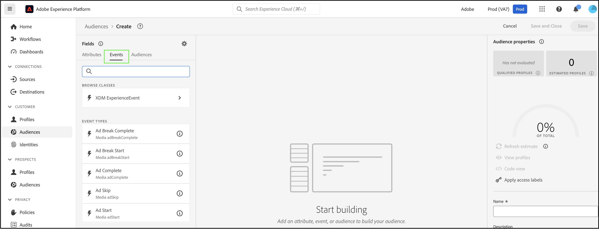

# Criar públicos no Real-Time CDP usando [!DNL Commerce] Dados do evento

Use os dados do evento capturados de seu [!DNL Commerce] armazenar para criar públicos no Real-Time CDP. Os dados capturados são baseados no comportamento de navegação, compras anteriores, atributos de perfil, tendências de conversão ou churn, status de fidelidade, valor alto e baixo do cliente e muito mais.

## Quais dados devo considerar usar?

Crie públicos-alvo no Real-Time CDP usando dados de eventos da loja, do back office e do perfil.

| Tipos de dados | Dados da vitrine (Eventos comportamentais) | Dados de back office (eventos do lado do servidor) | Perfil do cliente e dados do segmento |
|---|---|---|---|
| **Definição** | Cliques ou ações que os clientes realizam no site. | Informações sobre o ciclo de vida e detalhes de cada pedido (passado e atual). | Quem são seus compradores e para quais segmentos eles se qualificam. |
| **Eventos capturados pelo Adobe Commerce** | [productPageView](events.md#productpageview) [addToCart](events.md#addtocart) | [placeOrder](events.md#completecheckout) [orderplacement](events-backoffice.md#orderplaced) [orderLineItemReembolsado](events-backoffice.md#orderlineitemrefunded) [pedido cancelado](events-backoffice.md#ordercancelled) [histórico do pedido](connect-data.md#send-historical-order-data) | [createAccount](events.md#createaccount) [editAccount](events.md#editaccount) [Registro do perfil](events-profilerecord.md) |

## O que outros clientes conquistaram?

Adobe [!DNL Commerce] Os clientes do atingiram impactos comerciais significativos ao ativar públicos-alvo incorporados no Real-Time CDP e implantá-los em seus [!DNL Commerce] instância.

Um varejista global de vestuário de várias marcas obteve:

- Uma fonte da verdade com dezenas de milhões de perfis unificados de clientes
- Foram criados mais de 40 públicos-alvo exclusivos de &quot;clientes de alta intenção&quot; para se envolver em vários canais

Uma empresa global de bebidas coletou:

- 98 milhões de perfis de clientes de mais de 100 países

## Vamos começar

Neste artigo, você aprenderá a:

- Crie um público-alvo no Real-Time CDP com base na variável [!DNL Commerce] dados que os eventos coletam
- Ative esse público para o seu [!DNL Commerce] loja
- Usar o público-alvo no [!DNL Commerce] para informar uma regra de preço de carrinho

>[!IMPORTANT]
>
>Conclua as tarefas descritas neste artigo usando sua [!DNL Commerce] ambiente de sandbox. Isso garante que os dados de eventos da loja e do back office enviados para o Experience Platform não diluam seus dados de eventos de produção.

### Pré-requisitos

Antes de começar, verifique se:

- Você foi provisionado para usar o Real-Time CDP. Se não tiver certeza, consulte o integrador de sistemas ou a equipe de desenvolvimento que gerencia projetos e ambientes.
- Você [instalado](install.md) e [configurado](connect-data.md) o [!DNL Data Connection] extensão no [!DNL Commerce].
- Você [confirmado](connect-data.md#confirm-that-event-data-is-collected) que o seu [!DNL Commerce] os dados do evento estão chegando à borda do Experience Platform.

### 1. Criar um público-alvo

Um público-alvo é um conjunto de clientes que compartilham comportamento ou características semelhantes. Neste exercício, você cria um público-alvo que qualifica as pessoas interessadas em um produto específico da sua loja.

Para simplificar este exercício, use dados do evento da [productPageView](events.md#productpageview) evento. Este evento captura detalhes sobre o produto visualizado, como nome do produto, SKU, preço, etc.

Use esses dados do evento para especificar que o público-alvo inclui indivíduos que têm pelo menos um evento &quot;Exibições do produto&quot;, no qual o SKU (identificador do produto) é igual a um produto específico do site e o evento ocorre no último dia. &#x200B;

1. Abra o Experience Platform e selecione **[!UICONTROL Audiences]** no menu de navegação esquerdo.

   

1. Clique em **[!UICONTROL Create Audience]**.

   

   A variável **Construtor de segmentos** espaço de trabalho é exibido.

1. No **Construtor de segmentos** selecione o **Criar regra** método de criação.

   

   A variável **Construtor de segmentos** é onde você define as regras e condições do seu público-alvo.&#x200B; Essas regras e condições se baseiam nos dados de evento e perfil da loja da Commerce e definem os critérios que determinam se um usuário se qualifica para o público-alvo. Por exemplo, você pode criar uma regra que inclua usuários que visualizaram um produto específico ou usuários que fizeram uma compra em um determinado período. Saiba mais sobre [Construtor de segmentos](https://experienceleague.adobe.com/en/docs/experience-platform/segmentation/ui/segment-builder) e regras e condições.

1. Selecione o [Eventos](https://experienceleague.adobe.com/en/docs/experience-platform/segmentation/ui/segment-builder#events) guia.

   

1. Procure o tipo de evento &quot;Exibições de produto&quot;. Em seguida, arraste e solte-o na **Construtor de segmentos** espaço de trabalho.

1. Retorne para a **Eventos** e procure por &quot;SKU&quot;, que é o campo de dados sob o `productListItems` campo. Arraste e solte-o na **Construtor de segmentos** espaço de trabalho sobre o **Exibição do produto** evento.

   A variável **Regras de evento** é exibida onde você pode especificar o produto específico do qual deseja criar seu público-alvo.

   

1. Defina o intervalo de tempo para um dia clicando em **A qualquer momento** e seleção *No(s) último(s)* com um valor de *1*.

   Ao criar um público-alvo, você pode especificar um intervalo de tempo para capturar a atividade recente. Definir um intervalo de tempo permite direcionar os usuários com base em suas interações ou comportamentos recentes em um período específico.

1. No **Propriedades do público** no lado direito do espaço de trabalho, defina as propriedades do público-alvo fornecendo um nome, uma descrição e um método de avaliação para o público-alvo.

1. Para salvar o público, clique em **[!UICONTROL Save and Close]**.

   Os detalhes do seu público-alvo são exibidos no **Público** painel.

### 2. Ativar o público-alvo para o [!DNL Commerce] destino

Você disponibiliza um público-alvo no [!DNL Commerce] ativando-o para o [!DNL Commerce] destino.

>[!IMPORTANT]
>
>Se você ainda não tiver definido [!DNL Commerce] como um destino disponível para receber dados, consulte o [Adobe [!DNL Commerce] Conexão](https://experienceleague.adobe.com/en/docs/experience-platform/destinations/catalog/personalization/adobe-commerce) tópico.

1. No **Detalhes** do público-alvo, clique em **Ativar para destino**.

1. Selecione o [!DNL Commerce] destino. Em seguida, clique em **Próxima**.

1. Conclua o processo de ativação clicando em **[!UICONTROL Finish]**.

## 3. Exibir o público-alvo no Painel de públicos-alvo

Entrada [!DNL Commerce], você pode exibir todos [ativo](https://experienceleague.adobe.com/en/docs/experience-platform/destinations/ui/activate/activate-edge-personalization-destinations) públicos-alvo que podem ser personalizados para sua [!DNL Commerce] instância usando o **Públicos da Real-Time CDP** painel.

Para acessar o **Públicos da Real-Time CDP** painel, vá para a página _Admin_ barra lateral e vá para **[!UICONTROL Customers]** > **[!UICONTROL Real-time CDP Audience]**.

No painel, procure pelo público-alvo criado. Observe que ela não está sendo usada em uma regra de preço do carrinho ou em um bloco dinâmico. Na próxima seção, vincule o público-alvo a uma regra de preço do carrinho.

### 4. Criar uma regra de preço do carrinho com base no público-alvo

Esta seção mostra como criar uma regra de preço de carrinho com base no novo público-alvo.

1. Confirme se o novo público-alvo é exibido no **Públicos da Real-Time CDP** painel.
1. [Criar uma regra de preço de carrinho](https://experienceleague.adobe.com/en/docs/commerce-admin/marketing/promotions/cart-rules/price-rules-cart-create).
1. [Definir a condição](https://experienceleague.adobe.com/en/docs/commerce-admin/marketing/promotions/cart-rules/price-rules-cart-create#use-real-time-cdp-audiences-to-set-a-condition) da regra de preço do carrinho usando seu novo público-alvo.
1. [Definir a ação](https://experienceleague.adobe.com/en/docs/commerce-admin/marketing/promotions/cart-rules/price-rules-cart-create#step-3-define-the-actions) que você deseja que ocorra quando o produto for adicionado ao carrinho.
1. Continue a configurar a regra de preço do carrinho.
1. Acesse a visualização do cliente da instância da sandbox.
1. Adicione o produto no qual você baseou o público-alvo do ao carrinho. Observe que a regra de preço do carrinho está ativada.

## Encerrar

Neste exercício, você criou um público-alvo no Real-Time CDP e o ativou para a [!DNL Commerce] destino. Em seguida, no [!DNL Commerce] admin, você criou uma regra de preço do carrinho com base nesse público-alvo e ativou a regra no ambiente de sandbox.
