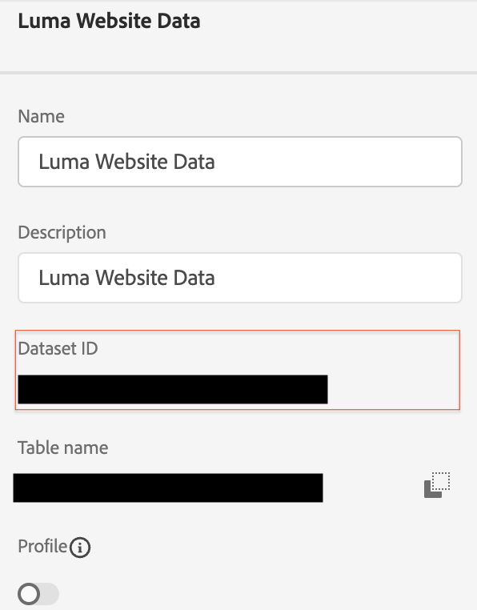

# Conectar dados do Commerce ao Adobe Experience Platform

Quando você instala o conector Experience Platform, duas novas páginas de configuração aparecem no **Sistema** menu em **Serviços** no Commerce _Admin_.

- Conector dos Commerce Services
- Conector Experience Platform

Para conectar sua instância do Adobe Commerce à Adobe Experience Platform, você deve configurar ambos os conectores, começando pelo conector dos Commerce Services e terminando com o conector do Experience Platform.

## Atualizar o conector dos Commerce Services

Se você instalou um serviço do Adobe Commerce anteriormente, provavelmente já configurou o conector dos Commerce Services. Caso contrário, você deverá concluir as seguintes tarefas no [Conector dos Commerce Services](../landing/saas.md) página:

1. Faça logon na sua conta do Commerce para [recuperar as chaves de API de produção e sandbox](../landing/saas.md#credentials).
1. Selecione um [Espaço de dados SaaS](../landing/saas.md#saas-configuration).
1. Faça logon na sua conta Adobe para [recuperar a ID da organização](../landing/saas.md#ims-organization-optional).

Após configurar o conector dos Commerce Services, configure o conector do Experience Platform.

## Atualize o conector do Experience Platform

Nesta seção, você conecta a instância do Adobe Commerce à Adobe Experience Platform usando a ID da organização. Em seguida, você pode especificar o tipo de dados - loja e back office - para enviar para a borda da Experience Platform.


## Geral

1. No Administrador, acesse **Sistema** > Serviços > **Conector Experience Platform**.

1. No **Configurações** em **Geral**, verifique a ID associada à sua conta do Adobe Experience Platform, conforme configurado na [Conector dos Commerce Services](../landing/saas.md#organizationid). A ID da organização é global. Somente uma ID de organização pode ser associada por instância do Adobe Commerce.

1. No **Escopo** , defina o contexto como **Site**.

1. (Opcional) Se você já tiver um [AEP Web SDK (liga)](https://experienceleague.adobe.com/docs/experience-platform/edge/home.html) implantado no site, ative a caixa de seleção e adicione o nome do AEP Web SDK. Caso contrário, deixe esses campos em branco e o conector do Experience Platform implantará um para você.

   >[!NOTE]
   >
   >Se você especificar seu próprio SDK da Web da AEP, o conector Experience Platform usará a ID de sequência de dados associada a esse SDK e não a ID de sequência de dados especificada nessa página (se houver).

## Coleta de dados

Nesta seção, você especifica o tipo de dados que deseja enviar para a borda do Experience Platform. Há dois tipos de dados: do lado do cliente e do lado do servidor.

Os dados do lado do cliente são dados capturados na loja. Isso inclui interações do comprador, como `View Page`, `View Product`, `Add to Cart`, e [lista de requisições](events.md#b2b-events) informações (para os comerciantes B2B). Os dados do lado do servidor, ou dados de back office, são dados capturados nos servidores do Commerce. Isso inclui informações sobre o status de um pedido, como se um pedido tivesse sido feito, cancelado, reembolsado, remetido ou concluído.

Para garantir que sua instância do Adobe Commerce possa iniciar a coleta de dados, revise a [pré-requisitos](overview.md#prerequisites).

Consulte o tópico de eventos para saber mais sobre [vitrine](events.md#storefront-events) e [back office](events.md#back-office-events) eventos.

>[!NOTE]
>
>Todos os campos no **Coleta de dados** aplica-se à **Site** escopo ou superior.

1. Selecionar **Eventos da loja** se desejar enviar dados comportamentais da loja.

   >[!NOTE]
   >
   >A variável **Eventos da loja** A caixa de seleção será ativada automaticamente se o SDK da Web da AEP e a ID da organização forem válidos.

1. Selecionar **Eventos de back office** se desejar enviar informações sobre o status da ordem, como se uma ordem foi feita, cancelada, reembolsada ou entregue.

   >[!NOTE]
   >
   >Se você selecionar **Eventos de back office**, todos os dados do back office são enviados para a borda do Experience Platform. Se um comprador optar por recusar a coleta de dados, você deverá definir explicitamente a preferência de privacidade do comprador no Experience Platform. Isso é diferente dos eventos da loja em que o coletor já lida com o consentimento com base nas preferências do comprador. [Saiba mais](https://experienceleague.adobe.com/docs/experience-platform/landing/governance-privacy-security/consent/adobe/dataset.html) sobre como definir a preferência de privacidade de um comprador no Experience Platform.

1. Para garantir atualizações de dados de eventos de back office com base em um agendamento de acordo com uma [cron](https://experienceleague.adobe.com/docs/commerce-admin/systems/tools/cron.html) tarefa, você deve alterar a `Sales Orders Feed` índice para `Update by Schedule`.

   1. No _Admin_ barra lateral, vá para **[!UICONTROL System]** > _[!UICONTROL Tools]_>**[!UICONTROL Index Management]**.

   1. Marque a caixa de seleção da `Sales Orders Feed` indexador.

   1. Definir **[!UICONTROL Actions]** para `Update by Schedule`.

   1. Se você estiver ativando os dados de back office pela primeira vez, execute os seguintes comandos para reindexar e acionar uma ressincronização. As ressincronizações subsequentes ocorrem automaticamente desde que o [cron](https://experienceleague.adobe.com/docs/commerce-admin/systems/tools/cron.html) a tarefa está configurada corretamente.

      ```bash
      bin/magento index:reindex sales_order_data_exporter_v2
      ```

      ```bash
      bin/magento saas:resync --feed orders
      ```

1. (Ignore esta etapa se estiver usando seu próprio SDK da Web da AEP.) [Criar](https://experienceleague.adobe.com/docs/experience-platform/edge/datastreams/configure.html#create) uma sequência de dados na Adobe Experience Platform ou selecione uma sequência de dados existente que deseja usar para a coleção.

1. (Ignore esta etapa se estiver usando seu próprio SDK da Web da AEP.) No **ID da sequência de dados** cole a ID desse fluxo de dados novo ou existente.

## Descrições dos campos

| Campo | Descrição |
|--- |--- |
| Escopo | Site específico no qual você deseja aplicar as configurações. |
| ID da organização (global) | ID que pertence à organização que adquiriu o produto Adobe DX. Essa ID vincula sua instância do Adobe Commerce ao Adobe Experience Platform. |
| O AEP Web SDK já foi implantado no site? | Marque essa caixa de seleção se você implantou seu próprio AEP Web SDK no site |
| Nome do SDK da Web da AEP (Global) | Se você já tiver um SDK da Web do Experience Platform implantado em seu site, especifique o nome desse SDK neste campo. Isso permite que o coletor de eventos da loja e o SDK de eventos da loja usem o SDK da Web do Experience Platform em vez da versão implantada pelo conector do Experience Platform. Se você não tiver um SDK da Web do Experience Platform implantado no site, deixe esse campo em branco e o conector do Experience Platform implantará um para você. |
| Eventos da loja | É marcado por padrão, desde que a ID da organização e a ID do fluxo de dados sejam válidas. Os eventos da loja coletam dados comportamentais anônimos dos compradores enquanto eles navegam pelo site. |
| Eventos do Back Office | Se marcado, a carga do evento conterá informações anônimas sobre o status do pedido, como se um pedido tivesse sido feito, cancelado, reembolsado ou remetido. |
| ID da sequência de dados (site) | ID que permite que os dados fluam do Adobe Experience Platform para outros produtos Adobe DX. Essa ID deve ser associada a um site específico em sua instância específica do Adobe Commerce. Se você especificar seu próprio SDK da Web do Experience Platform, não especifique uma ID de fluxo de dados neste campo. O conector Experience Platform usa a ID de sequência de dados associada a esse SDK e ignora qualquer ID de sequência de dados especificada nesse campo (se houver). |

>[!NOTE]
>
>Após a integração, os dados da loja começam a fluir para a borda do Experience Platform. Os dados de back office levam cerca de cinco minutos para serem exibidos na borda do. As atualizações subsequentes ficam visíveis na borda com base na programação do cron.

## (Beta) Enviar dados históricos de pedido

>[!NOTE]
>
>Esse recurso está disponível somente para usuários beta. Você pode participar do beta enviando um email para o seguinte endereço: [dataconnection@adobe.com](mailto:dataconnection@adobe.com).

A Adobe Commerce coleta até cinco anos de dados históricos de pedidos e status. Você pode usar o conector Experience Platform para enviar esses dados históricos ao Experience Platform para enriquecer os perfis do cliente com base nesses pedidos anteriores. Os dados são armazenados em um conjunto de dados no Experience Platform.

Embora o Commerce já colete os dados históricos do pedido, há várias tarefas que você deve concluir para enviar esses dados para o Experience Platform. As seções a seguir orientam você pelo processo.

### Instalar beta de pedido histórico

Para habilitar a coleção de dados de pedido históricos para beta, você deve atualizar a raiz do projeto [!DNL Composer] `.json` do seguinte modo:

1. Abra a raiz `composer.json` arquivo e pesquisa `magento/experience-platform-connector`.

1. No `require` , atualize o número da versão da seguinte maneira:

   ```json
   "require": {
      ...
      "magento/experience-platform-connector": "^3.0.0-beta1",
      ...
    }
   ```

1. Para comerciantes B2B, atualize o `.json` do seguinte modo:

   ```json
   "require": {
     ...
     "magento/experience-platform-connector-b2b": "^2.0.0-beta1"
     ...
   }
   ```

1. **Salvar** `composer.json`. Em seguida, execute o seguinte a partir da linha de comando:

   ```bash
   composer update magento/experience-platform-connector –-with-dependencies
   ```

   ou, para os comerciantes B2B:

   ```bash
   composer update magento/experience-platform-connector-b2b --with-dependencies
   ```

### Configurar beta de ordem histórica

Para garantir que o histórico de pedidos de seus clientes possa ser enviado para o Experience Platform, você deve especificar credenciais que vinculem sua instância do Commerce ao Experience Platform. Se você já tiver instalado e ativado o [Audience Activation](https://experienceleague.adobe.com/docs/commerce-admin/customers/audience-activation.html) você já especificou as credenciais necessárias e pode ignorar esta etapa. Se você ainda não tiver instalado e ativado o módulo Audience Activation, execute as seguintes etapas:

>[!NOTE]
>
>Nesta seção, insira as credenciais do console do desenvolvedor. Verifique se o projeto do console do desenvolvedor tem a configuração correta [funções e permissões configuradas](https://experienceleague.adobe.com/docs/experience-platform/landing/platform-apis/api-authentication.html#assign-api-to-a-role).

1. No _Admin_ barra lateral, vá para **[!UICONTROL Stores]** > _[!UICONTROL Settings]_>**[!UICONTROL Configuration]**.

1. Expandir **[!UICONTROL Services]** e selecione **[!UICONTROL Experience Platform Connector]**.

1. Insira as credenciais de configuração encontradas no [console do desenvolvedor](https://developer.adobe.com/console/home).

   {width="700" zoomable="yes"}

   >[!NOTE]
   >
   >Na versão beta, o Commerce usa credenciais JSON Web Tokens (JWT) no console do desenvolvedor. Após a versão beta, o Commerce usará o OAuth 2.0 no console do desenvolvedor.

1. Clique em **Salvar configuração**.

### Configurar o serviço de sincronização de pedidos

Depois de inserir credenciais de desenvolvedor, você pode configurar o serviço de sincronização de pedidos. O serviço de sincronização de pedidos usa o [Estrutura da fila de mensagens](https://developer.adobe.com/commerce/php/development/components/message-queues/) e RabbitMQ. Após concluir essas etapas, os dados do status do pedido podem ser sincronizados com o SaaS, que é necessário antes de ser enviado para o Experience Platform.

1. [Ativar](https://experienceleague.adobe.com/docs/commerce-cloud-service/user-guide/configure/service/rabbitmq.html) RabbitMQ.

   >[!NOTE]
   >
   >O RabbitMQ já está configurado para as versões 2.4.7 e mais recentes do Commerce, mas você deve habilitar os consumidores.

1. Habilitar consumidores da fila de mensagens por trabalho cron em `.magento.env.yaml` usar `CRON_CONSUMERS_RUNNER` variável de ambiente.

   ```yaml
      stage:
        deploy:
          CRON_CONSUMERS_RUNNER:
            cron_run: true
   ```

   >[!NOTE]
   >
   >Consulte a [implantar documentação de variáveis](https://experienceleague.adobe.com/docs/commerce-cloud-service/user-guide/configure/env/stage/variables-deploy.html#cron_consumers_runner) para saber mais sobre todas as opções de configuração disponíveis.

Com o serviço de sincronização de pedidos ativado, você pode especificar o intervalo de datas do pedido histórico na página do conector Experience Platform.

### Especificar intervalo de datas do histórico da ordem

Nesta seção, você especifica o intervalo de datas para os pedidos históricos que deseja enviar para o Experience Platform.

{width="700" zoomable="yes"}

1. No Administrador, acesse **Sistema** > Serviços > **Conector Experience Platform**.

1. Selecione o **Histórico de pedidos** guia.

1. Em **Sincronização do histórico do pedido**, insira o **ID do conjunto de dados**. Esse deve ser o mesmo conjunto de dados associado ao fluxo de dados especificado na [coleção de dados](#data-collection) acima.

   1. Para acessar a ID do conjunto de dados, abra a interface do Experience Platform e selecione **Conjuntos de dados** no painel de navegação esquerdo para abrir a **Conjuntos de dados** painel. O painel lista todos os conjuntos de dados disponíveis para sua organização. Os detalhes são exibidos para cada conjunto de dados listado, incluindo o nome, o esquema ao qual o conjunto de dados pertence e o status da execução de assimilação mais recente.
   1. Abra o conjunto de dados associado à sua sequência de dados.
   1. No painel direito, você verá detalhes sobre o conjunto de dados. Copie a ID do conjunto de dados.

   {width="700" zoomable="yes"}

1. No **De** e **Para** Os campos especificam o intervalo de dados para os dados históricos de pedido que você deseja enviar. Não é possível selecionar um intervalo de datas que exceda cinco anos.

1. Selecionar [!UICONTROL Start Sync] para acionar o início da sincronização. Os dados históricos de pedidos são dados em lote, e não dados de vitrine e back-office que estão transmitindo dados. Os dados em lote levam cerca de 45 minutos para chegar no Experience Platform.

   >[!NOTE]
   >
   >Na versão beta, se você acionar uma sincronização várias vezes no mesmo intervalo de tempo ou em sobreposição, verá eventos duplicados no conjunto de dados.

## Confirmar se os dados do evento foram coletados

Para confirmar se os dados estão sendo coletados em sua loja do Commerce, use o [Adobe Experience Platform Debugger](https://experienceleague.adobe.com/docs/experience-platform/debugger/home.html) para examinar o site do Commerce. Depois de confirmar que os dados estão sendo coletados, é possível verificar se os dados do evento da loja e do back office aparecem na borda executando uma consulta que retorna dados do [conjunto de dados que você criou](overview.md#prerequisites).

1. Selecionar **Consultas** na navegação à esquerda de Experience Platform e clique em [!UICONTROL Create Query].

   

1. Quando o Editor de consultas for aberto, insira uma consulta que selecione dados do conjunto de dados.

   

   Por exemplo, sua consulta pode ser semelhante ao seguinte:

   ```sql
   SELECT * from `your_dataset_name` ORDER by TIMESTAMP DESC
   ```

1. Após a execução da consulta, os resultados são exibidos no **Resultados** , ao lado da guia **Console** guia. Essa exibição mostra a saída em tabela da sua query.

   

Neste exemplo, você vê dados de evento do [`commerce.productListAdds`](events.md#addtocart), [`commerce.productViews`](events.md#productpageview), [`web.webpagedetails.pageViews`](events.md#pageview)e assim por diante. Essa exibição permite verificar se os dados do Commerce chegaram à borda.

Se os resultados não forem os esperados, abra o conjunto de dados e procure qualquer importação de lotes com falha. Saiba mais sobre [solução de problemas de importações de lote](https://experienceleague.adobe.com/docs/experience-platform/ingestion/batch/troubleshooting.html).
