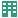

# Experience Platform Connector Events

Abaixo encontram-se os eventos Commerce disponíveis quando você instala a extensão Experience Platform connector . Os dados que esses eventos coletam são enviados para a borda do Adobe Experience Platform. Você também pode criar [eventos personalizados](custom-events.md) para coletar dados adicionais não fornecidos imediatamente.

Além dos dados que os eventos a seguir coletam, você também obtém [outros dados](https://experienceleague.adobe.com/docs/experience-platform/edge/data-collection/automatic-information.html) fornecido pelo SDK da Web da Adobe Experience Platform.

## Eventos de vitrine

Os eventos da loja coletam dados comportamentais anônimos dos compradores durante a navegação no site. Os dados coletados por esses eventos podem ser usados para criar promoções e campanhas direcionadas a um conjunto específico de compradores.

>[!NOTE]
>
>Todos os eventos de vitrine incluem o [`identityMap`](https://experienceleague.adobe.com/docs/experience-platform/xdm/field-groups/profile/identitymap.html) , que inclui o endereço de email do comprador, quando disponível, e ECID. Ao incluir esses dados de perfil em cada evento, você não precisa de uma importação de conta de usuário separada do Adobe Commerce.

### addToCart

| Descrição | Nome do evento XDM |
|---|---|
| Disparado quando um produto é adicionado ao carrinho ou quando a quantidade de um produto no carrinho é aumentada. | `commerce.productListAdds` |

#### Dados coletados de addToCart

A tabela a seguir descreve os dados coletados para esse evento.

| Campo | Descrição |
|---|---|
| `productListAdds` | Indica se um produto foi adicionado a um carrinho de compras. Um valor de `1` indica que um produto foi adicionado. |
| `productListItems` | Uma matriz de produtos adicionados ao carrinho de compras |
| `SKU` | Unidade de manutenção de estoque. O identificador exclusivo do produto. |
| `name` | O nome de exibição ou nome legível do produto |
| `priceTotal` | O preço total do item de linha do produto |
| `quantity` | O número de unidades de produto adicionadas ao carrinho |
| `discountAmount` | Indica a quantia de desconto aplicada |
| `currencyCode` | O [ISO 4217](https://en.wikipedia.org/wiki/ISO_4217) moeda do produto |
| `productImageUrl` | URL da imagem principal do produto |
| `selectedOptions` | Campo usado para um produto configurável. `attribute` identifica um atributo do produto configurável, como `size` ou `color` e `value` identifica o valor do atributo, como `small` ou `black`. |
| `cartID` | A ID exclusiva que identifica o carrinho do cliente |

### openCart

| Descrição | Nome do evento XDM |
|---|---|
| Disparado quando um novo carrinho é criado, ou seja, quando um produto é adicionado a um carrinho vazio. | `commerce.productListOpens` |

#### Dados coletados do openCart

A tabela a seguir descreve os dados coletados para esse evento.

| Campo | Descrição |
|---|---|
| `productListOpens` | Indica se um carrinho foi criado. Um valor de `1` indica que um carrinho foi criado. |
| `productListItems` | Uma matriz de produtos adicionados ao carrinho de compras |
| `SKU` | Unidade de manutenção de estoque. O identificador exclusivo do produto. |
| `name` | O nome de exibição ou nome legível do produto |
| `priceTotal` | O preço total do item de linha do produto |
| `quantity` | O número de unidades de produto adicionadas ao carrinho |
| `discountAmount` | Indica a quantia de desconto aplicada |
| `currencyCode` | O [ISO 4217](https://en.wikipedia.org/wiki/ISO_4217) moeda do produto |
| `productImageUrl` | URL da imagem principal do produto |
| `selectedOptions` | Campo usado para um produto configurável. `attribute` identifica um atributo do produto configurável, como `size` ou `color` e `value` identifica o valor do atributo, como `small` ou `black`. |
| `cartID` | A ID exclusiva que identifica o carrinho do cliente |

### removeFromCart

| Descrição | Nome do evento XDM |
|---|---|
| Disparado sempre que um produto é removido ou sempre que a quantidade de um produto no carrinho é diminuída. | `commerce.productListRemovals` |

#### Dados coletados de removeFromCart

A tabela a seguir descreve os dados coletados para esse evento.

| Campo | Descrição |
|---|---|
| `productListRemovals` | Indica se um produto foi removido do carrinho. Um valor de `1` indica que um produto foi removido do carrinho. |
| `productListItems` | Uma matriz de produtos removidos do carrinho de compras |
| `SKU` | Unidade de manutenção de estoque. O identificador exclusivo do produto. |
| `name` | O nome de exibição ou nome legível do produto |
| `priceTotal` | O preço total do item de linha do produto |
| `quantity` | O número de unidades de produto removidas do carrinho |
| `discountAmount` | Indica a quantia de desconto aplicada |
| `currencyCode` | O [ISO 4217](https://en.wikipedia.org/wiki/ISO_4217) moeda do produto |
| `productImageUrl` | URL da imagem principal do produto |
| `selectedOptions` | Campo usado para um produto configurável. `attribute` identifica um atributo do produto configurável, como `size` ou `color` e `value` identifica o valor do atributo, como `small` ou `black`. |
| `cartID` | A ID exclusiva que identifica o carrinho do cliente |

### shoppingCartView

| Descrição | Nome do evento XDM |
|---|---|
| Disparado quando qualquer página de carrinho é carregada. | `commerce.productListViews` |

#### Dados coletados de shoppingCartView

A tabela a seguir descreve os dados coletados para esse evento.

| Campo | Descrição |
|---|---|
| `productListViews` | Indica se uma lista de produtos foi visualizada |
| `productListItems` | Uma matriz de produtos no carrinho de compras |
| `SKU` | Unidade de manutenção de estoque. O identificador exclusivo do produto. |
| `name` | O nome de exibição ou nome legível do produto |
| `priceTotal` | O preço total do item de linha do produto |
| `quantity` | O número de unidades de produto no carrinho |
| `discountAmount` | Indica a quantia de desconto aplicada |
| `currencyCode` | O [ISO 4217](https://en.wikipedia.org/wiki/ISO_4217) moeda do produto |
| `productImageUrl` | URL da imagem principal do produto |
| `selectedOptions` | Campo usado para um produto configurável. `attribute` identifica um atributo do produto configurável, como `size` ou `color` e `value` identifica o valor do atributo, como `small` ou `black`. |
| `cartID` | A ID exclusiva que identifica o carrinho do cliente |

### pageView

| Descrição | Nome do evento XDM |
|---|---|
| Disparado quando qualquer página é carregada. | `web.webpagedetails.pageViews` |

#### Dados coletados de pageView

A tabela a seguir descreve os dados coletados para esse evento.

| Campo | Descrição |
|---|---|
| `pageViews` | Indica se uma página foi carregada. A `value` de `1` indica que a página foi carregada. |

### productPageView

| Descrição | Nome do evento XDM |
|---|---|
| Disparado quando qualquer página de produto é carregada. | `commerce.productViews` |

#### Dados coletados de productPageView

A tabela a seguir descreve os dados coletados para esse evento.

| Campo | Descrição |
|---|---|
| `productViews` | Indica se o produto foi exibido |
| `productListItems` | Uma matriz de produtos no carrinho de compras |
| `SKU` | Unidade de manutenção de estoque. O identificador exclusivo do produto. |
| `name` | O nome de exibição ou nome legível do produto |
| `priceTotal` | O preço total do item de linha do produto |
| `discountAmount` | Indica a quantia de desconto aplicada |
| `currencyCode` | O [ISO 4217](https://en.wikipedia.org/wiki/ISO_4217) moeda do produto |
| `productImageUrl` | URL da imagem principal do produto |
| `selectedOptions` | Campo usado para um produto configurável. `attribute` identifica um atributo do produto configurável, como `size` ou `color` e `value` identifica o valor do atributo, como `small` ou `black`. |

### startCheckout

| Descrição | Nome do evento XDM |
|---|---|
| Disparado quando o comprador clica em um botão de finalização. | `commerce.checkouts` |

#### Dados coletados do startCheckout

A tabela a seguir descreve os dados coletados para esse evento.

| Campo | Descrição |
|---|---|
| `checkouts` | Indica se uma ação ocorreu durante o processo de finalização |
| `productListItems` | Uma matriz de produtos no carrinho de compras |
| `SKU` | Unidade de manutenção de estoque. O identificador exclusivo do produto. |
| `name` | O nome de exibição ou nome legível do produto |
| `priceTotal` | O preço total do item de linha do produto |
| `quantity` | O número de unidades de produto no carrinho |
| `discountAmount` | Indica a quantia de desconto aplicada |
| `currencyCode` | O [ISO 4217](https://en.wikipedia.org/wiki/ISO_4217) moeda do produto |
| `productImageUrl` | URL da imagem principal do produto |
| `selectedOptions` | Campo usado para um produto configurável. `attribute` identifica um atributo do produto configurável, como `size` ou `color` e `value` identifica o valor do atributo, como `small` ou `black`. |
| `cartID` | A ID exclusiva que identifica o carrinho do cliente |

### completeCheckout

| Descrição | Nome do evento XDM |
|---|---|
| Disparado quando o comprador faz um pedido. | `commerce.order` |

#### Dados coletados do completeCheckout

A tabela a seguir descreve os dados coletados para esse evento.

| Campo | Descrição |
|---|---|
| `purchases` | Indica se um pedido foi aceito |
| `order` | Contém informações sobre o pedido colocado para um ou mais produtos |
| `purchaseID` | Identificador exclusivo atribuído pelo vendedor para esta compra ou contrato. Não há garantia de que a ID seja exclusiva. |
| `orderType` | Indica o tipo de pedido que foi feito, como Check-out ou Compra instantânea |
| `payments` | A lista de pagamentos para esta ordem |
| `currencyCode` | O [ISO 4217](https://en.wikipedia.org/wiki/ISO_4217) código de moeda usado para este item de pagamento. Por exemplo, `USD` ou `EUR`. |
| `paymentAmount` | O valor do pagamento |
| `paymentType` | O método de pagamento desta ordem. As opções são: `cash`, `credit_card`, `debit_card`, `gift_card`, `check`, `paypal`, `wire_transfer`, `credit_card_reference`, `other` |
| `transactionID` | O identificador exclusivo de transação para este item de pagamento |
| `shipping` | Detalhes de envio para um ou mais produtos. |
| `shippingMethod` | O método de envio escolhido pelo cliente, como delivery padrão, entrega acelerada, coleta na loja e assim por diante |
| `shippingAmount` | O custo total de envio dos itens no carrinho |
| `promotionID` | Identificador exclusivo da promoção, se houver |
| `personalEmail` | Especifica o endereço de email pessoal |
| `address` | O endereço técnico, por exemplo, `name@domain.com` como geralmente definido em RFC2822 e padrões subsequentes |
| `productListItems` | Uma matriz de produtos no carrinho de compras |
| `SKU` | Unidade de manutenção de estoque. O identificador exclusivo do produto. |
| `name` | O nome de exibição ou nome legível do produto |
| `priceTotal` | O preço total do item de linha do produto |
| `quantity` | O número de unidades de produto no carrinho |
| `discountAmount` | Indica a quantia de desconto aplicada |
| `currencyCode` | O [ISO 4217](https://en.wikipedia.org/wiki/ISO_4217) código de moeda usado para os totais da ordem. |
| `productImageUrl` | URL da imagem principal do produto |
| `selectedOptions` | Campo usado para um produto configurável. `attribute` identifica um atributo do produto configurável, como `size` ou `color` e `value` identifica o valor do atributo, como `small` ou `black`. |

## Eventos de perfil

Os eventos de perfil incluem informações da conta, como `signIn`, `signOut`, `createAccount`e `editAccount`. Esses dados são usados para ajudar a preencher os principais detalhes do cliente, necessários para melhor definir segmentos ou executar campanhas de marketing, como se você quisesse direcionar os compradores que moram em Nova York.

### signIn

| Descrição | Nome do evento XDM |
|---|---|
| Disparado quando um comprador tenta entrar. | `userAccount.login` |

>[!NOTE]
>
> Esse evento é acionado quando a ação específica é tentada. Não indica que a ação foi bem sucedida.

#### Dados coletados do signIn

A tabela a seguir descreve os dados coletados para esse evento.

| Campo | Descrição |
|---|---|
| `eventType` | O tipo de evento principal para esse registro de série de tempo, como: `userAccount.login` |
| `person` | Um ator, contato ou proprietário individual |
| `accountID` | Captura a ID da conta do usuário |
| `personalEmailID` | Especifica o identificador exclusivo para o email pessoal |
| `address` | O endereço técnico, por exemplo, `name@domain.com` como geralmente definido em RFC2822 e padrões subsequentes |
| `userAccount` | Indica quaisquer detalhes de fidelidade, preferências, processos de logon e outras preferências de conta |
| `login` | Indica se um visitante tentou fazer logon |

### signOut

| Descrição | Nome do evento XDM |
|---|---|
| Disparado quando um comprador tenta sair. | `userAccount.logout` |

>[!NOTE]
>
> Esse evento é acionado quando a ação específica é tentada. Não indica que a ação foi bem sucedida.

#### Dados coletados do signOut

A tabela a seguir descreve os dados coletados para esse evento.

| Campo | Descrição |
|---|---|
| `eventType` | O tipo de evento principal para esse registro de série de tempo, como: `userAccount.logout` |
| `userAccount` | Indica quaisquer detalhes de fidelidade, preferências, processos de logon e outras preferências de conta |
| `logout` | Indica se um visitante tentou fazer logoff |

### createAccount

| Descrição | Nome do evento XDM |
|---|---|
| Disparado quando um comprador tenta criar uma conta. | `userAccount.createProfile` |

>[!NOTE]
>
> Esse evento é acionado quando a ação específica é tentada. Não indica que a ação foi bem sucedida.

#### Dados coletados de createAccount

A tabela a seguir descreve os dados coletados para esse evento.

| Campo | Descrição |
|---|---|
| `eventType` | O tipo de evento principal para esse registro de série de tempo, como: `account.createProfile` |
| `person` | Um ator, contato ou proprietário individual |
| `accountID` | Captura a ID da conta do usuário |
| `accountType` | Captura o tipo de conta de usuário, como `Personal` ou `Company`, se aplicável |
| `personalEmailID` | Especifica o identificador exclusivo para o email pessoal |
| `address` | O endereço técnico, por exemplo, `name@domain.com` como geralmente definido em RFC2822 e padrões subsequentes |
| `userAccount` | Indica quaisquer detalhes de fidelidade, preferências, processos de logon e outras preferências de conta |
| `createProfile` | Indica se um usuário criou um perfil de conta |

### editAccount

| Descrição | Nome do evento XDM |
|---|---|
| Disparado quando um comprador tenta editar uma conta. | `userAccount.updateProfile` |

>[!NOTE]
>
> Esse evento é acionado quando a ação específica é tentada. Não indica que a ação foi bem sucedida.

#### Dados coletados de editAccount

A tabela a seguir descreve os dados coletados para esse evento.

| Campo | Descrição |
|---|---|
| `eventType` | O tipo de evento principal para esse registro de série de tempo, como: `account.updateProfile` |
| `person` | Um ator, contato ou proprietário individual |
| `accountID` | Captura a ID da conta do usuário |
| `accountType` | Captura o tipo de conta de usuário, como `Personal` ou `Company`, se aplicável |
| `personalEmailID` | Especifica o identificador exclusivo para o email pessoal |
| `personalEmail` | Especifica o endereço de email pessoal |
| `address` | O endereço técnico, por exemplo, `name@domain.com` como geralmente definido em RFC2822 e padrões subsequentes |
| `userAccount` | Indica quaisquer detalhes de fidelidade, preferências, processos de logon e outras preferências de conta |
| `updateProfile` | Indica se um usuário atualizou seu perfil de conta |

## Pesquisar eventos

Os eventos de pesquisa fornecem dados relevantes para a intenção do comprador. O insight da intenção de um comprador ajuda os comerciantes a ver como os compradores estão procurando itens, no que clicam e, por fim, comprando ou abandonando. Um exemplo de como você pode usar esses dados é se deseja direcionar os compradores existentes que pesquisam seu produto principal, mas nunca compram o produto.

Use o `uniqueIdentifier` campo encontrado em `searchRequestSent` e `searchResponseReceived` para fazer referência cruzada de uma solicitação de pesquisa à resposta de pesquisa correspondente.

### searchRequestSent

| Descrição | Nome do evento XDM |
|---|---|
| Disparado pelos seguintes eventos no provedor &quot;pesquisar à medida que você digita&quot;:  Pressione Enter, Clique _Exibir todos_   Disparado pelos seguintes eventos nas páginas de resultados da pesquisa:  Selecione um filtro, Altere a ordem de classificação (_Ordenar por_), Altere a direção da classificação (crescente ou decrescente), Altere o número de resultados por página (_Mostrar número por página_), Navegue até a próxima página, Navegue até a página anterior, Navegue até uma página diferente | `searchRequest` |

>[!NOTE]
>
>Os eventos de pesquisa não são suportados em uma Adobe Commerce Enterprise Edition com o módulo B2B instalado.

#### Dados coletados de searchRequestSent

A tabela a seguir descreve os dados coletados para esse evento.

| Campo | Descrição |
|---|---|
| `searchRequest` | Indica se uma solicitação de pesquisa foi enviada |
| `id` | A ID exclusiva para esta solicitação de pesquisa específica |
| `filter` | Indica se algum filtro foi aplicado para limitar os resultados da pesquisa |
| `attribute` (filtro) | A faceta de um item usada para determinar se ele deve ser incluído nos resultados da pesquisa |
| `value` | Valores de atributos usados para determinar quais itens estão incluídos nos resultados da pesquisa |
| `isRange` | Quando verdadeiro, os valores indicam endpoints de um intervalo de valores aceitável |
| `sort` | Indica como os resultados da pesquisa devem ser classificados |
| `attribute` (classificação) | Um atributo usado para classificar itens nos resultados da pesquisa |
| `order` | A ordem na qual os resultados da pesquisa serão retornados |
| `query` | Os termos pesquisados |

### searchResponseReceived

| Descrição | Nome do evento XDM |
|---|---|
| Disparado quando o Live Search retorna resultados para a página de resultados de &quot;pesquisa ao digitar&quot; ou de pesquisa. | `searchResponse` |

>[!NOTE]
>
>Os eventos de pesquisa não são suportados em uma Adobe Commerce Enterprise Edition com o módulo B2B instalado.

#### Dados coletados de searchResponseReceived

A tabela a seguir descreve os dados coletados para esse evento.

| Campo | Descrição |
|---|---|
| `searchResponse` | Indica se uma resposta de pesquisa foi recebida |
| `id` | A ID exclusiva para esta resposta de pesquisa específica |
| `suggestions` | Uma matriz de sequências de caracteres que incluem os nomes de produtos e categorias existentes no catálogo que são semelhantes à consulta de pesquisa |
| `numberOfResults` | O número de produtos devolvidos |
| `productListItems` | Uma matriz de produtos no carrinho de compras. |
| `SKU` | Unidade de manutenção de estoque. O identificador exclusivo do produto. |
| `name` | O nome de exibição ou nome legível do produto |
| `productImageUrl` | URL da imagem principal do produto |

## Eventos B2B

 Para comerciantes B2B, você deve [instalar](install.md#install-the-b2b-extension) o `experience-platform-connector-b2b` para ativar esses eventos.

Os eventos B2B contêm [lista de requisições](https://experienceleague.adobe.com/docs/commerce-admin/b2b/requisition-lists/requisition-lists.html) informações, como se uma lista de requisição tivesse sido criada, adicionada ou excluída de. Ao rastrear eventos específicos de listas de requisições, você pode ver quais produtos seus clientes compram com frequência e criar campanhas com base nesses dados.

### createRequisitionList

| Descrição | Nome do evento XDM |
|---|---|
| Disparado quando um comprador cria uma nova lista de requisições. | `commerce.requisitionListOpens` |

#### Dados coletados de createRequisitionList

A tabela a seguir descreve os dados coletados para esse evento.

| Campo | Descrição |
|---|---|
| `requisitionList` | As propriedades da lista de requisições criada pelo cliente |
| `ID` | Identificador exclusivo da lista de requisições |
| `name` | Nome da lista de requisições especificada pelo cliente |
| `description` | Descrição da lista de requisições especificada pelo cliente |

### addToRequisitionList

| Descrição | Nome do evento XDM |
|---|---|
| Disparado quando um comprador adiciona um produto a uma lista de requisitos existente ou ao criar uma nova lista. | `commerce.requisitionListAdds` |

>[!NOTE]
>
>`addToRequisitionList` não é compatível com páginas de exibição de categoria ou produtos configuráveis. Ele é compatível com as páginas de exibição do produto e com produtos simples.

#### Dados coletados de addToRequisitionList

A tabela a seguir descreve os dados coletados para esse evento.

| Campo | Descrição |
|---|---|
| `requisitionList` | As propriedades da lista de requisições criada pelo cliente |
| `ID` | Identificador exclusivo da lista de requisições |
| `name` | Nome da lista de requisições especificada pelo cliente |
| `description` | Descrição da lista de requisições especificada pelo cliente |
| `productListItems` | Uma matriz de produtos que foram adicionados à lista de requisições |
| `name` | O nome de exibição ou nome legível do produto |
| `SKU` | Unidade de manutenção de estoque. O identificador exclusivo do produto. |
| `quantity` | O número de unidades de produto adicionadas |
| `priceTotal` | O preço total do item de linha do produto |
| `discountAmount` | Indica a quantia de desconto aplicada |
| `currencyCode` | O [ISO 4217](https://en.wikipedia.org/wiki/ISO_4217) código de moeda usado para este item de pagamento |
| `selectedOptions` | Campo usado para um produto configurável. `attribute` identifica um atributo do produto configurável, como `size` ou `color` e `value` identifica o valor do atributo, como `small` ou `black`. |

### removeFromRequisitionList

| Descrição | Nome do evento XDM |
|---|---|
| Disparado quando um comprador remove um produto de uma lista de requisições. | `commerce.requisitionListRemovals` |

#### Dados coletados de removeFromRequisitionList

A tabela a seguir descreve os dados coletados para esse evento.

| Campo | Descrição |
|---|---|
| `requisitionList` | As propriedades da lista de requisições criada pelo cliente |
| `ID` | Identificador exclusivo da lista de requisições |
| `name` | Nome da lista de requisições especificada pelo cliente |
| `description` | Descrição da lista de requisições especificada pelo cliente |
| `productListItems` | Uma matriz de produtos que foram adicionados à lista de requisições |
| `name` | O nome de exibição ou nome legível do produto |
| `SKU` | Unidade de manutenção de estoque. O identificador exclusivo do produto. |
| `quantity` | O número de unidades de produto adicionadas |
| `priceTotal` | O preço total do item de linha do produto |
| `discountAmount` | Indica a quantia de desconto aplicada |
| `currencyCode` | O [ISO 4217](https://en.wikipedia.org/wiki/ISO_4217) código de moeda usado para este item de pagamento |
| `selectedOptions` | Campo usado para um produto configurável. `attribute` identifica um atributo do produto configurável, como `size` ou `color` e `value` identifica o valor do atributo, como `small` ou `black`. |

## Eventos do back-office

Os eventos de back-office contêm informações sobre o status de um pedido, como se um pedido foi feito, cancelado, reembolsado, enviado ou concluído. Os dados coletados por esses eventos do lado do servidor mostram uma visualização 360 do pedido do comprador. Essa visualização ajuda os comerciantes a direcionar melhor ou analisar todo o status do pedido ao desenvolver campanhas de marketing. Por exemplo, você pode detectar tendências em determinadas categorias de produtos que têm um bom desempenho em épocas diferentes do ano. Por exemplo, roupas de inverno que vendem melhor durante meses mais frios ou certas cores de produtos que os compradores estão interessados ao longo dos anos. Além disso, os dados de status do pedido podem ajudar você a calcular o valor do cliente do tempo de vida, entendendo a propensão de um comprador para converter com base em pedidos anteriores.

>[!NOTE]
>
>Todos os eventos de back-office incluem o [`identityMap`](https://experienceleague.adobe.com/docs/experience-platform/xdm/field-groups/profile/identitymap.html) , que fornece o endereço de email do comprador. Ao incluir esses dados de perfil em cada evento, você não precisa de uma importação de conta de usuário separada do Adobe Commerce.

### orderPlaced

| Descrição | Nome do evento XDM |
|---|---|
| Disparado quando um comprador faz um pedido. | `commerce.backofficeOrderPlaced` |

#### Dados coletados de orderPlaced

A tabela a seguir descreve os dados coletados para esse evento.

| Campo | Descrição |
|---|---|
| `address` | O endereço técnico, por exemplo, `name@domain.com` como geralmente definido em RFC2822 e padrões subsequentes |
| `productListItems` | Uma matriz de produtos no pedido |
| `id` | O identificador de item de linha para esta entrada de produto. O próprio produto é identificado através da variável `product` campo. |
| `name` | O nome de exibição ou nome legível do produto |
| `SKU` | Unidade de manutenção de estoque. O identificador exclusivo do produto. |
| `quantity` | O número de unidades de produto no carrinho |
| `priceTotal` | O preço total do item de linha do produto |
| `discountAmount` | Indica a quantia de desconto aplicada |
| `order` | Contém informações sobre o pedido |
| `purchaseID` | Identificador exclusivo atribuído pelo vendedor para esta compra ou contrato. Não há garantia de que a ID seja exclusiva |
| `priceTotal` | O preço total deste pedido após a aplicação de todos os descontos e impostos |
| `currencyCode` | Código monetário ISO 4217 usado para os totais de pedidos |
| `purchaseOrderNumber` | Identificador exclusivo atribuído pelo comprador para esta compra ou contrato |
| `payments` | A lista de pagamentos para esta ordem |
| `paymentType` | O método de pagamento desta ordem. Valores enumerados e personalizados são permitidos. |
| `currencyCode` | O [ISO 4217](https://en.wikipedia.org/wiki/ISO_4217) código de moeda usado para este item de pagamento |
| `paymentAmount` | O valor do pagamento |
| `taxAmount` | O montante do imposto pago pelo comprador como parte do pagamento final |
| `createdDate` | A hora e a data em que um novo pedido é criado no sistema de comércio. Por exemplo, `2022-10-15T20:20:39+00:00` |
| `shipping` | Detalhes de envio para um ou mais produtos |
| `shippingMethod` | O método de envio escolhido pelo cliente, como delivery padrão, entrega acelerada, coleta na loja e assim por diante |
| `shippingAmount` | O valor que o cliente tinha que pagar pela remessa. |
| `address` | Endereço de entrega física |
| `street1` | Informações de nível de rua principal, número do apartamento, número da rua e nome da rua |
| `street2` | Campo adicional para informações de nível de rua |
| `city` | O nome da cidade |
| `state` | O nome do estado. Este é um campo de forma livre. |
| `postalCode` | O código postal da localização. Os códigos postais não estão disponíveis para todos os países. Em alguns países, apenas fará parte do código postal. |
| `country` | O nome do território administrado pelo governo. Exceto `xdm:countryCode`, esse é um campo de forma livre que pode ter o nome do país em qualquer idioma. |
| `billingAddress` | Endereço postal de cobrança |
| `street1` | Informações de nível de rua principal, número do apartamento, número da rua e nome da rua |
| `street2` | Campo adicional para informações de nível de rua |
| `city` | O nome da cidade |
| `state` | O nome do estado. Este é um campo de forma livre. |
| `postalCode` | O código postal da localização. Os códigos postais não estão disponíveis para todos os países. Em alguns países, apenas fará parte do código postal. |
| `country` | O nome do território administrado pelo governo. Exceto `xdm:countryCode`, esse é um campo de forma livre que pode ter o nome do país em qualquer idioma. |
| `personalEmail` | Um endereço de email pessoal |
| `address` | O endereço técnico, por exemplo, &#39;name@domain.com&#39;, como normalmente definido em RFC2822 e padrões subsequentes |

### orderItemsShipped

| Descrição | Nome do evento XDM |
|---|---|
| Disparado quando um pedido é enviado. | `commerce.backofficeOrderItemsShipped` |

#### Dados coletados de orderItemsShipped

A tabela a seguir descreve os dados coletados para esse evento.
|Campo|Descrição| |—|—| |`address`|O endereço técnico, por exemplo, `name@domain.com` como normalmente definido em RFC2822 e padrões subsequentes| |`productListItems`|Uma matriz de produtos na ordem| |`id`|O identificador de item de linha para esta entrada de produto. O próprio produto é identificado através da variável `product` campo.| |`name`|Nome de exibição ou nome legível do produto| |`SKU`|Unidade de Manutenção de Estoque. O identificador exclusivo do produto.| |`quantity`|O número de unidades de produto no carrinho| |`priceTotal`|O preço total do item da linha do produto| |`discountAmount`|Indica o valor de desconto aplicado| |`order`|Contém informações sobre o pedido| |`purchaseID`|Identificador único atribuído pelo vendedor para esta compra ou contrato. Não há garantia de que a ID seja exclusiva| |`priceTotal`|O preço total deste pedido após a aplicação de todos os descontos e impostos| |`currencyCode`|Código monetário ISO 4217 utilizado para os totais da ordem| |`purchaseOrderNumber`|Identificador único atribuído pelo comprador para esta compra ou contrato| |`payments`|A lista de pagamentos para esta ordem| |`paymentType`|O método de pagamento desta ordem. Valores enumerados e personalizados são permitidos.| |`currencyCode`|O [ISO 4217](https://en.wikipedia.org/wiki/ISO_4217) código de moeda usado para este item de pagamento| |`paymentAmount`|O valor do pagamento| |`lastUpdatedDate`|A hora em que um registro de pedido específico é atualizado pela última vez no sistema de comércio| |`shipping`|Pormenores sobre a expedição de um ou mais produtos| |`shippingMethod`|O método de envio escolhido pelo cliente, como delivery padrão, entrega acelerada, coleta na loja e assim por diante| |`trackingNumber`|O número de rastreamento fornecido pela transportadora para uma entrega de item de ordem| |`trackingURL`|O URL para rastrear o status de envio de um item de pedido| |`shipDate`|A data em que um ou mais itens de um pedido são enviados| |`address`|Endereço de expedição física| |`street1`|Informação primária sobre o nível da rua, número do apartamento, número da rua e nome da rua| |`street2`|Campo adicional para informações sobre o nível da rua| |`city`|O nome da cidade| |`state`|O nome do estado. Este é um campo de forma livre.| |`postalCode`|O código postal da localização. Os códigos postais não estão disponíveis para todos os países. Em alguns países, apenas fará parte do código postal.| |`country`|Nome do território administrado pelo Estado. Exceto `xdm:countryCode`, esse é um campo de forma livre que pode ter o nome do país em qualquer idioma.| |`shippingAmount`|O montante que o cliente tinha de pagar pela expedição.| |`billingAddress`|Endereço postal de cobrança| |`street1`|Informação primária sobre o nível da rua, número do apartamento, número da rua e nome da rua| |`street2`|Campo adicional para informações sobre o nível da rua| |`city`|O nome da cidade| |`state`|O nome do estado. Este é um campo de forma livre.| |`postalCode`|O código postal da localização. Os códigos postais não estão disponíveis para todos os países. Em alguns países, apenas fará parte do código postal.| |`country`|Nome do território administrado pelo Estado. Exceto `xdm:countryCode`, esse é um campo de forma livre que pode ter o nome do país em qualquer idioma.| |`personalEmail`|Um endereço de email pessoal| |`address`|O endereço técnico, por exemplo, &#39;name@domain.com&#39;, como normalmente definido na RFC2822 e nas normas subsequentes|

### orderCancelled

| Descrição | Nome do evento XDM |
|---|---|
| Disparado quando um comprador cancela um pedido. | `commerce.backofficeOrderCancelled` |

#### Dados coletados de orderCancelled

A tabela a seguir descreve os dados coletados para esse evento.
|Campo|Descrição| |—|—| |`address`|O endereço técnico, por exemplo, `name@domain.com` como normalmente definido em RFC2822 e padrões subsequentes| |`productListItems`|Uma matriz de produtos na ordem| |`id`|O identificador de item de linha para esta entrada de produto. O próprio produto é identificado através da variável `product` campo.| |`name`|Nome de exibição ou nome legível do produto| |`SKU`|Unidade de Manutenção de Estoque. O identificador exclusivo do produto.| |`quantity`|O número de unidades de produto no carrinho| |`priceTotal`|O preço total do item da linha do produto| |`discountAmount`|Indica o valor de desconto aplicado| |`order`|Contém informações sobre o pedido| |`purchaseID`|Identificador único atribuído pelo vendedor para esta compra ou contrato. Não há garantia de que a ID seja exclusiva| |`purchaseOrderNumber`|Identificador único atribuído pelo comprador para esta compra ou contrato| |`cancelDate`|A data e a hora em que um comprador cancela um pedido| |`lastUpdatedDate`|A hora em que um registro de pedido específico é atualizado pela última vez no sistema de comércio| |`personalEmail`|Um endereço de email pessoal| |`address`|O endereço técnico, por exemplo, &#39;name@domain.com&#39;, como normalmente definido na RFC2822 e nas normas subsequentes|

### creditMemoIssued

| Descrição | Nome do evento XDM |
|---|---|
| Disparado quando um comprador retorna um item em um pedido. | `commerce.backofficeCreditMemoIssued` |

#### Dados recolhidos de creditMemoIssued

A tabela a seguir descreve os dados coletados para esse evento.
|Campo|Descrição| |—|—| |`address`|O endereço técnico, por exemplo, `name@domain.com` como normalmente definido em RFC2822 e padrões subsequentes| |`productListItems`|Uma matriz de produtos na ordem| |`id`|O identificador de item de linha para esta entrada de produto. O próprio produto é identificado através da variável `product` campo.| |`name`|Nome de exibição ou nome legível do produto| |`SKU`|Unidade de Manutenção de Estoque. O identificador exclusivo do produto.| |`quantity`|O número de unidades de produto no carrinho| |`priceTotal`|O preço total do item da linha do produto| |`discountAmount`|Indica o valor de desconto aplicado| |`order`|Contém informações sobre o pedido| |`purchaseID`|Identificador único atribuído pelo vendedor para esta compra ou contrato. Não há garantia de que a ID seja exclusiva| |`purchaseOrderNumber`|Identificador único atribuído pelo comprador para esta compra ou contrato| |`lastUpdatedDate`|A hora em que um registro de pedido específico é atualizado pela última vez no sistema de comércio| |`personalEmail`|Um endereço de email pessoal| |`address`|O endereço técnico, por exemplo, &#39;name@domain.com&#39;, como normalmente definido na RFC2822 e nas normas subsequentes|

### orderShipmentCompleted

| Descrição | Nome do evento XDM |
|---|---|
| Disparado quando um comprador retorna um item em um pedido. | `commerce.backofficeOrderShipmentCompleted` |

#### Dados coletados de orderShipmentCompleted

A tabela a seguir descreve os dados coletados para esse evento.
|Campo|Descrição| |—|—| |`address`|O endereço técnico, por exemplo, `name@domain.com` como normalmente definido em RFC2822 e padrões subsequentes| |`productListItems`|Uma matriz de produtos na ordem| |`id`|O identificador de item de linha para esta entrada de produto. O próprio produto é identificado através da variável `product` campo.| |`name`|Nome de exibição ou nome legível do produto| |`SKU`|Unidade de Manutenção de Estoque. O identificador exclusivo do produto.| |`quantity`|O número de unidades de produto no carrinho| |`priceTotal`|O preço total do item da linha do produto| |`discountAmount`|Indica o valor de desconto aplicado| |`order`|Contém informações sobre o pedido| |`purchaseID`|Identificador único atribuído pelo vendedor para esta compra ou contrato. Não há garantia de que a ID seja exclusiva| |`priceTotal`|O preço total deste pedido após a aplicação de todos os descontos e impostos| |`currencyCode`|Código monetário ISO 4217 utilizado para os totais da ordem| |`purchaseOrderNumber`|Identificador único atribuído pelo comprador para esta compra ou contrato| |`taxAmount`|O montante do imposto pago pelo comprador como parte do pagamento final.| |`createdDate`|A hora e a data em que um novo pedido é criado no sistema de comércio. Por exemplo, `2022-10-15T20:20:39+00:00`| |`payments`|A lista de pagamentos para esta ordem| |`paymentType`|O método de pagamento desta ordem. Valores enumerados e personalizados são permitidos.| |`currencyCode`|O [ISO 4217](https://en.wikipedia.org/wiki/ISO_4217) código de moeda usado para este item de pagamento| |`paymentAmount`|O valor do pagamento| |`shipping`|Pormenores sobre a expedição de um ou mais produtos| |`shippingMethod`|O método de envio escolhido pelo cliente, como delivery padrão, entrega acelerada, coleta na loja e assim por diante| |`address`|Endereço de expedição física| |`street1`|Informação primária sobre o nível da rua, número do apartamento, número da rua e nome da rua| |`street2`|Campo adicional para informações sobre o nível da rua| |`city`|O nome da cidade| |`state`|O nome do estado. Este é um campo de forma livre.| |`postalCode`|O código postal da localização. Os códigos postais não estão disponíveis para todos os países. Em alguns países, apenas fará parte do código postal.| |`country`|Nome do território administrado pelo Estado. Exceto `xdm:countryCode`, esse é um campo de forma livre que pode ter o nome do país em qualquer idioma.| |`shippingAmount`|O montante que o cliente tinha de pagar pela expedição.| |`address`|O endereço técnico, por exemplo, `name@domain.com` como normalmente definido em RFC2822 e padrões subsequentes| |`billingAddress`|Endereço postal de cobrança| |`street1`|Informação primária sobre o nível da rua, número do apartamento, número da rua e nome da rua| |`street2`|Campo adicional para informações sobre o nível da rua| |`city`|O nome da cidade| |`state`|O nome do estado. Este é um campo de forma livre.| |`postalCode`|O código postal da localização. Os códigos postais não estão disponíveis para todos os países. Em alguns países, estes dados contêm apenas parte do código postal.| |`country`|Nome do território administrado pelo Estado. Exceto `xdm:countryCode`, esse é um campo de forma livre que pode ter o nome do país em qualquer idioma.| |`personalEmail`|Um endereço de email pessoal| |`address`|O endereço técnico, por exemplo, &#39;name@domain.com&#39;, como normalmente definido na RFC2822 e nas normas subsequentes|
