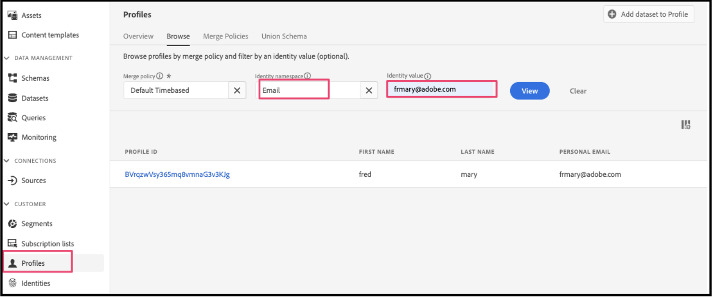

# Usar o Adobe Journey Optimizer para enviar um email de carrinho abandonado

[Adobe Journey Optimizer](https://experienceleague.adobe.com/docs/journey-optimizer/using/get-started/get-started.html) O ajuda a personalizar a experiência comercial para seus compradores. Por exemplo, você pode usar o Journey Optimizer para criar e entregar campanhas de marketing programadas, como promoções semanais para uma loja de varejo, ou gerar um email de carrinho abandonado se um cliente tiver adicionado um produto a um carrinho, mas não concluído o processo de finalização.

Ao seguir essas etapas, você pode aprender a ouvir uma `checkout` evento gerado pela sua instância do Commerce e responda a esse evento no Journey Optimizer para criar um email de carrinho abandonado.

>[!IMPORTANT]
>
>Para fins de demonstração, verifique se você está usando seu ambiente de sandbox do Commerce. Isso garante que os dados de eventos da loja e do back office enviados para o Experience Platform não diluam seus dados de eventos de produção.

## Pré-requisitos

Antes de começar com essas etapas, verifique se:

- Você foi provisionado para usar o Adobe Journey Optimizer
- Você [configurado](connect-data.md) o conector do Experience Platform
- Você [confirmado](connect-data.md#confirm-that-event-data-is-collected) seus dados de evento do Commerce estão chegando à borda do Experience Platform

## Etapa 1: criar um usuário no ambiente de sandbox do Commerce

Crie um usuário em seu ambiente de sandbox e confirme se as informações da conta do usuário aparecem no Experience Platform. Verifique se o email especificado é válido, pois é usado posteriormente nesta seção para enviar o email do carrinho abandonado.

1. Faça logon ou crie uma conta no ambiente de sandbox do Commerce.

   {width="700" zoomable="yes"}

   Com o Conector de Experience Platform instalado e configurado, essas informações da conta são enviadas ao Experience Platform como um perfil.

1. Confirme se as informações da sua conta de usuário aparecem no **[!UICONTROL Profile]** seção do Experience Platform.

   Ir para **[!UICONTROL Profiles]** no Adobe Experience Platform. Clique em **[!UICONTROL Detail]** no perfil para ver o perfil que você criou.

   {width="700" zoomable="yes"}

## Etapa 2: Exibir eventos no Journey Optimizer

No ambiente de sandbox do Commerce, visualize páginas de produtos, adicione itens ao carrinho e várias outras atividades que um comprador realizaria. Essas atividades acionam eventos na loja. Agora você pode confirmar se esses eventos estão fluindo para o Journey Optimizer.

1. Launch [Adobe Journey Optimizer](https://experienceleague.adobe.com/docs/journey-optimizer/using/get-started/user-interface.html).
1. Selecionar **[!UICONTROL Profiles]**.
1. Definir **[!UICONTROL Identity namespace]** para `Email`.
1. Defina o **[!UICONTROL Identity value]** ao seu endereço de email.
1. Selecione o seu perfil e, em seguida, a **[!UICONTROL Events]** guia.

   {width="700" zoomable="yes"}

   Procure o `commerce.checkouts` e examine a carga útil do evento:

       &quot;json
       &quot;personID&quot;: &quot;84281643067178465783746543501073369488&quot;,
       &quot;eventType&quot;: &quot;commerce.checkouts&quot;,
       &quot;_id&quot;: &quot;4b41703f-e42e-485b-8d63-7001e3580856-0&quot;,
       &quot;commerce&quot;: {
       &quot;cart&quot;: {},
       &quot;check-outs&quot;: {
       &quot;value&quot;: 1
       }
       &quot;
   
   Como você pode ver, a carga útil completa do evento contém dados avançados do evento. Na próxima seção, você configurará eventos no Journey Optimizer para acompanhar e responder aos eventos `commerce.checkouts` evento gerado pela sua loja do Commerce.

## Etapa 3: configurar eventos no Journey Optimizer

Configure dois eventos no Journey Optimizer: um evento escuta a `commerce.checkouts` do Commerce, e o outro é um evento básico de tempo limite que aguarda um período específico para passar antes de acionar um email de carrinho abandonado.

### Criar um evento de ouvinte

1. Launch [Adobe Journey Optimizer](https://experienceleague.adobe.com/docs/journey-optimizer/using/get-started/user-interface.html).

1. Clique em **[!UICONTROL Configurations]** no **[!UICONTROL Administration]** do painel esquerdo.

1. No **[!UICONTROL Events]** bloco, clique em **[!UICONTROL Manage]**.

   {width="700" zoomable="yes"}

1. No **[!UICONTROL Events]** clique em **[!UICONTROL Create Event]**.

1. Na navegação à direita, configure seu evento da seguinte maneira:

   1. Defina o **[!UICONTROL Name]** para: `firstname_lastname_checkout`.
   1. Definir **[!UICONTROL Type]** para **[!UICONTROL Unitary]**.
   1. Definir **[!UICONTROL Event id typ]e** para **[!UICONTROL Rule based]**.
   1. Definir **[!UICONTROL Schema]** ao seu Commerce [schema](update-xdm.md).
   1. Selecionar **[!UICONTROL Fields]** e no **[!UICONTROL Fields]** que for exibida, selecione os campos úteis para esse evento.

      Por exemplo, selecione todos os campos sob a **[!UICONTROL Product list items]**, **[!UICONTROL Commerce]**, **[!UICONTROL eventType]**, e **[!UICONTROL Web]**.

   1. Clique em **[!UICONTROL OK]** para salvar os campos selecionados.
   1. Clique dentro do **[!UICONTROL Event id condition]** e crie uma condição de `eventType` é igual a `commerce.checkouts` E `personalEmail.address` é igual ao endereço de email usado ao criar o perfil na seção anterior.

      {width="700" zoomable="yes"}

   1. Clique em **[!UICONTROL OK]**.
   1. Clique em **[!UICONTROL Save]** para salvar o evento.

### Criar um evento de tempo limite

1. Crie um evento no Journey Optimizer como você fez antes.

1. Na navegação à direita, configure seu evento da seguinte maneira:

   1. Defina o **[!UICONTROL Name]** para: `firstname_lastname_timeout`.
   1. Definir **[!UICONTROL Type]** para **[!UICONTROL Unitary]**.
   1. Definir **[!UICONTROL Event id typ]e** para **[!UICONTROL Rule based]**.
   1. Definir **[!UICONTROL Schema]** ao seu Commerce [schema](update-xdm.md).
   1. Defina o **[!UICONTROL Schema]**, **[!UICONTROL Fields]**, e **[!UICONTROL Event id condition]** o mesmo que acima.
   1. Clique em **[!UICONTROL Save]** para salvar o evento.

Com esses dois eventos configurados, crie uma jornada que envie um email de carrinho abandonado.

## Etapa 4: criar uma jornada de check-out

Crie uma jornada que acompanhe o `commerce.checkouts` e envia um email de carrinho abandonado após um período especificado.

1. No Journey Optimizer, selecione **[!UICONTROL Journeys]** em **J[!UICONTROL OURNEY MANAGEMENT]**.
1. Clique em **[!UICONTROL Create Journey]**.
1. Especifique o nome da jornada.
1. Clique em **[!UICONTROL OK]** para salvar a jornada.
1. Na navegação à esquerda, sob o **[!UICONTROL EVENTS]** procure o evento de check-out criado anteriormente: `firstname_lastname_checkout` e arraste-o e solte-o na tela.

   >[!TIP]
   >
   >Clicar duas vezes no evento adiciona-o automaticamente à tela.

1. Procure o evento de tempo limite e adicione-o à tela.
1. Clique duas vezes no evento de tempo limite.

   1. No **[!UICONTROL Timeout]** , selecione a **[!UICONTROL Define the event time]** caixa de seleção
   1. No **[!UICONTROL Wait for]** campo inserir `1` e `Minute`.
   1. Selecione o **[!UICONTROL Set a timeout path]** caixa de seleção

   Com essa configuração de tempo limite, um comprador que realiza um check-out, mas não conclui o pedido em um minuto, aciona essa ramificação de tempo limite. Em um ambiente de produção real, isso seria definido por um período mais longo, como 24 horas.

1. Na navegação à esquerda, em **[!UICONTROL ACTIONS]**, adicione o **[!UICONTROL Email]** ação para a ramificação de tempo limite. Sua jornada deve ser semelhante ao seguinte:

   {width="700" zoomable="yes"}

### Criar email de carrinho abandonado

Crie um email de carrinho abandonado que é enviado quando um carrinho abandonado é detectado.

1. Na jornada criada acima, clique duas vezes na guia **[!UICONTROL Email]** ícone na tela.

1. Siga as [etapas](https://experienceleague.adobe.com/docs/journey-optimizer/using/content-management/personalization/personalization-use-cases/personalization-use-case-helper-functions.html#configure-email) no guia do Journey Optimizer para criar o email de carrinho abandonado.

Agora você tem uma jornada no Journey Optimizer que escuta as `commerce.checkouts` evento da sua loja do Commerce e um email de carrinho abandonado que é enviado após um período. Na próxima seção, você testará a jornada.

## Etapa 5: acionar o evento de finalização em tempo real

Nesta seção, teste o evento em tempo real.

1. No Journey Optimizer, alterne para o modo Teste.

   {width="700" zoomable="yes"}

1. Para testar essa jornada em tempo real, abra outra guia do navegador e vá para o site do Commerce da sandbox.

   1. Adicione um produto ao carrinho.
   1. Vá para a página de check-out.
   1. Na página de check-out, abandone o carrinho voltando para a página principal ou fechando sua guia.

      A jornada agora é acionada. Para confirmar, abra a guia que tem a jornada no Journey Optimizer. Você deve ver uma seta verde que mostra o caminho pelo qual o usuário passou.

1. Verifique o email na sua caixa de entrada.
