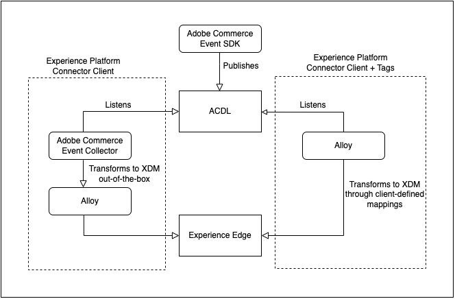

# Coletar dados de comércio usando tags do Adobe Experience Platform

Embora você possa usar o conector do Experience Platform para publicar e assinar eventos de loja, alguns comerciantes já podem estar usando uma solução de coleta de dados, como o [Tags do Adobe Experience Platform](https://experienceleague.adobe.com/docs/platform-learn/data-collection/tags/create-a-property.html?lang=en). Para esses comerciantes, o Adobe Commerce fornece uma opção de publicação somente no conector do Experience Platform que usa o SDK de eventos do Adobe Commerce.


_Fluxo de dados do conector de Experience Platform com tags_

Neste tópico, você aprenderá a mapear os valores de evento da loja fornecidos pelo conector do Experience Platform para a solução de tags da Adobe Experience Platform que já está usando.

## Coletar dados de evento do Adobe Commerce

Para coletar dados de evento do Commerce:

- Instale o [SDK de eventos do Adobe Commerce](https://github.com/adobe/commerce-events/tree/main/packages/commerce-events-sdk). Para vitrines do PHP, consulte [instalar](install.md) tópico. Para vitrines do PWA Studio, consulte [guia PWA Studio](https://developer.adobe.com/commerce/pwa-studio/integrations/adobe-commerce/aep/).

   >[!NOTE]
   >
   > Do **not** [configure](connect-data.md) a ID da organização e a ID do armazenamento de dados.

## Mapear dados de vitrine do Commerce para o Adobe Experience Platform

Para mapear os dados da loja do Commerce para o Adobe Experience Platform, configure e instale o seguinte de dentro das tags do Adobe Experience Platform:

1. [Configurar uma propriedade de tag](https://experienceleague.adobe.com/docs/platform-learn/implement-in-websites/configure-tags/create-a-property.html?lang=en) na Coleta de dados do Adobe Experience Platform.

1. Em **Criação**, selecione **Extensões** e instale e configure as seguintes extensões:

   - [Camada de dados do cliente Adobe](https://experienceleague.adobe.com/docs/experience-platform/tags/extensions/adobe/client-data-layer/overview.html)

   - [Adobe Experience Platform Web SDK](https://experienceleague.adobe.com/docs/experience-platform/edge/fundamentals/installing-the-sdk.html)

1. [Publicar tag](https://experienceleague.adobe.com/docs/experience-platform/tags/publish/overview.html) para seu ambiente de desenvolvimento.

1. Siga as **Mapeamento de evento** etapas abaixo para configurar elementos de dados e regras para eventos específicos.

### Mapeamento de evento

Como a coleta de dados usando tags é diferente do uso do SDK de eventos do Adobe Commerce, é importante entender os termos equivalentes usados em ambas as estruturas.

| Termo das tags Adobe Experience Platform | Termo do SDK para eventos do Adobe Commerce |
|---|---|
| _elementos de dados_ | contexto |
| _regras_ | evento |
|  | _condições de regra_ - ouvintes de eventos (de ACDL)<br><br>_ações da regra_ - manipuladores de evento (enviar para o Adobe Experience Platform) |

Quando você atualiza os elementos de dados e as regras nas tags do Adobe Experience Platform com dados de evento específicos do Adobe Commerce, há algumas etapas comuns que você seguirá.

Por exemplo, vamos adicionar a Adobe Commerce `signOut` para tags Adobe Experience Platform. As etapas descritas abaixo, exceto por valores específicos definidos, descrevem como adicionar [elementos de dados](https://experienceleague.adobe.com/docs/experience-platform/collection/e2e.html#data-element) e [regras](https://experienceleague.adobe.com/docs/experience-platform/collection/e2e.html#create-a-rule), que se aplicam a todos os eventos do Adobe Commerce que você está adicionando às tags.

1. Criar um elemento de dados:

   
   _Criar novo elemento de dados_

1. Definir **Nome** para `sign out`.

1. Definir **Extensão** para `Adobe Experience Platform Web SDK`.

1. Definir **Tipo de elemento de dados** para `XDM object`.

1. Selecione o **Sandbox** e **Esquema** que você deseja atualizar.

1. Em **userAccount** > **logout**, defina o **value** em **Logout do visitante** para `1`.

   
   _Atualizar valor de Sair_

1. Selecionar **Salvar**.

1. Criar uma regra:

   
   _Criar nova regra_

1. Selecionar **Adicionar** under **EVENTOS**.

1. Definir **Extensão** para `Adobe Client Data Layer`.

1. Definir **Tipo de evento** para `Data Pushed`.

1. Selecionar **Evento específico** e defina a **Evento/Chave para registrar-se para** para `sign-out`.

1. Selecionar **Manter alterações** para salvar a nova regra.

1. Adicione uma ação .

1. Definir **Extensão** para `Adobe Experience Platform Web SDK`.

1. Definir **Tipo de ação** para `Send Event`.

1. Definir **Instância** para `Alloy`.

1. Definir **Tipo** para `userAccount.logout`.

1. Definir **Dados XDM** para `%sign out%`.

1. Clique em **Salvar**.

   Você criou um elemento de dados no esquema para a variável `signOut` do Adobe Commerce. Além disso, você criou uma regra com uma ação específica que deve ocorrer quando o evento for acionado na loja da Adobe Commerce.

Repita as etapas acima nas tags para cada um dos eventos do Adobe Commerce descritos abaixo.

### Eventos disponíveis

Para cada um dos eventos a seguir, mapeie os eventos do Adobe Commerce para seu XDM seguindo as etapas acima.

- [&quot;signOut&quot;](#signout)
- [&quot;signIn&quot;](#signin)
- [&quot;createAccount&quot;](#createaccount)
- [`editAccount`](#editaccount)
- [`pageView`](#pageview)
- [`productView`](#productview)
- [&quot;searchRequestSent&quot;](#searchrequestsent)
- [&quot;searchResponseReceived&quot;](#searchresponsereceived)
- [`addToCart`](#addtocart)
- [&quot;viewCart&quot;](#viewcart)
- [&quot;removeFromCart&quot;](#removefromcart)
- [&quot;initiateCheckout&quot;](#initiatecheckout)
- [&quot;placeOrder&quot;](#placeorder)

### signOut {#signout}

#### Elementos de dados

Crie o seguinte elemento de dados:

1. Fazer logoff:

   - **Nome**: `Sign out`
   - **Extensão**: `Adobe Experience Platform Web SDK`
   - **Tipo de elemento de dados**: `XDM object`
   - **Grupo de campos**: `userAccount` > `logout`
   - **Logout do visitante**: **Valor** = `1`

#### Regras 

- **Nome**: `Sign out`
- **Extensão**: `Adobe Client Data Layer`
- **Tipo de evento**: `Data Pushed`
- **Evento específico**: `sign-out`

##### Ações

- **Extensão**: `Adobe Experience Platform Web SDK`
- **Tipo de ação**: `Send event`
- **Tipo**: `userAccount.logout`
- **Dados XDM**: `%sign-out%`

### signIn {#signin}

#### Elementos de dados

Crie os seguintes elementos de dados:

1. E-mail da conta:

   - **Nome**: `account email`
   - **Extensão**: `Adobe Client Data Layer`
   - **Tipo de elemento de dados**: `Data Layer Computed State`
   - **[Opcional] caminho**: `accountContext.emailAddress`

1. Tipo de conta:

   - **Nome**: `account type`
   - **Extensão**: `Adobe Client Data Layer`
   - **Tipo de elemento de dados**: `Data Layer Computed State`
   - **[Opcional] caminho**: `accountContext.accountType`

1. ID da conta:

   - **Nome**: `account id`
   - **Extensão**: `Adobe Client Data Layer`
   - **Tipo de elemento de dados**: `Data Layer Computed State`
   - **[Opcional] caminho***: `accountContext.accountId`

1. Fazer logon:

   - **Nome**: `sign in`
   - **Extensão**: `Adobe Experience Platform Web SDK`
   - **Tipo de elemento de dados**: `XDM object`
   - **Grupo de campos**: `person` > `accountID`
   - **ID da conta**: **Valor** = `%account id%`
   - **Grupo de campos**: `person` > `accountType`
   - **Tipo de conta**: **Valor** = `%account type%`
   - **Grupo de campos**: `person` > `personalEmailID`
   - **Endereço de email pessoal**: **Valor** = `%account email%`
   - **Grupo de campos**: `personalEmail` > `address`
   - **Endereço**: **Valor** = `%account email%`
   - **Grupo de campos**: `userAccount` > `login`
   - **Logon do visitante**: **Valor** = `1`

#### Regras 

- **Nome**: `sign in`
- **Extensão**: `Adobe Client Data Layer`
- **Tipo de evento**: `Data Pushed`
- **Evento específico**: `sign-in`

##### Ações

- **Extensão**: `Adobe Experience Platform Web SDK`
- **Tipo de ação**: `Send event`
- **Tipo**: `userAccount.login`
- **Dados XDM**: `%sign in%`

### createAccount {#createaccount}

#### Elementos de dados

Crie os seguintes elementos de dados:

1. E-mail da conta:

   - **Nome**: `account email`
   - **Extensão**: `Adobe Client Data Layer`
   - **Tipo de elemento de dados**: `Data Layer Computed State`
   - **[Opcional] caminho**: `accountContext.emailAddress`

1. Tipo de conta:

   - **Nome**: `account type`
   - **Extensão**: `Adobe Client Data Layer`
   - **Tipo de elemento de dados**: `Data Layer Computed State`
   - **[Opcional] caminho**: `accountContext.accountType`

1. ID da conta:

   - **Nome**: `account id`
   - **Extensão**: `Adobe Client Data Layer`
   - **Tipo de elemento de dados**: `Data Layer Computed State`
   - **[Opcional] caminho**: `accountContext.accountId`

1. Criar conta:

   - **Nome**: `Create account`
   - **Extensão**: `Adobe Experience Platform Web SDK`
   - **Tipo de elemento de dados**: `XDM object`
   - **Grupo de campos**: `person` > `accountID`
   - **ID da conta**: **Valor** = `%account id%`
   - **Grupo de campos**: `person` > `accountType`
   - **Tipo de conta**: **Valor** = `%account type%`
   - **Grupo de campos**: `person` > `personalEmailID`
   - **Endereço de email pessoal**: **Valor** = `%account email%`
   - **Grupo de campos**: `personalEmail` > `address`
   - **Endereço**: **Valor** = `%account email%`
   - **Grupo de campos**: `userAccount` > `createProfile`
   - **Criação de perfil da conta**: **Valor** = `1`

#### Regras 

- **Nome**: `Create account`
- **Extensão**: `Adobe Client Data Layer`
- **Tipo de evento**: `Data Pushed`
- **Evento específico**: `create-account`

##### Ações

- **Extensão**: `Adobe Experience Platform Web SDK`
- **Tipo de ação**: `Send event`
- **Tipo**: `userAccount.createProfile`
- **Dados XDM**: `%create account%`

### editAccount {#editaccount}

#### Elementos de dados

Crie os seguintes elementos de dados:

1. E-mail da conta:

   - **Nome**: `account email`
   - **Extensão**: `Adobe Client Data Layer`
   - **Tipo de elemento de dados**: `Data Layer Computed State`
   - **[Opcional] caminho**: `accountContext.emailAddress`

1. Tipo de conta:

   - **Nome**: `account type`
   - **Extensão**: `Adobe Client Data Layer`
   - **Tipo de elemento de dados**: `Data Layer Computed State`
   - **[Opcional] caminho**: `accountContext.accountType`

1. ID da conta:

   - **Nome**: `account id`
   - **Extensão**: `Adobe Client Data Layer`
   - **Tipo de elemento de dados**: `Data Layer Computed State`
   - **[Opcional] caminho**: `accountContext.accountId`

1. Editar conta:

   - **Nome**: `Edit account`
   - **Extensão**: `Adobe Experience Platform Web SDK`
   - **Tipo de elemento de dados**: `XDM object`
   - **Grupo de campos**: `person` > `accountID`
   - **ID da conta**: **Valor** = `%account id%`
   - **Grupo de campos**: `person` > `accountType`
   - **Tipo de conta**: **Valor** = `%account type%`
   - **Grupo de campos**: `person` > `personalEmailID`
   - **Endereço de email pessoal**: **Valor** = `%account email%`
   - **Grupo de campos**: `personalEmail` > `address`
   - **Endereço**: **Valor** = `%account email%`
   - **Grupo de campos**: `userAccount` > `updateProfile`
   - **Criação de perfil da conta**: **Valor** = `1`

#### Regras

- **Nome**: `Edit account`
- **Extensão**: `Adobe Client Data Layer`
- **Tipo de evento**: `Data Pushed`
- **Evento específico**: `edit-account`

##### Ações

- **Extensão**: `Adobe Experience Platform Web SDK`
- **Tipo de ação**: `Send event`
- **Tipo**: `userAccount.updateProfile`
- **Dados XDM**: `%edit account%`

### pageView {#pageview}

#### Elementos de dados

Crie os seguintes elementos de dados:

1. Nome da página:

   - **Nome**: `page name`
   - **Extensão**: `Adobe Client Data Layer`
   - **Tipo de elemento de dados**: `Data Layer Computed State`
   - **[Opcional] caminho**: `pageContext.pageName`

#### Regras 

- **Nome**: `page view`
- **Extensão**: `Adobe Client Data Layer`
- **Tipo de evento**: `Data Pushed`
- **Evento específico**: `page-view`

##### Ações

- **Extensão**: `Adobe Experience Platform Web SDK`
- **Tipo de ação**: `Send event`
- **Tipo**: `web.webPageDetails.pageViews`
- **Dados XDM**: `%page view%`

### productView {#productview}

#### Elementos de dados

Crie os seguintes elementos de dados:

1. Nome do produto:

   - **Nome**: `product name`
   - **Extensão**: `Adobe Client Data Layer`
   - **Tipo de elemento de dados**: `Data Layer Computed State`
   - **[Opcional] caminho**: `productContext.name`

1. SKU do produto:

   - **Nome**: `product sku`
   - **Extensão**: `Adobe Client Data Layer`
   - **Tipo de elemento de dados**: `Data Layer Computed State`
   - **[Opcional] caminho**: `productContext.sku`

1. Moeda do produto:

   - **Nome**: `product currency`
   - **Extensão**: `Adobe Client Data Layer`
   - **Tipo de elemento de dados**: `Data Layer Computed State`
   - **[Opcional] caminho**: `productContext.pricing.currencyCode`

1. Código monetário:

   - **Nome**: `currency code`
   - **Extensão**: `Core`
   - **Tipo de elemento de dados**: `Custom Code`
   - **Abrir editor**:

   ```bash
   return _satellite.getVar('product currency') || _satellite.getVar('storefront').storeViewCurrencyCode
   ```

1. Preço especial:

   - **Nome**: `special price`
   - **Extensão**: `Adobe Client Data Layer`
   - **Tipo de elemento de dados**: `Data Layer Computed State`
   - **[Opcional] caminho**: `productContext.pricing.specialPrice`

1. Preço normal:

   - **Nome**: `regular price`
   - **Extensão**: `Adobe Client Data Layer`
   - **Tipo de elemento de dados**: `Data Layer Computed State`
   - **[Opcional] caminho**: `productContext.pricing.regularPrice`

1. Preço do produto:

   - **Nome**: `product price`
   - **Extensão**: `Core`
   - **Tipo de elemento de dados**: `Custom Code`
   - **Abrir editor**:

   ```bash
   return _satellite.getVar('product regular price') || _satellite.getVar('product special price')
   ```

1. Exibição do produto:

   - **Nome**: `product view`
   - **Extensão**: `Adobe Experience Platform Web SDK`
   - **Tipo de elemento de dados**: `XDM object`
   - **Grupo de campos**: `productListItems`. Selecionar **Fornecer itens individuais** e clique no botão **Adicionar item** botão. Como essa exibição é para um PDP, você pode preencher com um único item.
   - **Grupo de campos**: `productListItems` > `name`
   - **Nome**: **Valor** = `%product name%`
   - **Grupo de campos**: `productListItems` > `SKU`
   - **SKU**: **Valor** = `%product sku%`
   - **Grupo de campos**: `productListItems` > `priceTotal`
   - **Preço total**: **Valor** = `%product price%`
   - **Grupo de campos**: `productListItems` > `currencyCode`
   - **Código monetário**: **Valor** = `%currency code%`
   - **Grupo de campos**: `commerce` > `productViews` > `value`
   - **value**: **Valor** = `1`

#### Regras 

- **Nome**: `product view`
- **Extensão**: `Adobe Client Data Layer`
- **Tipo de evento**: `Data Pushed`
- **Evento específico**: `product-page-view`

##### Ações

- **Extensão**: `Adobe Experience Platform Web SDK`
- **Tipo de ação**: `Send event`
- **Tipo**: `commerce.productViews`
- **Dados XDM**: `%product view%`

### searchRequestSent {#searchrequestsent}

#### Elementos de dados

Crie os seguintes elementos de dados:

1. Entrada de pesquisa

   - **Nome**: `search input`
   - **Extensão**: `Adobe Client Data Layer`
   - **Tipo de elemento de dados**: `Data Layer Computed State`
   - **[Opcional] caminho**: `searchInputContext.units[0]`

1. Pesquisar frase de entrada

   - **Nome**: `search input phrase`
   - **Extensão**: `Core`
   - **Tipo de elemento de dados**: `Custom Code`
   - **Abrir editor**:

   ```bash
   return _satellite.getVar('search input').phrase;
   ```

1. Pesquisar classificação de entrada

   - **Nome**: `search input sort`
   - **Extensão**: `Core`
   - **Tipo de elemento de dados**: `Custom Code`
   - **Abrir editor**:

   ```bash
   const searchInput = _satellite.getVar('search input');
   const sortFromInput = searchInput ? searchInput.sort : [];
   const sort = sortFromInput.map((searchSort) => {
       return {
           attribute: searchSort.attribute,
           order: searchSort.direction,
       };
   });
   return sort;
   ```

1. Pesquisar filtros de entrada

   - **Nome**: `search input filters`
   - **Extensão**: `Core`
   - **Tipo de elemento de dados**: `Custom Code`
   - **Abrir editor**:

   ```bash
   const searchInput = _satellite.getVar('search input');
   const filtersFromInput = searchInput ? searchInput.filter : [];
   const filters = filtersFromInput.map(
       (searchFilter) => {
           let value = [];
           let isRange = false;
           if (searchFilter.eq) {
               value.push(searchFilter.eq);
           } else if (searchFilter.in) {
               value = searchFilter.in;
           } else if (searchFilter.range) {
               isRange = true;
               value.push(String(searchFilter.range.from));
               value.push(String(searchFilter.range.to));
           }
           return {
               attribute: searchFilter.attribute,
               value,
               isRange,
           };
       }
   );
   
   return filters;
   ```

1. Solicitação de pesquisa:

   - **Nome**: `search request`
   - **Extensão**: `Adobe Experience Platform Web SDK`
   - **Tipo de elemento de dados**: `XDM object`
   - **Grupo de campos**: `siteSearch` > `phrase`
   - **value**: Ainda não disponível
   - **Grupo de campos**: `siteSearch` > `sort`. Selecionar **Fornecer todo o objeto**.
   - **Grupo de campos**: `siteSearch` > `filter`. Selecionar **Fornecer todo o objeto**.
   - **Grupo de campos**: `searchRequest` > `value`
   - **value**: **Valor** = `1`

#### Regras 

- **Nome**: `search request sent`
- **Extensão**: `Adobe Client Data Layer`
- **Tipo de evento**: `Data Pushed`
- **Evento específico**: `search-request-sent`

##### Ações

- **Extensão**: `Adobe Experience Platform Web SDK`
- **Tipo de ação**: `Send event`
- **Tipo**: `searchRequest`
- **Dados XDM**: `%search request%`

### searchResponseReceived {#searchresponsereceived}

#### Elementos de dados

Crie os seguintes elementos de dados:

1. Resultados da pesquisa:

   - **Nome**: `search results`
   - **Extensão**: `Adobe Client Data Layer`
   - **Tipo de elemento de dados**: `Data Layer Computed State`
   - **[Opcional] caminho**: `searchResultsContext.units[0]`

1. Número de produtos do resultado da pesquisa:

   - **Nome**: `search result number of products`
   - **Extensão**: `Core`
   - **Tipo de elemento de dados**: `Custom Code`
   - **Abrir editor**:

   ```bash
   return _satellite.getVar('search result').products.length;
   ```

1. Produtos do resultado da pesquisa:

   - **Nome**: `search result products`
   - **Extensão**: `Core`
   - **Tipo de elemento de dados**: `Custom Code`
   - **Abrir editor**:

   ```bash
   const searchResult = _satellite.getVar('search result');
   const productsFromResult = searchResult.products ? searchResult.products : [];
   const products = productsFromResult.map(
       (product) => {
           return { SKU: product.sku, name: product.name };
       }
   );
   return products;
   ```

1. Sugestões do resultado da pesquisa:

   - **Nome**: `search result products`
   - **Extensão**: `Core`
   - **Tipo de elemento de dados**: `Custom Code`
   - **Abrir editor**:

   ```bash
   const searchResult = _satellite.getVar('search result');
   const suggestionsFromResult = searchResult.suggestions ? searchResult.suggestions : [];
   const suggestions = suggestionsFromResult.map((suggestion) => suggestion.suggestion);
   return suggestions;
   ```

1. Resposta de pesquisa:

   - **Nome**: `search response`
   - **Extensão**: `Adobe Experience Platform Web SDK`
   - **Tipo de elemento de dados**: `XDM object`
   - **Grupo de campos**: `siteSearch` > `suggestions`. Selecionar **Fornecer todo o objeto**.
   - **Elemento de dados**: `%search result suggestions%`
   - **Grupo de campos**: `siteSearch` > `numberOfResults`
   - **value**: `%search result number of products%`
   - **Grupo de campos**: `productListItems`. Selecionar **Fornecer todo o objeto**.
   - **Elemento de dados**: `%search result products%`
   - **Grupo de campos**: `searchResponse` > `value`
   - **value**: **Valor** = `1`

#### Regras 

- **Nome**: `search response received`
- **Extensão**: `Adobe Client Data Layer`
- **Tipo de evento**: `Data Pushed`
- **Evento específico**: `search-response-received`

##### Ações

- **Extensão**: `Adobe Experience Platform Web SDK`
- **Tipo de ação**: `Send event`
- **Tipo**: `searchResponse`
- **Dados XDM**: `%search response%`

### addToCart {#addtocart}

#### Elementos de dados

Crie os seguintes elementos de dados:

1. Nome do produto:

   - **Nome**: `product name`
   - **Extensão**: `Adobe Client Data Layer`
   - **Tipo de elemento de dados**: `Data Layer Computed State`
   - **[Opcional] caminho**: `productContext.name`

1. SKU do produto:

   - **Nome**: `product sku`
   - **Extensão**: `Adobe Client Data Layer`
   - **Tipo de elemento de dados**: `Data Layer Computed State`
   - **[Opcional] caminho**: `productContext.sku`

1. Código monetário:

   - **Nome**: `currency code`
   - **Extensão**: `Adobe Client Data Layer`
   - **Tipo de elemento de dados**: `Data Layer Computed State`
   - **[Opcional] caminho**: `productContext.pricing.currencyCode`

1. Preço especial do produto:

   - **Nome**: `product special price`
   - **Extensão**: `Adobe Client Data Layer`
   - **Tipo de elemento de dados**: `Data Layer Computed State`
   - **[Opcional] caminho**: `productContext.pricing.specialPrice`

1. Preço normal do produto:

   - **Nome**: `product regular price`
   - **Extensão**: `Adobe Client Data Layer`
   - **Tipo de elemento de dados**: `Data Layer Computed State`
   - **[Opcional] caminho**: `productContext.pricing.regularPrice`

1. Preço do produto:

   - **Nome**: `product price`
   - **Extensão**: `Core`
   - **Tipo de elemento de dados**: `Custom Code`
   - **Abrir editor**:

   ```bash
   return _satellite.getVar('product regular price') || _satellite.getVar('product special price') 
   ```

1. Carrinho:

   - **Nome**: `cart`
   - **Extensão**: `Adobe Client Data Layer`
   - **Tipo de elemento de dados**: `Data Layer Computed State`
   - **[Opcional] caminho**: `shoppingCartContext`

1. ID do carrinho:

   - **Nome**: `cart id`
   - **Extensão**: `Core`
   - **Tipo de elemento de dados**: `Custom Code`
   - **Abrir editor**:

   ```bash
   return _satellite.getVar('cart').id
   ```

1. Adicionar ao carrinho:

   - **Nome**: `add to cart`
   - **Extensão**: `Adobe Experience Platform Web SDK`
   - **Tipo de elemento de dados**: `XDM object`
   - **Grupo de campos**: `productListItems`. Selecionar **Fornecer itens individuais** e clique no botão **Adicionar item** botão. Como essa exibição é para um PDP, você pode preencher com um único item.
   - **Grupo de campos**: `productListItems` > `name`
   - **Nome**: **Valor** = `%product name%`
   - **Grupo de campos**: `productListItems` > `SKU`
   - **SKU**: **Valor** = `%product sku%`
   - **Grupo de campos**: `productListItems` > `priceTotal`
   - **Preço total**: **Valor** = `%product price%`
   - **Grupo de campos**: `productListItems` > `currencyCode`
   - **Código monetário**: **Valor** = `%currency code%`
   - **Grupo de campos**: `commerce` > `cart` > `cartID`
   - **ID do carrinho**: **Valor** = `%cart id%`
   - **Grupo de campos**: `commerce` > `productListAdds` > `value`
   - **value**: **Valor** = `1`

#### Regras 

- **Nome**: `add to cart`
- **Extensão**: `Adobe Client Data Layer`
- **Tipo de evento**: `Data Pushed`
- **Evento específico**: `add-to-cart`

##### Ações

- **Extensão**: `Adobe Experience Platform Web SDK`
- **Tipo de ação**: `Send event`
- **Tipo**: `commerce.productListAdds`
- **Dados XDM**: `%add to cart%`

### viewCart {#viewcart}

#### Elementos de dados

Crie os seguintes elementos de dados:

1. Loja:

   - **Nome**: `storefront`
   - **Extensão**: `Adobe Client Data Layer`
   - **Tipo de elemento de dados**: `Data Layer Computed State`
   - **[Opcional] caminho**: `storefrontInstanceContext`

1. Carrinho:

   - **Nome**: `cart`
   - **Extensão**: `Adobe Client Data Layer`
   - **Tipo de elemento de dados**: `Data Layer Computed State`
   - **[Opcional] caminho**: `shoppingCartContext`

1. ID do carrinho:

   - **Nome**: `cart id`
   - **Extensão**: `Core`
   - **Tipo de elemento de dados**: `Custom Code`
   - **Abrir editor**:

   ```bash
   return _satellite.getVar('cart').id
   ```

1. Itens da lista de produtos:

   - **Nome**: `product list items:`
   - **Extensão**: `Core`
   - **Tipo de elemento de dados**: `Custom Code`
   - **Abrir editor**:

   ```bash
   const storefrontContext = _satellite.getVar('storefront');
   const cart = _satellite.getVar('cart');
   
   const returnList = [];
   cart.items.forEach(item => {
       const selectedOptions = [];
       item.configurableOptions?.forEach(option => {
           selectedOptions.push({
               attribute: option.optionLabel,
               value: option.valueLabel,
           });
       });
   
       const productListItem = {
           SKU: item.product.sku,
           name: item.product.name,
           quantity: item.quantity,
           priceTotal: item.prices.price.value * item.quantity,
           currencyCode: item.prices.price.currency ? item.prices.price.currency : storefrontContext.storeViewCurrencyCode,
           selectedOptions: selectedOptions,
       };
   
       returnList.push(productListItem);
   });
   return returnList;
   ```

1. Exibir carrinho:

   - **Nome**: `view cart`
   - **Extensão**: `Adobe Experience Platform Web SDK`
   - **Tipo de elemento de dados**: `XDM object`
   - **Grupo de campos**: `productListItems`. Para `productListItems`, pode haver vários itens pré-calculados. Selecionar **productListItems** > **Preencher toda a matriz**.
   - **Elemento de dados**: `%product list items%`
   - **Grupo de campos**: `commerce` > `cart` > `cartID`
   - **ID do carrinho**: **Valor** = `%cart id%`
   - **Grupo de campos**: `commerce` > `productListViews` > `value`
   - **value**: **Valor** = `1`

#### Regras 

- **Nome**: `view cart`
- **Extensão**: `Adobe Client Data Layer`
- **Tipo de evento**: `Data Pushed`
- **Evento específico**: `shopping-cart-view`

##### Ações

- **Extensão**: `Adobe Experience Platform Web SDK`
- **Tipo de ação**: `Send event`
- **Tipo**: `commerce.productListViews`
- **Dados XDM**: `%view cart%`

### removeFromCart {#removefromcart}

#### Elementos de dados

Crie os seguintes elementos de dados:

1. Nome do produto:

   - **Nome**: `product name`
   - **Extensão**: `Adobe Client Data Layer`
   - **Tipo de elemento de dados**: `Data Layer Computed State`
   - **[Opcional] caminho**: `productContext.name`

1. SKU do produto:

   - **Nome**: `product sku`
   - **Extensão**: `Adobe Client Data Layer`
   - **Tipo de elemento de dados**: `Data Layer Computed State`
   - **[Opcional] caminho**: `productContext.sku`

1. Código monetário:

   - **Nome**: `currency code`
   - **Extensão**: `Adobe Client Data Layer`
   - **Tipo de elemento de dados**: `Data Layer Computed State`
   - **[Opcional] caminho**: `productContext.pricing.currencyCode`

1. Preço especial do produto:

   - **Nome**: `product special price`
   - **Extensão**: `Adobe Client Data Layer`
   - **Tipo de elemento de dados**: `Data Layer Computed State`
   - **[Opcional] caminho**: `productContext.pricing.specialPrice`

1. Preço normal do produto:

   - **Nome**: `product regular price`
   - **Extensão**: `Adobe Client Data Layer`
   - **Tipo de elemento de dados**: `Data Layer Computed State`
   - **[Opcional] caminho**: `productContext.pricing.regularPrice`

1. Preço do produto:

   - **Nome**: `product price`
   - **Extensão**: `Core`
   - **Tipo de elemento de dados**: `Custom Code`
   - **Abrir editor**:

   ```bash
   return _satellite.getVar('product regular price') || _satellite.getVar('product special price') 
   ```

1. Carrinho:

   - **Nome**: `cart`
   - **Extensão**: `Adobe Client Data Layer`
   - **Tipo de elemento de dados**: `Data Layer Computed State`
   - **[Opcional] caminho**: `shoppingCartContext`

1. ID do carrinho:

   - **Nome**: `cart id`
   - **Extensão**: `Core`
   - **Tipo de elemento de dados**: `Custom Code`
   - **Abrir editor**:

   ```bash
   return _satellite.getVar('cart').id
   ```

1. Remover do carrinho:

   - **Nome**: `remove from cart`
   - **Extensão**: `Adobe Experience Platform Web SDK`
   - **Tipo de elemento de dados**: `XDM object`
   - **Grupo de campos**: `productListItems`. Selecionar **Fornecer itens individuais** e clique no botão **Adicionar item** botão. Como essa exibição é para um PDP, você pode preencher com um único item.
   - **Grupo de campos**: `productListItems` > `name`
   - **Nome**: **Valor** = `%product name%`
   - **Grupo de campos**: `productListItems` > `SKU`
   - **SKU**: **Valor** = `%product sku%`
   - **Grupo de campos**: `productListItems` > `priceTotal`
   - **Preço total**: **Valor** = `%product price%`
   - **Grupo de campos**: `productListItems` > `currencyCode`
   - **Código monetário**: **Valor** = `%currency code%`
   - **Grupo de campos**: `commerce` > `cart` > `cartID`
   - **ID do carrinho**: **Valor** = `%cart id%`
   - **Grupo de campos**: `commerce` > `productListRemovals` > `value`
   - **value**: **Valor** = `1`

#### Regras 

- **Nome**: `remove from cart`
- **Extensão**: `Adobe Client Data Layer`
- **Tipo de evento**: `Data Pushed`
- **Evento específico**: `remove-from-cart`

##### Ações

- **Extensão**: `Adobe Experience Platform Web SDK`
- **Tipo de ação**: `Send event`
- **Tipo**: `commerce.productListRemovals`
- **Dados XDM**: `%remove from cart%`

### initiateCheckout {#initiatecheckout}

#### Elementos de dados

Crie os seguintes elementos de dados:

1. Loja:

   - **Nome**: `storefront`
   - **Extensão**: `Adobe Client Data Layer`
   - **Tipo de elemento de dados**: `Data Layer Computed State`
   - **[Opcional] caminho**: `storefrontInstanceContext`

1. Carrinho:

   - **Nome**: `cart`
   - **Extensão**: `Adobe Client Data Layer`
   - **Tipo de elemento de dados**: `Data Layer Computed State`
   - **[Opcional] caminho**: `shoppingCartContext`

1. ID do carrinho:

   - **Nome**: `cart id`
   - **Extensão**: `Core`
   - **Tipo de elemento de dados**: `Custom Code`
   - **Abrir editor**:

   ```bash
   return _satellite.getVar('cart').id
   ```

1. Itens da lista de produtos:

   - **Nome**: `product list items`
   - **Extensão**: `Core`
   - **Tipo de elemento de dados**: `Custom Code`
   - **Abrir editor**:

   ```bash
   const storefrontContext = _satellite.getVar('storefront');
   const cart = _satellite.getVar('cart');
   
   const returnList = [];
   cart.items.forEach(item => {
       const selectedOptions = [];
       item.configurableOptions?.forEach(option => {
           selectedOptions.push({
               attribute: option.optionLabel,
               value: option.valueLabel,
           });
       });
   
       const productListItem = {
           SKU: item.product.sku,
           name: item.product.name,
           quantity: item.quantity,
           priceTotal: item.prices.price.value * item.quantity,
           currencyCode: item.prices.price.currency ? item.prices.price.currency : storefrontContext.storeViewCurrencyCode,
           selectedOptions: selectedOptions,
       };
   
       returnList.push(productListItem);
   });
   return returnList;
   ```

1. Iniciar check-out:

   - **Nome**: `initiate checkout`
   - **Extensão**: `Adobe Experience Platform Web SDK`
   - **Tipo de elemento de dados**: `XDM object`
   - **Grupo de campos**: `productListItems`. Para `productListItems`, pode haver vários itens pré-calculados. Selecionar **productListItems** > **Preencher toda a matriz**.
   - **Elemento de dados**: `%product list items%`
   - **Grupo de campos**: `commerce` > `cart` > `cartID`
   - **ID do carrinho**: **Valor** = `%cart id%`
   - **Grupo de campos**: `commerce` > `checkouts` > `value`
   - **value**: **Valor** = `1`

#### Regras 

- **Nome**: `initiate checkout`
- **Extensão**: `Adobe Client Data Layer`
- **Tipo de evento**: `Data Pushed`
- **Evento específico**: `initiate-checkout`

##### Ações

- **Extensão**: `Adobe Experience Platform Web SDK`
- **Tipo de ação**: `Send event`
- **Tipo**: `commerce.checkouts`
- **Dados XDM**: `%initiate checkout%`

### placeOrder {#placeorder}

#### Elementos de dados

Crie os seguintes elementos de dados:

1. Loja:

   - **Nome**: `storefront`
   - **Extensão**: `Adobe Client Data Layer`
   - **Tipo de elemento de dados**: `Data Layer Computed State`
   - **[Opcional] caminho**: `storefrontInstanceContext`

1. Carrinho:

   - **Nome**: `cart`
   - **Extensão**: `Adobe Client Data Layer`
   - **Tipo de elemento de dados**: `Data Layer Computed State`
   - **[Opcional] caminho**: `shoppingCartContext`

1. ID do carrinho:

   - **Nome**: `cart id`
   - **Extensão**: `Core`
   - **Tipo de elemento de dados**: `Custom Code`
   - **Abrir editor**:

   ```bash
   return _satellite.getVar('cart').id
   ```

1. Pedido:

   - **Nome**: `order`
   - **Extensão**: `Adobe Client Data Layer`
   - **Tipo de elemento de dados**: `Data Layer Computed State`
   - **[Opcional] caminho**: `orderContext`

1. Pedido de comércio:

   - **Nome**: `commerce order`
   - **Extensão**: `Core`
   - **Tipo de elemento de dados**: `Custom Code`
   - **Abrir editor**:

   ```bash
   const order = _satellite.getVar('order');
   const storefront = _satellite.getVar('storefront');
   
   if (order.payments && order.payments.length) {
       payments = order.payments.map(payment => {
           return {
               paymentAmount: payment.total,
               paymentType: payment.paymentMethodCode,
               transactionID: order.orderId.toString(),
           };
       });
   } else {
       payments = [
           {
               paymentAmount: order.grandTotal,
               paymentType: order.paymentMethodCode,
               transactionID: order.orderId.toString(),
           },
       ];
   }
   
   return {
       purchaseID: order.orderId.toString(),
       currencyCode: storefront.storeViewCurrencyCode,
       payments,
   };
   ```

1. Envio de pedidos:

   - **Nome**: `order shipping`
   - **Extensão**: `Core`
   - **Tipo de elemento de dados**: `Custom Code`
   - **Abrir editor**:

   ```bash
   const order = _satellite.getVar('order');
   return {
       shippingMethod: order.shipping.shippingMethod,
       shippingAmount: order.shipping.shippingAmount || 0,
   }
   ```

1. ID de promoção:

   - **Nome**: `promotion id`
   - **Extensão**: `Core`
   - **Tipo de elemento de dados**: `Custom Code`
   - **Abrir editor**:

   ```bash
   return _satellite.getVar('order').appliedCouponCode
   ```

1. Itens da lista de produtos:

   - **Nome**: `product list items`
   - **Extensão**: `Core`
   - **Tipo de elemento de dados**: `Custom Code`
   - **Abrir editor**:

   ```bash
   const storefrontContext = _satellite.getVar('storefront');
   const cart = _satellite.getVar('cart');
   
   const returnList = [];
   cart.items.forEach(item => {
       const selectedOptions = [];
       item.configurableOptions?.forEach(option => {
           selectedOptions.push({
               attribute: option.optionLabel,
               value: option.valueLabel,
           });
       });
   
       const productListItem = {
           SKU: item.product.sku,
           name: item.product.name,
           quantity: item.quantity,
           priceTotal: item.prices.price.value * item.quantity,
           currencyCode: item.prices.price.currency ? item.prices.price.currency : storefrontContext.storeViewCurrencyCode,
           selectedOptions: selectedOptions,
       };
   
       returnList.push(productListItem);
   });
   return returnList;
   ```

1. Colocar pedido:

   - **Nome**: `place order`
   - **Extensão**: `Adobe Experience Platform Web SDK`
   - **Tipo de elemento de dados**: `XDM object`
   - **Grupo de campos**: `productListItems`. Para `productListItems`, pode haver vários itens pré-calculados. Selecionar **productListItems** > **Preencher toda a matriz**.
   - **Elemento de dados**: `%product list items%`
   - **Grupo de campos**: `commerce` > `order`
   - **Identificador exclusivo**: **Valor** = `%commerce order%`
   - **Grupo de campos**: `commerce` > `shipping`
   - **Identificador exclusivo**: **Valor** = `%order shipping%`
   - **Grupo de campos**: `commerce` > `promotionID`
   - **ID de promoção**: **Valor** = `%promotion id%`
   - **Grupo de campos**: `commerce` > `purchases` > `value`
   - **value**: **Valor** = `1`

#### Regras 

- **Nome**: `place order`
- **Extensão**: `Adobe Client Data Layer`
- **Tipo de evento**: `Data Pushed`
- **Evento específico**: `place-order`

##### Ações

- **Extensão**: `Adobe Experience Platform Web SDK`
- **Tipo de ação**: `Send event`
- **Tipo**: `commerce.order`
- **Dados XDM**: `%place order%`

## Definindo identidade

Os perfis do conector do Experience Platform são unidos e gerados com base no `personID` e `personalEmail` campos de identidade em eventos de experiência XDM. 

Se você tiver uma configuração anterior que depende de campos diferentes, poderá continuar a usá-los. Para definir os campos de identidade do perfil do conector de Experience Platform, você deve definir os seguintes campos:

- `personalEmail` - Somente eventos de conta - siga as etapas descritas acima para eventos de conta
- `personID` - Todos os outros acontecimentos:

   - Se você já estiver capturando `ECID` em tags, você pode definir `personID` em todas as regras do SDK da Web da Adobe Experience Platform para `%ECID%`.
   - Para capturar `ECID` nas tags , é necessário adicionar um **Código personalizado** para enviar regras de evento seguindo a [Documentação de tags](https://experienceleague.adobe.com/docs/experience-platform/edge/extension/accessing-the-ecid.html). Veja o exemplo abaixo.

### Exemplo

As imagens a seguir mostram como configurar um `pageView` com `personID` no conector Experience Platform:

1. Configure o elemento de dados com código personalizado para ECID:

   
   _Configurar elemento de dados com código personalizado_

1. Adicionar código personalizado ECID:

   
   _Código para definir o ECID no elemento de dados_

1. Atualizar esquema XDM com personID definido como ECID:

   
   _Definir personID como ECID_

1. Defina as ações da regra que recuperam a ECID:

   
   _Recuperar ECID_

## Configuração do consentimento

O consentimento da coleta de dados do conector do Adobe Commerce e Experience Platform é ativado por padrão. O cancelamento é gerenciado por meio da variável [`mg_dnt` cookie](https://docs.magento.com/user-guide/stores/cookie-reference.html). Você pode seguir as etapas descritas aqui se optar por usar `mg_dnt` para gerenciar o consentimento. O [Documentação do SDK da Web da Adobe Experience Platform](https://experienceleague.adobe.com/docs/experience-platform/edge/consent/supporting-consent.html?lang=en) O tem várias opções adicionais para gerenciar o consentimento.

1. Crie um **Código personalizado principal** elemento de dados (`%do not track cookie%`) para o `mg_dnt` cookie:

   
   _Criar não rastrear o elemento de dados_

1. Crie um **Código personalizado principal** elemento de dados (`%consent%`) que retorna `out` se o cookie estiver definido e `in` do contrário:

   
   _Criar elemento de dados de consentimento_

1. Configurar a extensão Adobe Experience Platform Web SDK com `%consent%` elemento de dados:

   
   _Atualizar o SDK com consentimento_

## Avisos

- Não seguir as etapas para desativar a coleta de Experience Platform resulta na contagem dupla dos eventos
- Não configurar mapeamentos/eventos conforme descrito neste tópico pode afetar as placas do Adobe Analytics
- Não é possível configurar o Target pelo conector Experience Platform, se a coleta de dados estiver desativada
