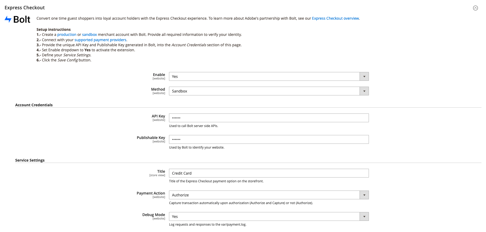

# [!DNL Express Checkout] integração

>[!IMPORTANT]
>
> Esse recurso destina-se somente aos usuários do EAP (Early Adobe Program) e ainda não está acessível para todos os clientes. Atualmente limitado a clientes dos EUA. Entre em contato com o Suporte da Adobe Commerce para obter assistência e perguntas.

Para começar a usar o [!DNL Express Checkout] para a extensão Adobe Commerce, você deve concluir algumas etapas de integração para conectar sua instância com nossa funcionalidade de check-out.

1. [Obter extensão](#get-extension).
1. [Criar uma conta comercial de produção ou sandbox com [!DNL Bolt]](#create-account-with-bolt). Forneça todas as informações necessárias para verificar sua identidade.
1. [Forneça a chave da API exclusiva e a chave publicável geradas em [!DNL Bolt]](#obtain-api-credentials).
1. [Configure um provedor de pagamento no [!DNL Bolt] account](#configure-payment-providers).
1. [Defina a lista suspensa Ativar como Sim](#enable-extension) para ativar a extensão.
1. [Definir as configurações do serviço](#complete-admin-configuration) para configurar o [!DNL Express Checkout] extensão.
1. [Clique no botão Salvar configuração](#enable-live-express-checkout) para ativar a extensão.

>[!NOTE]
>
> Se você não configurar o [!DNL Bolt] contas (etapa 2 acima) não é possível configurar os ambientes sandbox ou de produção.

## Pré-requisitos

Para usar o [!DNL Express Checkout], você deve ter o seguinte disponível para [!DNL Bolt]:

- Fornecedores de pagamento suportados
- Conta de produto e produção em [!DNL Bolt]
- API e chave Publicável gerada em [!DNL Bolt]

Consulte a [pré-requisitos](../express-checkout/prerequisites.md) para obter mais informações.

Consulte [Credenciais da API](#obtain-api-credentials) para saber como criar ou acessar as chaves de API da sua instância.

## Obter extensão

Consulte a [instalar](../express-checkout/install.md) para obter informações detalhadas sobre como obter a extensão do .

## Criar conta com Bolt

Antes de configurar o [!DNL Express Checkout] no administrador do Adobe Commerce, é necessário criar um [sandbox](https://merchant-sandbox.bolt.com/register){target=&quot;_blank&quot;} e [produção](https://merchant.bolt.com/register){target=&quot;_blank&quot;} conta comercial no [!DNL Bolt]. Forneça todos os detalhes necessários para criar uma conta no [!DNL Bolt].

Consulte a [testar e validar](../express-checkout/testing.md) para obter mais informações.

## Obter credenciais da API

Para usar o [!DNL Express Checkout] é necessário [!DNL Bolt] chaves exclusivas. Obtenha as seguintes chaves de API navegando até **Desenvolvedores** > **API** > **Teclas** no **Painel Bolt Merchant**.

- Chave da API: Uma chave privada usada pelo back end para interagir com o [!DNL Bolt] APIs.
- Chave publicável: Uma chave usada pelo front-end para interagir com [!DNL Bolt] APIs.

Consulte a [[!DNL Bolt] detalhes do ambiente](https://help.bolt.com/developers/references/environment-details/#about-keys)página {target=&quot;_blank&quot;} para saber mais sobre a API e as chaves para publicação do [!DNL Express Checkout] extensão.

>[!CAUTION]
>
> Você deve criar chaves de API para ambientes de sandbox e de produção.

## Configurar provedores de pagamento

Para conectar seu provedor de serviços de pagamento, siga as etapas descritas na [configuração do processador](https://help.bolt.com/integrations/adobe-express-checkout/set-up/)desenvolvedor {target=&quot;_blank&quot;} [!DNL Bolt] página.

## Habilitar extensão

1. No _Administrador_ barra lateral, navegue até **Lojas** > **Configuração** > **Check-out** para acessar a página Configuração do administrador de finalização .

   

1. No [!DNL Express Checkout] exibir, definir **Habilitar** para `Yes`.
1. Selecione o método (sandbox ou produção) a ser usado.

   - Sandbox para fins de teste e desenvolvimento
   - Produção para processar transações com o processador de pagamento ao vivo

1. Valide as credenciais depois de fornecer sua API exclusiva e chaves editáveis.

>[!CAUTION]
>
> Você deve fornecer API exclusiva e chaves Publicáveis antes de habilitar a extensão; caso contrário, os clientes verão um formulário de pagamento e não poderão fazer um pedido.

## Configuração completa do administrador

1. No _Administrador_ barra lateral, navegue até **Lojas** > **Configuração** > **Check-out** para acessar a página de configuração geral do administrador de check-out .
1. No _Configurações de serviço_ , forneça todos os detalhes necessários para habilitar a extensão do .
1. Definir _Ação de pagamento_ como:

   - Autorizar: Não capture a transação automaticamente após a autorização.
   - Autorizar e capturar: Capture a transação automaticamente após a autorização.

Para obter mais informações sobre as opções de check-out padrão do Adobe Commerce, consulte [checkout](https://docs.magento.com/user-guide/configuration/sales/checkout.html) tópico.

## Habilitar check-out do live express

Para ativar o [!DNL Express Checkout] para extensão Adobe Commerce:

1. Clique em **Salvar configuração**.
1. Navegar para **[!UICONTROL System]** > **[!UICONTROL Cache Management]** e clique em **[!UICONTROL Flush Cache]** para atualizar todos os caches inválidos.

## Obter ajuda

O processo de integração foi projetado para orientá-lo pelas etapas necessárias para configurar e ativar o [!DNL Express Checkout] funcionalidade. Contato [!DNL Adobe Commerce] equipe de engenharia por meio do Slack atribuído [Canal de programas Adobe Beta](http://adobe-beta-programs.slack.com/) para qualquer assistência.

Consulte a [testar e validar](../express-checkout/testing.md) para obter mais informações.
