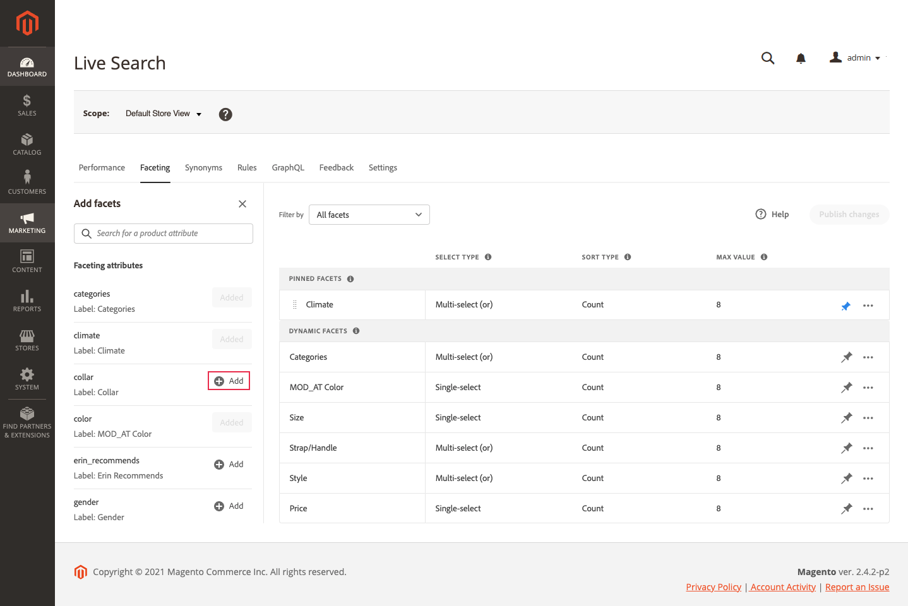

# Adicionar aspectos

Qualquer atributo de produto filtrável pode ser usado como uma faceta. O *Adicionar aspectos* O painel lista as facetas atuais e facilita a atribuição de atributos de produto adicionais como facetas. Durante esse processo de três etapas, um atributo é escolhido para ser usado como uma faceta, as propriedades são editadas, se necessário, e as alterações são publicadas na loja.

## Etapa 1: Adicionar uma faceta

1. Em Admin, acesse **Marketing** > SEO &amp; Pesquisar > **[!DNL Live Search]**.
1. No *Faceta* clique em **Adicionar aspectos**.
1. No *Adicionar aspectos* lista, cada atributo disponível tem um atributo separado *Adicionar* botão. Siga um destes procedimentos:

   

   * No *Atributos de faceta* escolha o atributo de produto que deseja usar como uma faceta e clique em **Adicionar**.
   * Para localizar um atributo de produto específico, insira os primeiros caracteres do nome do atributo no *Pesquisar* caixa. Em seguida, clique em **Adicionar**.

      Para configurar intervalos e agrupamentos de lapidamento de preço, consulte [Configurações](settings.md). Para saber mais, acesse [Tipos de faceta](facets-type.md).
A faceta é adicionada à parte inferior da *Aspectos dinâmicos* e a *Publicar alterações* torna-se disponível.
   

1. Se a faceta que deseja adicionar não puder ser encontrada, acesse **Lojas** > Atributos > **Produto** e verifique se o atributo tem a variável [propriedades necessárias](facets.md) para ser usado como uma faceta. Se necessário, atualize as seguintes propriedades de loja do atributo:

   * Usar na pesquisa - `Yes`
   * Usar na navegação em camadas dos resultados da pesquisa - `Yes`
   * Usar na navegação em camadas - `Filterable (with results)`

1. Quando solicitado, atualize o cache.

   A faceta fica disponível na loja na próxima vez que o catálogo for sincronizado com [!DNL Live Search]. Se a faceta não estiver disponível após duas horas, consulte [Sincronizar dados do catálogo](install.md#synchronize-catalog-data).

## Etapa 2: Editar propriedades de faceta (opcional)

1. Para editar as propriedades da faceta, clique em **Mais** () na coluna da extrema direita.
1. No menu, clique em **Editar**. Em seguida, ajuste as seguintes propriedades, conforme necessário.

   * Rótulo - ([Cabeça](facets-type.md) somente) Insira o rótulo da faceta que deseja usar.
   * Selecionar tipo - O *Selecionar tipo* usado para todos [!DNL Commerce] vitrines é `single select`. Para implementações sem periféricos, `multi-select` pode ser atribuído com um operador lógico (`or` ou `and`) para determinar o conjunto de produtos retornados.
   * Tipo de classificação - as Facetas são classificadas alfabeticamente para todas [!DNL Commerce] vitrines. Para implementações sem cabeçalho, as facetas podem ser classificadas alfabeticamente ou por contagem. Opções: Alfabético, Contagem (somente sem cabeçalho)
   * Valor máx. - Insira o número máximo de valores de faceta exibidos na loja. Entradas válidas: 0 - 30; Padrão: 8

1. Ao concluir, clique em **Salvar**.

   

1. Para fixar a faceta na parte superior do *Filtros* clique no pino cinza ().
1. Para alterar a ordem da faceta fixa, clique no botão **Mover** () e arraste a linha para uma nova posição na *Aspectos fixados* seção.

## Etapa 3: Publicar alterações

1. Quando a faceta estiver concluída, clique em **Publicar alterações**.
1. Aguarde até que a faceta apareça na loja.
Se a faceta não estiver disponível após duas horas, consulte [Verificar exportação](install.md#synchronize-catalog-data) nas instruções de instalação.

## Descrições dos campos

| Campo | Descrição |
|--- |--- |
| Rótulo | ([Cabeça](facets-type.md) only) A variável [rótulo da faceta](facets-type.md) que é visível na loja pode ser editada para fins de consistência com sua marca. |
| Selecionar tipo | Exibe a [método de seleção](facets-type.md) que está associada ao atributo do produto. Todas as facetas na [!DNL Commerce] vitrines são `Single select` somente. As implementações headless também suportam `Multi-select` com os operadores lógicos `OR` e `AND`. |
| Tipo de classificação | O método usado para [sort](facets-type.md) aspectos. Todos [!DNL Commerce] as vitrines classificam somente alfabeticamente as facetas. As implementações headless também podem ser classificadas por `Count`. Opções: Alfabético - Classifica facetas alfabeticamente. Contagem - (Somente sem cabeçalho) Classifica aspectos com base no número de correspondências encontradas. |
| Valor máx. | O número máximo de valores que podem ser exibidos na loja para cada faceta. As facetas que representam um intervalo de valores são distribuídas uniformemente. Entradas válidas: 0 - 30; Padrão: 8 |

### Controles

| Controle | Descrição |
|--- |--- |
|  | Fixa ou desvincula uma faceta à parte superior do *Filtros* lista. |
|  | Exibe um menu com mais ações que podem ser aplicadas à faceta selecionada. Opções: Editar, Excluir |
|  | Use o *Mover* ícone para arrastar uma faceta fixa para outro local na *Aspectos fixados* seção. |
