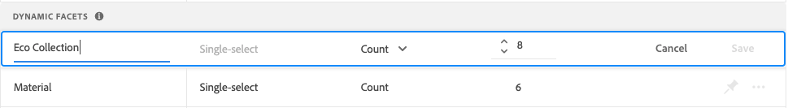

# Gerenciar aspectos

Siga estas instruções para atualizar as propriedades de facetas existentes ou alterar sua apresentação na loja.

## Configurar agrupamentos de facetas de preço

Consulte [Configurações](settings.md) para configurar intervalos e agrupamentos de lapidamento de preço.

## Editar faceta

1. Encontre a faceta que deseja editar.
1. Se houver muitas facetas na lista, defina *Filtrar por* para um dos seguintes:

   * Fixo
   * Dinâmico

   Para saber mais, acesse [Tipos de faceta](facets-type.md).

   

1. Para editar as propriedades da faceta, clique em **Mais** (...) opções.
1. Clique em **Editar**

   

1. Para editar o rótulo da faceta, siga um destes procedimentos:

   * Para um [!DNL Commerce] loja, edite a [rótulo do atributo](https://docs.magento.com/user-guide/stores/attributes-product.html).
   * Para uma implementação sem cabeçalho, clique no valor na primeira coluna e edite o texto conforme necessário.

   

1. (Somente cabeçalho) Para alterar o método usado para classificar valores de aspecto, clique no valor na *Tipo de classificação* e escolha uma das seguintes opções:

   * Alfabético
   * Contagem

   

1. No **Valor máx.** , defina o número máximo (de 0 a 10) dos valores do filtro de faceta a serem exibidos na loja.
1. Ao concluir, clique em **Salvar**.
Suas alterações não aparecerão na loja até que sejam publicadas.

## Fixar/desafixar faceta

O pino muda de cor ao ser clicado e é usado para mover a faceta para o *Aspectos fixados* ou *Aspectos dinâmicos* seção.

1. Para fixar uma faceta na parte superior do *Filtros* localize a faceta na lista *Aspectos dinâmicos* e clique no pino cinza (.
O pino fica azul e a faceta move-se para *Aspectos fixados* seção.
1. Para desafixar uma faceta, encontre a faceta na *Aspectos fixados* e clique no pino azul (.
O pino fica cinza e a faceta move-se para o *Aspectos dinâmicos* seção.

   

## Mover faceta afixada

A ordem das facetas fixadas pode ser alterada movendo a linha para uma posição diferente. As facetas fixadas têm um *Mover* ícone ( no início da linha. Ao contrário dos aspectos fixados, os aspectos dinâmicos não podem ser movidos.

1. Encontre a faceta na *Aspectos fixados* da lista.
1. Use o **Mover** ( ícone para arrastar a linha para uma nova posição na *Aspectos fixados* seção.
Depois que as alterações forem publicadas, as facetas reordenadas aparecerão na loja *Filtros* lista.

## Excluir faceta

1. Encontre a faceta na lista e clique em **Mais** (...) opções.
1. Clique em **Excluir**.
1. Quando solicitado a confirmar, clique em **Excluir faceta**.
A faceta é removida da loja após as alterações serem publicadas.

## Publicar alterações

1. Para atualizar a loja com suas alterações, clique em **Publicar alterações**.
1. Aguarde cerca de quinze minutos para que as atualizações apareçam em sua loja.
