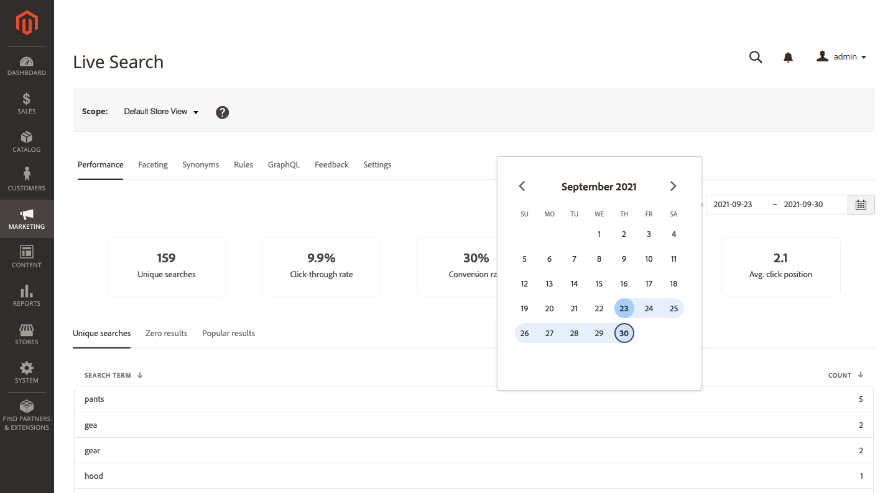
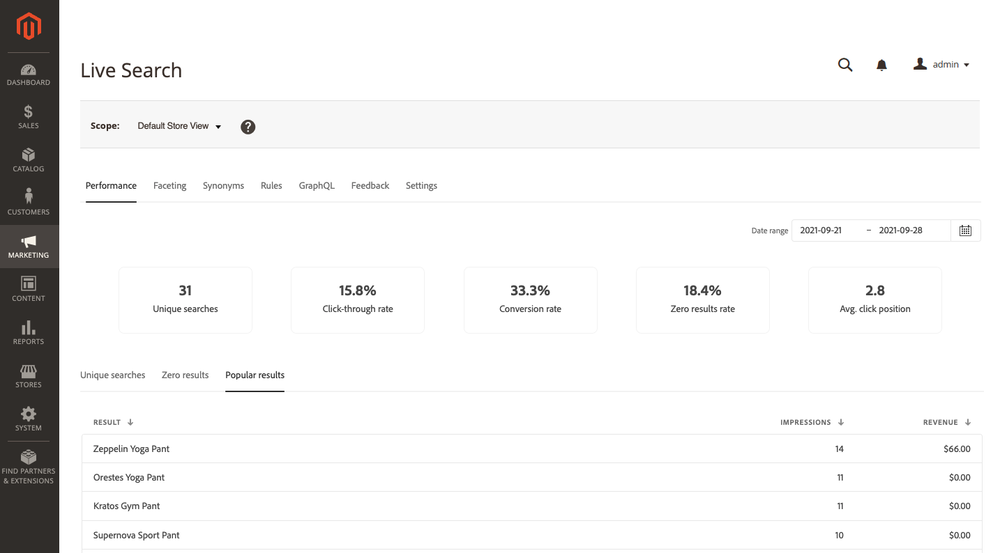

# Desempenho

O [!DNL Live Search] O painel de desempenho fornece informações sobre os termos de pesquisa que os compradores usam. As informações podem ser usadas para identificar tendências, aumentar o click-through e melhorar a taxa de conversão. O painel Desempenho fornece um instantâneo das métricas de pesquisa para um intervalo de datas específico e inclui os seguintes relatórios:

* Pesquisas exclusivas
* Resultados zero
* Resultados populares

## Exibir um relatório

1. Para inserir o **Intervalo de datas**, clique no calendário () e siga um destes procedimentos:

   * Para especificar uma única data, clique duas vezes na data no calendário.
   * Para especificar um intervalo de datas, clique na primeira e última data no calendário.

   

1. Clique na guia do relatório que deseja visualizar.

   

## Descrições dos campos

| Dados de instantâneo | Descrição |
|--- |--- |
| Pesquisas exclusivas | O número total de pesquisas exclusivas para o intervalo de datas especificado. Várias pesquisas pelo mesmo comprador, mesmo se para o mesmo query, são consideradas exclusivas se enviadas com mais de uma hora de intervalo. |
| Índice de click-through | A porcentagem de pesquisas concluídas com o comprador clicando em um produto. Por exemplo, a taxa de cliques é de 50% se o comprador pesquisar por &quot;calças&quot; e &quot;camisetas&quot; e, em seguida, clicar em um resultado na pesquisa &quot;camisetas&quot;. |
| Índice de conversão | A porcentagem de produtos que o comprador compra em comparação ao número de produtos em que o comprador clica para o intervalo de datas especificado. Por exemplo, a taxa de conversão da interação é de 100% se o comprador visualizar seis produtos na loja, clicar em um e fazer uma compra.   A taxa de conversão não é afetada pelo número de visualizações de um determinado produto. Por exemplo, a taxa de conversão permanece a mesma se o comprador usar a pesquisa, mas não clicar em nenhum produto. |
| Taxa de resultados zero | A porcentagem de pesquisas exclusivas que não retorna resultados para o intervalo de datas especificado. Por exemplo, a taxa de resultados zero é de 66,67% se o comprador pesquisar por &quot;fjjjfjf&quot; duas vezes (sem resultados) e por &quot;calças&quot; uma vez (com resultados). |
| Média posição do clique | A posição relativa da taxa média de click-through com base em pesquisas exclusivas para o intervalo de datas especificado. |

| Relatórios | Descrição |
|--- |--- |
| Pesquisas exclusivas | Lista as consultas de pesquisa exclusivas utilizadas durante o intervalo de datas especificado. Os dados do relatório são calculados da mesma forma que os dados exclusivos do instantâneo de pesquisa. Se um comprador digitar a mesma consulta de pesquisa duas vezes, mas com mais de uma hora de intervalo, a pesquisa será considerada duas pesquisas exclusivas. Limite do relatório: 500 termos principais |
| Resultados zero | Lista as consultas de pesquisa que não retornam resultados e o número de vezes usadas durante o intervalo de datas especificado. Limite do relatório: 500 termos principais |
| Resultados populares | Lista os nomes dos produtos que receberam mais visualizações durante o intervalo de datas especificado. Os resultados populares são calculados somente com base em impressões e não são afetados pelo número de cliques ou receita gerada. Limite do relatório: 500 termos principais |
