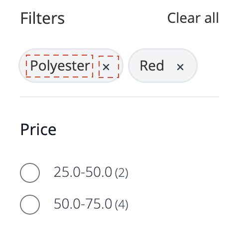

# Widget da página de listagem de produtos

A variável [!DNL Live Search Product Listing Page Widget] (PLP) usa a plataforma Commerce Services para fornecer uma página de listagem de produtos com desempenho, pesquisável e facetável. Este tópico descreve como ativar e estilizar o widget PLP.

## Ativar o dispositivo PLP

Quando a variável [!DNL Live Search] estiver instalado, a funcionalidade de pesquisa padrão será convertida em [!DNL Live Search] automaticamente.

A variável [!DNL Live Search] O widget PLP é habilitado por padrão para novas instalações. Se você estiver atualizando [!DNL Live Search] e o widget PLP já foi desligado, ele permanecerá assim.

Para desativar o dispositivo PLP:

1. Ir para **Lojas** > Configurações > **Configuração** > **[!DNL Live Search]** > **Recursos da loja** e defina **Ativar widgets de listagem de produtos** para &quot;Não&quot;.
1. Selecionar **Salvar configuração** para salvar a configuração.

## Exemplo de estilo

Você pode personalizar a aparência do widget PLP para corresponder ao seu site usando [CSS](https://developer.adobe.com/commerce/frontend-core/guide/css/).

>[!NOTE]
>
>Elementos com classes personalizadas em um tema do Adobe Commerce não são herdados. Esses elementos devem ser direcionados por sua classe específica para corresponder às classes personalizadas; as classes de ação principais não funcionarão em um botão de widget.
>Os elementos direcionados genéricos dentro do CSS são herdados; `button` aplica-se a botões de widget.

Os divs destacados contêm a classe de destino `ds-sdk-product-item__product-name`.


Personalize o nome do produto adicionando uma regra para torná-lo em letras maiúsculas.

```css
.ds-sdk-product-item__product-name {
 text-transform: uppercase;
}
```


## Classes CSS

### Lista de produtos

* `.ds-sdk-product-list`: div externa
* `.ds-sdk-product-list__grid`: div interna


#### Paginação de lista de produtos

* `.ds-plp-pagination`


* `.ds-plp-pagination_item`


* `.ds-plp-pagination_item--current`


### Widgets

* `.ds-widgets`: div externa
* `.ds-widgets__actions`: div interna do lado esquerdo
* `.ds-widgets__results`: div interna do lado direito


### Lista suspensa Classificar

* `.ds-sdk-sort-dropdown`


* `.ds-sdk-sort-dropdown__button`


* `.ds-sdk-sort-dropdown__items`


* `.ds-sdk-sort-dropdown__items--item`


* `.ds-sdk-sort-dropdown__items--item-selected`


* `.ds-sdk-sort-dropdown__items--item-active`


### Facetas

* `.ds-plp-facets`
* `.ds-plp-facets__header`
* `.ds-plp-facets__header_title`
* `.ds-plp-facets__header__clear-all`

{width="350"}

* `.ds-plp-facets__pills`
* `.ds-sdk-pill`

{width="350"}

* `.ds-sdk-pill__label`
* `.ds-sdk-pill__cta`

{width="350"}

* `.ds-plp-facets__list`

{width="350"}

* `.ds-sdk-input`
* `.ds-sdk-input__label`
* `.ds-sdk-product-item__product-swatch-group`
* `ds-sdk-product-item__product-swatch-item`
* `.ds-sdk-input_fieldset_show-more`


* `.ds-sdk-labelled-input`


* `.ds-sdk-labelled-input__input`
* `.ds-sdk-labelled-input__label`


### Item do produto

* `.ds-sdk-product-item`
* `.ds-sdk-product-item__image`
* `.ds-sdk-product-item__product-name`
* `.ds-sdk-product-item__product-options`
* `.ds-sdk-product-price`
   * `.ds-sdk-product-price--no-discount`
   * `.ds-sdk-product-price--grouped`
   * `.ds-sdk-product-price--bundle`
   * `.ds-sdk-product-price--discount`


### Carregando

* `.ds-sdk-loading`
* `.ds-sdk-loading__spinner`
* `.ds-sdk-loading__spinner-label`


