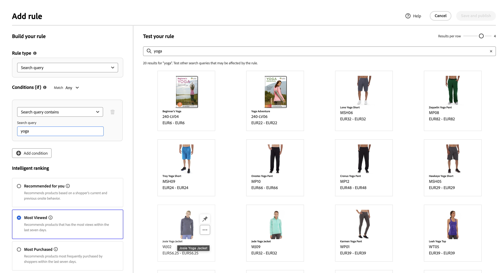
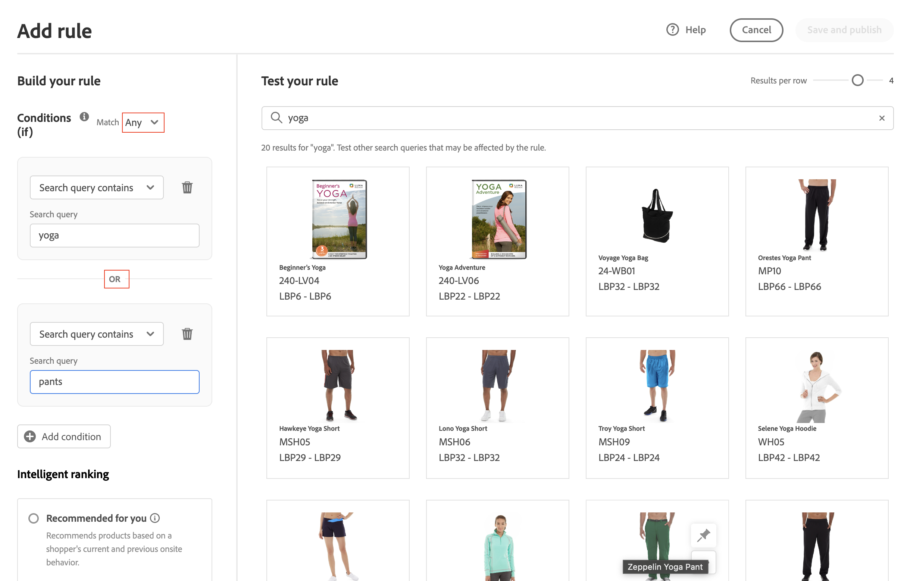

# Adicionar regras

Para criar uma regra, a primeira etapa é usar o editor de regras para definir as condições no texto de query do comprador que acionam os eventos associados. Em seguida, complete os detalhes da regra, teste os resultados e publique a regra.

## Adicionar uma regra

1. No Administrador, acesse **Marketing** > SEO E Pesquisa > **[!DNL Live Search]**.
1. Defina o **Escopo** para identificar o [exibição de loja](https://experienceleague.adobe.com/docs/commerce-admin/start/setup/websites-stores-views.html#scope-settings) onde a regra se aplica.
1. Clique em **Regras** guia.
1. Clique em **Adicionar regra** para iniciar o editor de regras.

## Condições

As condições são os requisitos para acionar um evento. Uma regra pode ter até dez condições e 25 eventos.

>[!NOTE]
>
>Atualmente, não é possível direcionar regras a um grupo de clientes específico.

### Condição única

1. Em *Criar sua regra*, selecione o **Condição** para ser atendida e siga as instruções para concluir a instrução.

   * A consulta de pesquisa contém - Digite a sequência de texto que deve estar na consulta do comprador. A configuração Corresponder determina o grau em que a consulta do comprador corresponde ao catálogo. Opções:  Qualquer — qualquer parte do texto de query do comprador pode corresponder à condição. Todos - Todas as consultas do comprador devem corresponder à condição.
   * A consulta de pesquisa é - Digite uma sequência de texto que corresponda exatamente à consulta do comprador. Por exemplo: &quot;calças de ioga&quot;. Regras com `Search query is` e Correspondência `All` O só pode ter uma condição.
   * Pesquisar consulta começa com - Insira um caractere ou sequência de texto que deve estar no início da consulta do comprador.
   * A consulta de pesquisa termina com - Digite um caractere ou sequência de texto que deve estar no final da consulta do comprador.

   Os resultados aparecem imediatamente no *Testar sua regra* e são numerados por prioridade. Você pode usar o *Resultados por linha* controle deslizante no canto superior direito para alterar o número de produtos em cada linha.

   

1. Para testar outras consultas, altere o texto da consulta no campo *Testar sua regra* caixa de pesquisa e pressione **Retornar**.
Inicialmente, o painel de teste renderiza a consulta na caixa de pesquisa Condições. Mas agora ele está renderizando a consulta a partir da caixa de query de teste. O painel de teste renderiza apenas uma consulta por vez.
1. Se quiser o resultado, atualize o texto no campo *Condições* caixa de pesquisa. Em seguida, clique em qualquer lugar na página para atualizar os resultados no painel de teste.
1. Para criar uma regra simples com uma condição, vá para a Etapa 3: [Adicionar eventos](#events).

### Várias condições

1. Para criar uma regra com várias condições, clique em **Adicionar condição**.
Uma regra pode ter até dez condições. O operador lógico que une duas condições baseia-se no atual *Corresponder* configuração. Por padrão, *Corresponder* é `All` e o operador lógico estiver `AND`.

   

1. Selecione a segunda condição e insira o texto de consulta necessário.

1. Para alterar a lógica da regra, altere a variável **Corresponder** configuração para determinar com que proximidade os critérios de pesquisa do comprador devem corresponder à condição de consulta. Definir **Corresponder** a um dos seguintes:

   * Qualquer - (Padrão) Todos os operadores lógicos na regra são definidos como `OR` e os resultados serão exibidos no painel de teste.
   * Todos - Todos os operadores lógicos na regra são definidos como `AND` e os resultados serão exibidos no painel de teste.

   A variável *Corresponder* determina o operador lógico usado para unir várias condições. Alteração do *Corresponder* a configuração altera todos os operadores lógicos na regra. Não é possível combinar `AND` e `OR` na mesma regra.

   Neste exemplo, em vez de procurar por &quot;calças de ioga&quot;, há duas consultas separadas que procuram por &quot;ioga&quot; ou &quot;calças&quot;. Essa regra é menos específica e é acionada com mais frequência na loja do que na outra.

   

1. Para adicionar outra condição, clique em **Adicionar condição** e repita o processo.

## Tipo de classificação

A classificação combina comportamentos de usuário e estatísticas do site para determinar a classificação do produto.
Os proprietários de lojas podem configurar os seguintes tipos de estratégias de classificação:

* Mais comprados: classifica os produtos por total de compras por SKU nos 7 dias anteriores.
* Mais adicionados ao carrinho - Classificações na ordem do total de atividades &quot;Adicionar ao carrinho&quot; nos 7 dias anteriores.
* Mais visualizados: classificação no meu total de visualizações por SKU nos 7 dias anteriores.
* Recomendado para você - Usa o `viewed-viewed` ponto de dados - Os compradores que visualizaram esse SKU também visualizaram esses outros SKUs
* Tendência: retroage aos eventos de exibição de página nas últimas 72 horas para eventos em segundo plano e 24 horas para eventos em primeiro plano
* Nenhum: os produtos são ordenados por Relevância

1. Selecione o tipo de estratégia para a regra. A janela Testar regra exibe os resultados esperados.

## Adição de eventos

Eventos são ações que modificam os resultados da pesquisa quando condições definidas são atendidas. Uma única regra pode ter até 25 eventos.

* Aumentar - Move um produto para cima nos resultados da pesquisa.
* Enterro - Move um SKU para baixo nos resultados da pesquisa.
* Fixar um produto - O produto é exibido na &quot;Posição&quot; selecionada na página.
* Ocultar um produto - Exclui um SKU dos resultados da pesquisa.

A maneira mais fácil de fixar um produto é arrastando e soltando.

1. Clique e arraste um produto no Painel de teste. Arraste e solte-o na posição desejada. Os campos Produto e Posição são automaticamente preenchidos no painel Eventos.

   

Você também pode clicar no ícone de pino para fixar um produto no local atual. Use o menu de contexto de reticências para &quot;Fixar na parte superior&quot; ou &quot;Fixar na parte inferior&quot;.

>[!NOTE]
>
>Você só pode fixar produtos retornados na query.

Ou eventos podem ser definidos manualmente:

1. Em *Eventos*, escolha o **Evento** quando as condições associadas forem satisfeitas.

   Por exemplo, escolha `Hide a product`. Em seguida, insira o nome do produto que deseja ocultar. Os produtos são sugeridos à medida que você digita.

1. Para vários eventos, escolha outros eventos que deseja acionar quando as condições forem atendidas.

## Detalhes adicionais

As informações inseridas aqui aparecem no campo [Detalhes da regra](rules-workspace.md) painel.

1. Em *Detalhes*, insira um **Nome** para a regra. Todos os nomes de regras devem ser exclusivos.
1. Insira um resumo **Descrição** da regra.
1. Insira o **Data de início** e **Data final** para que a regra fique ativa ou escolha as datas no calendário.

   Para selecionar um intervalo de datas, clique na primeira data e arraste para selecionar o intervalo.

   

## Finalização da regra

1. Examine os resultados da regra no painel de teste.
1. Se a regra tiver várias consultas, teste cada uma que possa ser afetada pela regra.
1. Quando terminar, clique em **Salvar e publicar**.

   A regra é adicionada à lista no espaço de trabalho de regras.

1. Embora as regras ativas entrem em vigor imediatamente, talvez seja necessário aguardar até 15 minutos para que os resultados da consulta em cache na loja sejam atualizados.

## Descrições dos campos

### Condições (if)

| Condição | Descrição |
|--- |--- |
| A consulta de pesquisa contém | Um caractere ou sequência de texto incluída na consulta do comprador. A consulta do comprador precisa corresponder apenas a um único caractere para atender a essa condição. |
| A consulta de pesquisa é | Um caractere ou sequência de texto que corresponde exatamente à consulta do comprador. Consultas complexas com várias condições não podem ser compostas quando essa condição é usada. |
| A consulta de pesquisa começa com | A consulta do comprador começa com esse caractere ou sequência de texto. |
| A consulta de pesquisa termina com | A consulta do comprador termina com esse caractere ou sequência de texto. |

### Operadores lógicos

| Operador | Descrição |
|--- |--- |
| OU | (Padrão) O operador lógico `OR` compara duas condições e atende aos requisitos para acionar um evento se pelo menos uma condição for verdadeira. |
| E | O operador lógico `AND` O compara duas condições e atende aos requisitos para acionar um evento se ambas as condições forem verdadeiras. |

### Corresponder operadores

| Operador | Descrição |
|--- |--- |
| Qualquer | Altera todos os operadores lógicos na regra para `OR` e retorna o conjunto de produtos correspondentes. |
| Todos | Altera todos os operadores lógicos na regra para `AND` e retorna o conjunto de produtos correspondentes. |

### Eventos

| Evento | Descrição |
|--- |--- |
| Aumentar | Move um SKU ou intervalo de SKUs para cima nos resultados da pesquisa. Cada uma é marcada com um selo de visualização &quot;aumentada&quot; nos resultados da pesquisa de teste. |
| Enterro | Move um SKU ou intervalo de SKUs para baixo nos resultados da pesquisa. Cada uma está marcada com um selo de visualização &quot;entranhado&quot; nos resultados de pesquisa de teste. |
| Fixar um produto | Anexa um único SKU a uma posição específica nos resultados da pesquisa. O produto é marcado com um selo de visualização &quot;fixado&quot; nos resultados da pesquisa de teste. |
| Ocultar um produto | Exclui um SKU, ou intervalo de SKUs, dos resultados da pesquisa. |

### Detalhes

| Campo | Descrição |
|--- |--- |
| Nome | O nome da regra. Rule names must be unique. |
| Data inicial | A data de início da regra, se programada. |
| Data final | A data final da regra, se programada. |
| Descrição | Uma breve descrição da regra. |
