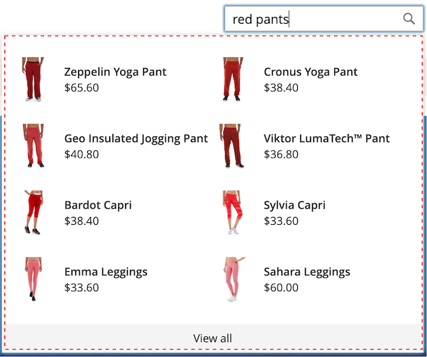

# Alterar estilo de elementos pop-up

O [loja](storefront-popover.md) sempre exibe o produto `name` e `price`e a seleção de campos não é configurável. No entanto, os elementos avançados podem ser estilizados usando classes CSS. Por exemplo, as declarações a seguir alteram a cor de plano de fundo do contêiner e do rodapé da portadora.

```css
.livesearch.popover-container {
    background-color: lavender;
}

.livesearch.view-all-footer {
    background-color: magenta;
}
```

## Visibilidade do contêiner

O componente principal do `.livesearch.popover-container` é `.search-autocomplete`.  O `.active` indica a visibilidade do contêiner. O `.active` A classe é adicionada condicionalmente quando o provedor está aberto.

```css
.search-autocomplete.active   /* visible */
.search-autocomplete          /* not visible */
```

Para obter mais informações sobre elementos de loja de estilos, consulte [Folhas de estilo em cascata (CSS)](https://devdocs.magento.com/guides/v2.4/frontend-dev-guide/css-topics/css-overview.html) no [Guia do desenvolvedor do Front-end](https://devdocs.magento.com/guides/v2.4/frontend-dev-guide/bk-frontend-dev-guide.html).

## Seletores de classes

Os seletores de classe a seguir podem ser usados para estilizar o contêiner, a sugestão e os elementos do produto no provedor.

* `.livesearch.popover-container`
* `.livesearch.view-all-footer`
* `.livesearch.suggestions-container`
* `.livesearch.suggestions-header`
* `.livesearch.suggestion`
* `.livesearch.products-container`
* `.livesearch.product-result`
* `.livesearch.product-name`
* `.livesearch.product-price`

### Seletores de classe do contêiner

`.livesearch.popover-container`



`.livesearch.view-all-footer`


### Seletores de classe de sugestão

`.livesearch.suggestions-container`


`.livesearch.suggestions-header`


`.livesearch.suggestion`


### Seletores de classe de produto

`.livesearch.products-container`


`.livesearch.product-result`


`.livesearch.product-name`


`.livesearch.product-price`


## Trabalhar com um tema modificado {#working-with-modified-theme}

A loja pode ser usada com um [tema](https://devdocs.magento.com/guides/v2.3/frontend-dev-guide/themes/theme-overview.html) que herda os arquivos necessários de *Luma*. O `top.search` no `header-wrapper` do `Magento_Search` não deve ser modificado.

```html
<referenceContainer name="header-wrapper">
   <block class="Magento\Framework\View\Element\Template" name="top.search" as="topSearch" template="Magento_Search::form.mini.phtml">
      <arguments>
         <argument name="configProvider" xsi:type="object">Magento\Search\ViewModel\ConfigProvider</argument>
      </arguments>
   </block>
</referenceContainer>
```

## Desabilitando a tampa

Para desativar e restaurar o padrão [Pesquisa rápida](https://docs.magento.com/user-guide/catalog/search-quick.html) , insira o seguinte comando:

```bash
bin/magento module:disable Magento_LiveSearchStorefrontPopover
```
