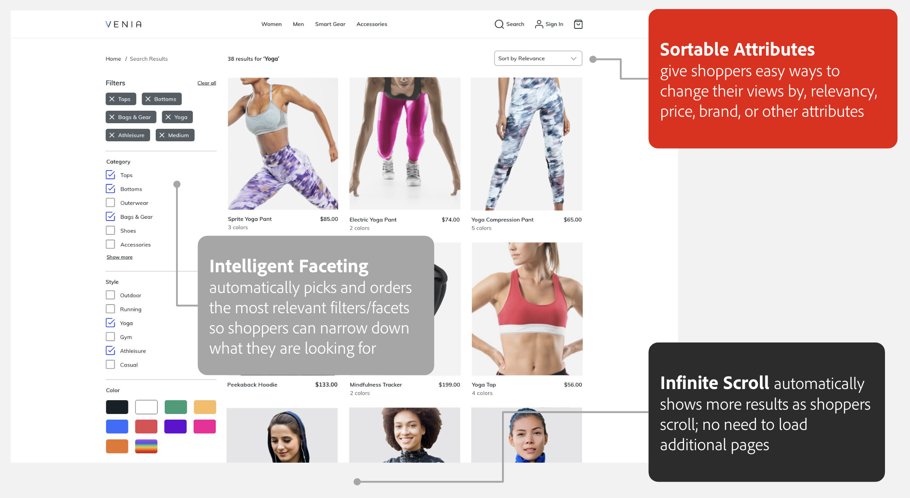

# Widgets da vitrine

Quando você instala [!DNL Live Search] você tem dois novos widgets na sua loja:

- [!DNL Live Search] [widget popover](storefront-popover.md) é a caixa que é aberta no campo de pesquisa que contém os resultados da pesquisa.
- [Widget de página de listagem de produtos](plp-styling.md) O (PLP) fornece uma página de listagem de produtos pesquisável com suporte a facetas e sinônimos. O widget está instalado e ativado no Live Search 4.0.0+.

Você pode personalizar a aparência desses widgets para melhor corresponder ao estilo e às diretrizes de marca da sua empresa.

## Widget de popover do Live Search

Quando você começar a digitar na caixa de pesquisa da vitrine do Commerce, [!DNL Live Search] O responde com produtos sugeridos e uma imagem em miniatura dos principais resultados da pesquisa na [widget popover](storefront-popover.md).

Para saber mais sobre o widget popover e como personalizá-lo para a sua loja, consulte [[!DNL Storefront Popover]](storefront-popover.md).

## Widget da página de listagem de produtos

Quando você clica para ver todos os resultados do popover da loja, o widget da página de listagem de produtos exibe os recursos que você pode usar para refinar continuamente sua pesquisa.

Para saber mais sobre o widget da página de listagem de produtos e como personalizar o widget da sua loja, consulte [widget da página de listagem de produtos](plp-styling.md).
