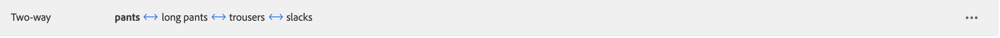
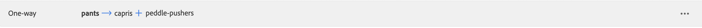

# Adicionar sinônimos

Aumente o engajamento do cliente adicionando sua própria lista de preparação de [!DNL Live Search] sinônimos. [!DNL Live Search] pode gerenciar até 200 sinônimos por `Data Space ID`.

![[!DNL Live Search] sinônimos](assets/synonym-workspace.png)

## Etapa 1: adicionar um sinônimo

1. No Administrador, acesse **Marketing** > SEO E Pesquisa > **[!DNL Live Search]**.
1. Para vários armazenamentos, defina **Escopo** para o [exibição de loja](https://experienceleague.adobe.com/docs/commerce-admin/start/setup/websites-stores-views.html#scope-settings) onde as configurações de sinônimo se aplicam.
1. Clique em **Sinônimos** guia.
1. Clique em **Adicionar sinônimos** botão.

## Etapa 2: definir o sinônimo por tipo

Siga as instruções para o [tipo de sinônimo](synonyms-type.md) que deseja criar.

### Sinônimo de bidirecional

1. Aceitar o padrão **Bidirecional** opção.

   

1. Insira o **Palavra-chave** termo ou frase a ser correspondido.
1. Insira o **Expansão** termos que você deseja adicionar como sinônimos para a palavra-chave. Separe vários termos com uma vírgula.
Neste exemplo, a palavra-chave a ser correspondida é &quot;calças&quot; e o conjunto de termos de expansão é &quot;calças compridas, calças, calças frouxas&quot;.

   

1. Quando terminar, clique em **Salvar**.
O conjunto de sinônimos aparece na lista com uma seta bidirecional entre cada termo, o que significa que os termos são intercambiáveis.

   

### Sinônimo unidirecional

1. Clique em **Unidirecional** tipo de sinônimo.

   

1. Insira o **Palavra-chave** e **Expansão** termos. Separe vários termos com uma vírgula.

   

   Neste exemplo, a palavra-chave é &quot;calças&quot; e os termos de expansão unidirecional &quot;capris, calças de comprimento de bezerro, traçadores de pedal&quot; são um subconjunto de &quot;calças&quot;, mas com um significado específico.

1. Quando terminar, clique em **Salvar**.
O conjunto de sinônimos aparece na lista com uma seta unidirecional apontando dos termos de expansão para a palavra-chave para indicar que os termos são subconjuntos da palavra-chave. Um sinal de mais separa cada termo de expansão.

   

## Etapa 3: publicar alterações

1. Quando seus sinônimos estiverem completos, clique em **Publicar alterações**.
1. Aguarde até duas horas para que suas atualizações fiquem disponíveis na loja.

## Descrições de campo

| Campo | Descrição |
|--- |--- |
| [Tipo](synonyms.md) | Determina se os sinônimos têm o mesmo significado que a palavra-chave ou se são um subconjunto da palavra-chave. Opções: Bidirecional (padrão) - Termos que têm o mesmo significado que a palavra-chave e retornam os mesmos resultados de pesquisa Unidirecional - Termos que são um subconjunto da palavra-chave. Sinônimos unidirecionais retornam uma lista mais restrita de produtos específicos. |
| Palavra-chave | Uma palavra que é comumente associada a uma seleção de produtos em seu catálogo. |
| Expansão | Termos adicionais que têm o mesmo significado ou significado semelhante à palavra-chave. |
