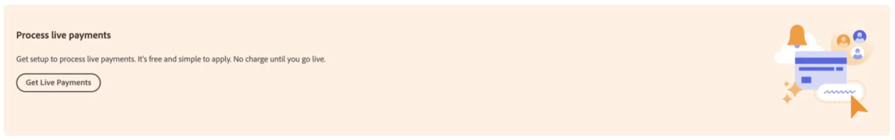

# Ativar [!DNL Payment Services] para produção

Você pode colocar o serviço em produção e concluir o [processo de integração](onboard.md), de acordo com as etapas neste tópico, após:

* [Instalar](install.md) a extensão Serviços de pagamento
* [Configurar e conectar](connect.md) sua instância
* [Configurar](sandbox.md) e [test](test-validate.md) sua sandbox

## Definir [!DNL Payment Services] como método de pagamento

Depois que você [configurar os Commerce Services](connect.md#configure-commerce-services) e ative [teste de sandbox](sandbox.md#enable-sandbox-testing) ou [pagamentos em tempo real](#enable-live-payments), você deve definir [!DNL Payment Services] como sua forma de pagamento.

1. No _Admin_ barra lateral, vá para **[!UICONTROL Sales]** > **[!UICONTROL Payment Services]**.
1. Clique em **[!UICONTROL Enable Payment Services]**.

   Essa opção estará visível se você ainda não tiver configurado o [!DNL Payment Services] como o método de pagamento para um ou mais sites.

   Você será direcionado para a área de configurações na exibição Início com as opções relevantes expandidas (**[!UICONTROL Sales]** > **[!UICONTROL Payment Services]** > _[!UICONTROL Settings]_), onde você pode ativar o [!DNL Payment Services] opções como seu [método de pagamento](https://docs.magento.com/user-guide/configuration/sales/payment-methods.html){target="_blank"}.

1. Entrada _[!UICONTROL General Configuration]_, definir **[!UICONTROL Enable]**para `Yes`.
1. Definir **[!UICONTROL Payment Action]**, para ambos _[!UICONTROL Credit Card Fields]_e_[!UICONTROL PayPal Smart Buttons]_, para uma das seguintes opções:

   | Configuração | Descrição |
   |---|---|
   | `Authorize` | Aprova a compra e suspende os fundos. A quantidade não é retirada até que seja &quot;capturada&quot; pelo comerciante. |
   | `Authorize and Capture` | Aprova a compra e o comerciante &quot;captura&quot; os fundos. |

   >[!IMPORTANT]
   >
   >[!DNL Payment Services] O oferece suporte a capturas parciais. Um comerciante pode capturar parcialmente (faturar) partes de um pedido. Por exemplo, você pode capturar cada item individualmente ou um item agora e o restante posteriormente.

1. Clique em **[!UICONTROL Save]**.
1. Clique em **[!UICONTROL Go to Payment Services]** para ser direcionado de volta ao [!DNL Payment Services] Início.
1. [Limpar o cache](https://docs.magento.com/user-guide/system/cache-management.html){target="_blank"}.

   A limpeza deve ser feita após cada alteração de configuração.

Consulte [Configurar serviços de pagamento](settings.md) para obter mais informações sobre como configurar Campos de cartão de crédito e Botões inteligentes do PayPal.

## Integração completa do comerciante

1. No _Admin_ barra lateral, vá para **[!UICONTROL Sales]** > **[!UICONTROL Payment Services]**.
1. Clique em **[!UICONTROL Live onboarding]**.

   Essa opção estará visível se você ainda não tiver concluído a integração ao vivo para [!DNL Payment Services].

   Você verá uma janela do PayPal.

1. Continue com o fluxo do PayPal, usando suas credenciais de conta do PayPal (não suas credenciais de conta de sandbox) ou cadastre-se para obter uma nova conta do PayPal.
1. Na barra lateral Admin, acesse **[!UICONTROL Sales]** > **[!UICONTROL Payment Services]**

   A variável _[!UICONTROL Live onboarding]_O botão não está mais visível e você vê um &quot;[!UICONTROL Live payments pending]&quot;caixa de texto.

   Nessa caixa de texto, também pode ser solicitado que você confirme seu endereço de email no PayPal para concluir a integração.

1. Se for solicitado que você confirme seu endereço de email, verifique se o email contém a mensagem de confirmação enviada pelo PayPal e clique em para confirmar seu endereço de email.
1. Na barra lateral Admin, acesse **[!UICONTROL Sales]** > **[!UICONTROL Payment Services]**.
1. Atualize a janela do navegador.

   Quando a integração do comerciante do PayPal for aprovada, você deverá ver uma notificação informando que o sistema de pagamento está no modo sandbox e não está processando pagamentos em tempo real.

   >[!IMPORTANT]
   >
   >Se você revogar o consentimento para [!DNL Payment Services] para [!DNL Adobe Commerce] e [!DNL Magento Open Source] para processar seus pagamentos (nas configurações de sua conta do PayPal), os pedidos em sua loja não podem ser processados pelo [!DNL Payment Services]. Na Página Inicial dos Serviços de Pagamento, será exibido um alerta sobre o consentimento revogado.

## Solicitar direitos a pagamentos do Adobe

Para habilitar a integração em tempo real, você deve solicitar o direito aos pagamentos do Adobe:

1. No _Admin_ barra lateral, vá para **[!UICONTROL Sales]** > **[!UICONTROL Payment Services]**.
1. Clique em **[!UICONTROL Get Live Payments]** no seu [!DNL Payment Services] Início.

   {width="500" zoomable="yes"}

1. Complete o formulário.
1. Um membro da equipe de vendas entrará em contato com você.

Como alternativa, você pode solicitar direitos a pagamentos do Adobe em [business.adobe.com](https://business.adobe.com/resources/payment-services.html).

>[!IMPORTANT]
>
>**Integração em tempo real** não estará acessível até que o direito aos pagamentos tenha sido aprovado.

## Configurar camada de preços

Para obter o seu [!DNL Payment Services] _ID do comerciante_:

1. No _Admin_ barra lateral, vá para **[!UICONTROL Sales]** > **[!UICONTROL Payment Services]**.
1. Na exibição Início, clique em **[!UICONTROL Settings]**. Consulte [Início](payments-home.md) para obter mais informações.
1. Selecione o necessário _ID do comerciante_ e envie-o ao representante de vendas, que configurará o tipo de preço correto.

## Habilitar pagamentos ao vivo

A _ID de comerciante de produção_ é gerado automaticamente e preenchido na variável [configuração](configure-admin.md). Não altere ou altere esta ID.

Para ativar pagamentos em tempo real:

1. No _Admin_ barra lateral, vá para **[!UICONTROL Sales]** > **[!UICONTROL Payment Services]**.
1. Na Página inicial, clique em **[!UICONTROL Settings]** na parte superior direita da página. Consulte [Início](payments-home.md) para obter mais informações.
1. No _[!UICONTROL General Configuration]_conjunto de seções **[!UICONTROL Payment mode]**para `Production`.
1. Clique em **[!UICONTROL Save]**.
1. [Limpar o cache](https://docs.magento.com/user-guide/system/cache-management.html){target="_blank"}.

   >[!IMPORTANT]
   >
   >Se você não limpar o cache, os clientes não poderão ver as opções de pagamento do PayPal durante o check-out.

Se você navegar de volta para [!DNL Payment Services] Na página inicial, a mensagem do modo de pagamento Sandbox não é mais exibida, pois você está processando pagamentos em tempo real agora.

Consulte [Configurar o no Admin](configure-admin.md) para opções de configuração herdadas.

>[!IMPORTANT]
>
>Se você revogar o consentimento para [!DNL Payment Services] para processar seus pagamentos (nas configurações de sua conta do PayPal), os pedidos em sua loja não podem ser processados pelo [!DNL Payment Services]. Se quiser reativar o processamento do pagamento, conclua a integração novamente. Na Página Inicial dos Serviços de Pagamento, será exibido um alerta sobre o consentimento revogado.

## Teste em produção

É altamente recomendável testar Pagamentos em produção, com cartões de crédito e bancos reais, antes de expor essa funcionalidade aos compradores.

Consulte [Teste e validação](test-validate.md) para obter mais informações.
