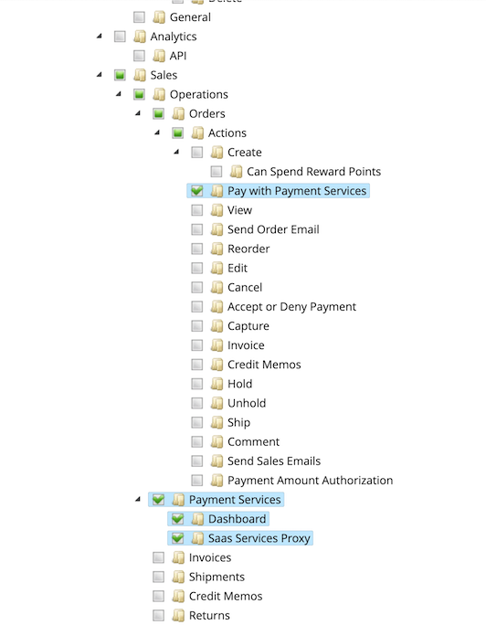

# Configurações

Você pode personalizar [!DNL Payment Services] para atender às suas necessidades com configurações úteis na [!DNL Payment Services] Início.

Para configurar [!DNL Payment Services] para [!DNL Adobe Commerce] e [!DNL Magento Open Source] click **[!UICONTROL Settings]**. Essas opções de configuração se aplicam somente ao ambiente definido no _[!UICONTROL Payment mode]_do campo[_ Geral _opções de configuração](#configure-general-settings).

Para configurações herdadas ou de várias lojas, consulte [Configurar o no Admin](configure-admin.md).

## Definir configurações gerais

A variável [!UICONTROL General] As configurações de fornecem a capacidade de habilitar ou desabilitar Serviços de Pagamento como seu método de pagamento e adicionar informações às transações do cliente para marcar ou adicionar um modo de exibição de site ou loja com informações personalizadas como prefixo.

### Habilitar Serviços de Pagamento

Você pode ativar [!DNL Payment Services] para seu site e ative os testes de sandbox ou os pagamentos em tempo real.

1. No _Admin_ barra lateral, vá para **[!UICONTROL Sales]** > **[!UICONTROL Payment Services]**.

   {width="400" zoomable="yes"}

1. Clique em **[!UICONTROL Settings]**. Consulte [Introdução ao [!DNL Payment Services] Início](payments-home.md) para obter mais informações.

   A variável _[!UICONTROL General]_inclui configurações usadas para habilitar [!DNL Payment Services] como o método de pagamento.

1. Para habilitar [!DNL Payment Services] como o método de pagamento para sua loja, no campo _[!UICONTROL General]_seção, alternar **[!UICONTROL Enable Payment Services as payment method]**para `Yes`.

1. Se você ainda estiver testando [!DNL Payment Services] para sua loja, defina **Modo de pagamento** para `Sandbox`. Se estiver pronto para ativar os pagamentos em tempo real, defina-os como `Production`.

   >[!NOTE]
   >
   >Seu _[!UICONTROL Sandbox Merchant ID]_e_[!UICONTROL Production Merchant ID]_ são gerados automaticamente e estão presentes em seus respectivos campos quando você conclui a integração da sandbox e/ou produção.

1. Clique em **[!UICONTROL Save]**.

   Se você tentar sair dessa visualização sem salvar as alterações, será exibido um modal que solicitará que você descarte as alterações, continue editando ou salve as alterações.

1. Navegue até **[!UICONTROL System]** > **[!UICONTROL Cache Management]** e clique em **[!UICONTROL Flush Cache]** para atualizar todos os caches inválidos.

Agora você pode prosseguir para a alteração das configurações padrão para [opções de pagamento](#configure-payment-options) funções e exibição de vitrine.

### Adicionar descritor simples

Você pode adicionar um [!UICONTROL Soft Descriptor] ao(s) site(s) ou à configuração de visualização(ões) de loja individual. Os descritores flexíveis são exibidos nos demonstrativos bancários de transação do cliente. Por exemplo, se você tiver várias lojas/marcas/catálogos, é possível definir facilmente entre eles adicionando texto personalizado à [!UICONTROL Soft Descriptor] campo.

1. No _Admin_ barra lateral, vá para **[!UICONTROL Sales]** > **[!UICONTROL Payment Services]**.
1. Clique em **[!UICONTROL Settings]**. Consulte [Introdução ao [!DNL Payment Services] Início](payments-home.md) para obter mais informações.
1. Selecione a exibição de site ou loja na caixa **[!UICONTROL Scope]** menu suspenso, para o qual você deseja criar um descritor simples. Para configuração inicial, deixe como **[!UICONTROL Default]** para definir o valor padrão.
1. Adicione seu texto personalizado (até 22 caracteres) no campo de texto, substituindo `Custom descriptor`.
1. Clique em **[!UICONTROL Save]**.
1. Para criar um descritor simples que não seja o padrão configurado para uma exibição de site ou loja:
   1. Selecione a exibição de site ou loja na caixa **[!UICONTROL Scope]** menu suspenso, para o qual você deseja criar um descritor simples.
   1. Alternar _desligado_ **[!UICONTROL Use website]** (ou **[!UICONTROL Use default]**, dependendo do escopo selecionado).
   1. Adicione seu texto personalizado no campo de texto.
   1. Clique em **[!UICONTROL Save]**.
1. Para habilitar para um site ou loja, exiba o descritor flexível padrão _ou_ o descritor simples usado para o site principal:
   1. Selecione a exibição de site ou loja na caixa **[!UICONTROL Scope]** menu suspenso, para o qual você deseja ativar um descritor simples existente.
   1. Alternar _em_ **[!UICONTROL Use website]** (ou **[!UICONTROL Use default]**, dependendo do escopo selecionado).
   1. Clique em **[!UICONTROL Save]**.

   Se você tentar sair dessa visualização sem salvar as alterações, será exibido um modal que solicitará que você descarte as alterações, continue editando ou salve as alterações.

### Opções de configuração

| Campo | Escopo | Descrição |
|---|---|---|
| [!UICONTROL Enable] | site | Ativar ou desativar [!DNL Payment Services] para o seu site. Opções: [!UICONTROL Off] / [!UICONTROL On] |
| [!UICONTROL Payment mode] | exibição de loja | Defina o método ou ambiente para sua loja. Opções: [!UICONTROL Sandbox] / [!UICONTROL Production] |
| [!UICONTROL Sandbox Merchant ID] | exibição de loja | Sua ID de comerciante de sandbox, que é gerada automaticamente durante a integração da sandbox. |
| [!UICONTROL Production Merchant ID] | exibição de loja | Sua ID de comerciante de produção, que é gerada automaticamente durante a integração da sandbox. |
| [!UICONTROL Soft Descriptor] | exibição de site ou loja | Adicione um descritor simples ao(s) site(s) e às visualizações da loja para adicionar informações às transações do cliente que definem marcas, lojas ou linhas de produtos. A variável [!UICONTROL Use website] a alternância aplica qualquer descritor simples adicionado no nível do site. A variável [!UICONTROL Use default] a alternância aplica qualquer descritor simples adicionado como padrão. |

## Configurar opções de pagamento

Agora que você ativou [!UICONTROL Payment Services] para o seu site, você pode alterar as configurações padrão para funções de pagamento e exibição de vitrine eletrônica.

1. No _Admin_ barra lateral, vá para **[!UICONTROL Sales]** > **[!UICONTROL Payment Services]**.
1. Clique em **[!UICONTROL Settings]**. Consulte [Introdução ao [!DNL Payment Services] Início](payments-home.md) para obter mais informações.
1. Configurar opções de pagamento para [cartões de crédito](#credit-card-fields), [botões de pagamento](#payment-buttons), e [estilo do botão](#button-style), de acordo com as seções a seguir.

### Campos de cartão de crédito

A variável _[!UICONTROL Credit Card Fields]_as configurações fornecem uma opção de finalização simples e segura para métodos de pagamento com cartão de crédito ou cartão de débito.

Consulte [Opções de pagamentos](payments-options.md#credit-card-fields) para obter mais informações.

1. No _Admin_ barra lateral, vá para **[!UICONTROL Sales]** > **[!UICONTROL Payment Services]**.
1. Selecione a exibição de loja, na caixa **[!UICONTROL Scope]** menu suspenso, para o qual você deseja ativar um método de pagamento.
1. No **[!UICONTROL Credit card fields]** edite o valor na guia **[!UICONTROL Checkout title]** para alterar o nome do método de pagamento exibido durante a finalização da compra.
1. Para [definir a ação de pagamento](production.md#set-payment-services-as-payment-method), alternar **[!UICONTROL Payment action]** para `Authorize` ou `Authorize and Capture`.
1. Para priorizar um método de pagamento na página de finalização da compra, forneça uma `Numeric Only` valor no **[!UICONTROL Sort order]** campo.
1. Para habilitar [Autenticação segura 3DS](security.md#3ds) (`Off` por padrão), alterne a variável **[!UICONTROL 3DS Secure authentication]** seletor para `Always` ou `When required`.
1. Para ativar ou desativar os campos de cartão de crédito na página de check-out, alterne o **[!UICONTROL Show on checkout page]** seletor.
1. Para ativar ou desativar [compartimentação de placa](#card-vaulting), alterne a **[!UICONTROL Vault enabled]** seletor.
1. Para ativar ou desativar [Métodos de pagamento com cofre no Administrador](#card-vaulting) (para que os comerciantes concluam pedidos de clientes no Administrador usando o método de pagamento com cofre), alterne a opção **[!UICONTROL Show vaulted methods in Admin]** seletor.
1. Para ativar ou desativar o modo de depuração, alterne o **[!UICONTROL Debug Mode]** seletor.
1. Clique em **[!UICONTROL Save]**.

   Se você tentar sair dessa visualização sem salvar as alterações, será exibido um modal que solicitará que você descarte as alterações, continue editando ou salve as alterações.

1. [Liberar o cache](#flush-the-cache).

#### Opções de configuração

| Campo | Escopo | Descrição |
|---|---|---|
| [!UICONTROL Title] | exibição de loja | Adicione o texto para exibição como o título desta opção de pagamento na exibição de Método de Pagamento durante a finalização da compra. Opções: [!UICONTROL text field] |
| [!UICONTROL Payment Action] | site | A variável [ação de pagamento](https://docs.magento.com/user-guide/configuration/sales/payment-methods.html#payment-actions){target="_blank"} para o método de pagamento especificado. Opções: [!UICONTROL Authorize] / [!UICONTROL Authorize and Capture] |
| [!UICONTROL Sort order] | exibição de loja | A ordem de classificação do método de pagamento especificado na página de check-out. `Numeric Only` value |
| [!UICONTROL 3DS Secure authentication] | site | Ativar ou desativar [Autenticação segura 3DS](security.md#3ds). Opções: [!UICONTROL Always] / [!UICONTROL When Required] / [!UICONTROL Off] |
| [!UICONTROL Show on checkout page] | site | Ative ou desative os campos de cartão de crédito para serem exibidos na página de check-out. Opções: [!UICONTROL Off] / [!UICONTROL On] |
| [!UICONTROL Vault enabled] | exibição de loja | Ativar ou desativar [compartimentalização de cartão de crédito](vaulting.md). Opções: [!UICONTROL Off] / [!UICONTROL On] |
| [!UICONTROL Show vaulted payment methods in Admin] | exibição de loja | Habilitar ou desabilitar a capacidade do comerciante de concluir pedidos de clientes no Administrador [usando um método de pagamento com cofre](vaulting.md). Opções: [!UICONTROL Off] / [!UICONTROL On] |
| [!UICONTROL Debug Mode] | site | Ative ou desative o Modo de depuração. Opções: [!UICONTROL Off] / [!UICONTROL On] |

### Apple Pay

A variável [!UICONTROL Apple Pay] opção de pagamento de botão permite fornecer uma [!UICONTROL Apple Pay] botão de pagamento no check-out da loja.

Consulte [Opções de pagamentos](payments-options.md#apple-pay-buttob) para obter mais informações.

Você pode habilitar e configurar o [!UICONTROL Apple Pay] opção de pagamento do botão:

1. No _Admin_ barra lateral, vá para **[!UICONTROL Sales]** > **[!UICONTROL Payment Services]**.
1. Selecione a exibição de loja, na caixa **[!UICONTROL Scope]** menu suspenso, para o qual você deseja ativar um método de pagamento.
1. No **[!UICONTROL Apple Pay]** edite o valor na guia _[!UICONTROL Checkout title]_para alterar o nome do método de pagamento exibido durante a finalização da compra.
1. Para [definir a ação de pagamento](production.md#set-payment-services-as-payment-method), alternar **[!UICONTROL Payment action]** para `Authorize` ou `Authorize and Capture`.
1. Para ativar ou desativar o Apple Pay na página de checkout, alterne a opção **[!UICONTROL Show Apple Pay on checkout page]** seletor.
1. Para ativar ou desativar o Apple Pay na página de detalhes do produto, alterne a opção **[!UICONTROL Show Apple Pay on product detail page]** seletor.
1. Para ativar ou desativar o Apple Pay na pré-visualização do minicarrinho, alterne a opção **[!UICONTROL Show Apple Pay on the mini cart preview]** seletor.
1. Para ativar ou desativar o Apple Pay na página do carrinho, alterne a opção **[!UICONTROL Show Apple Pay on cart page]** seletor.
1. Para ativar ou desativar o modo de depuração, alterne o **[!UICONTROL Debug Mode]** seletor.
1. Clique em **[!UICONTROL Save]**.

   Se você tentar sair dessa visualização sem salvar as alterações, será exibido um modal que solicitará que você descarte as alterações, continue editando ou salve as alterações.

1. [Liberar o cache](#flush-the-cache).

#### Opções de configuração

| Campo | Escopo | Descrição |
|---|---|---|
| [!UICONTROL Checkout title] | exibição de loja | Adicione o texto para exibição como o título desta opção de pagamento na exibição de Método de Pagamento durante a finalização da compra. Opções: [!UICONTROL text field] |
| [!UICONTROL Payment Action] | site | A variável [ação de pagamento](https://docs.magento.com/user-guide/configuration/sales/payment-methods.html#payment-actions) para o método de pagamento especificado. Opções: [!UICONTROL Authorize] / [!UICONTROL Authorize and Capture] |
| [!UICONTROL Show on checkout page] | site | Ative ou desative o botão Apple Pay para mostrar na página de finalização. Opções: [!UICONTROL Off] / [!UICONTROL On] |
| [!UICONTROL Show on checkout page] | site | Ative ou desative o botão Apple Pay para mostrar na página de detalhes do produto. Opções: [!UICONTROL Off] / [!UICONTROL On] |
| [!UICONTROL Show on mini cart preview] | site | Ative ou desative o botão Apple Pay para exibir na pré-visualização do mini carrinho. Opções: [!UICONTROL Off] / [!UICONTROL On] |
| [!UICONTROL Show on cart page] | site | Ative ou desative o botão Apple Pay para mostrar na página do carrinho. Opções: [!UICONTROL Off] / [!UICONTROL On] |
| [!UICONTROL Debug Mode] | site | Ative ou desative o Modo de depuração. Opções: [!UICONTROL Off] / [!UICONTROL On] |

### Botões de pagamento

A variável [!DNL PayPal Smart Buttons] as opções de pagamento fornecem um processo de finalização simples, rápido e seguro para o cliente. Consulte [Opções de pagamentos](payments-options.md#paypal-smart-buttons) para obter mais informações.

Você pode ativar e configurar as opções de pagamento dos botões inteligentes do PayPal:

1. Selecione a exibição de loja, na caixa **[!UICONTROL Scope]** menu suspenso, para o qual você deseja ativar um método de pagamento.
1. Para alterar o nome do método de pagamento conforme mostrado durante a finalização da compra, edite o valor na caixa **[!UICONTROL Checkout Title]** campo.
1. Para [definir a ação de pagamento](production.md#set-payment-services-as-payment-method), alternar **[!UICONTROL Payment action]** para `Authorize` ou `Authorize and Capture`.
1. Para priorizar um método de pagamento na página de finalização da compra, forneça uma `Numeric Only` valor no **[!UICONTROL Sort order]** campo.
1. Use os seletores para ativar ou desativar os seletores [!DNL PayPal smart button] recursos de exibição:

   - **[!UICONTROL Show PayPal buttons on product checkout page]**
   - **[!UICONTROL Show PayPal buttons on product detail page]**
   - **[!UICONTROL Show PayPal buttons in mini-cart preview]**
   - **[!UICONTROL Show PayPal buttons on cart page]**
   - **[!UICONTROL Show PayPal Pay Later button]**
   - **[!UICONTROL Show PayPal Pay Later message]**
   - **[!UICONTROL Show Venmo button]**
   - **[!UICONTROL Show Apple Pay button]**
   - **[!UICONTROL Show PayPal Credit and Debit Card button]**

     >[!NOTE]
     >
     > Para usar o Apple Pay você [deve ter uma conta de testador de sandbox da Apple](https://developer.apple.com/apple-pay/sandbox-testing/#create-a-sandbox-tester-account) (completo com informações de cobrança e cartão de crédito falso) para testá-lo. Quando estiver pronto para usar o Apple Pay na sandbox _ou_ modo de produção, após concluir qualquer [teste e validação](test-validate.md#test-in-sandbox-environment), complete [autorregistro com [!DNL Apple Pay]](https://developer.paypal.com/docs/checkout/apm/apple-pay/#register-your-live-domain) (_Registre seu domínio ativo_ (somente na seção ) e [configure-o para suas lojas no [!DNL Payment Services]](settings.md#payment-buttons).

     À medida que você alterna a visibilidade de ativação/desativação para botões de pagamento ou a mensagem PayPal Pay Later (Pagar mais tarde no PayPal), uma visualização visual dessa configuração é exibida na parte inferior da página Configurações.

1. Para ativar o modo de depuração, alterne a variável **[!UICONTROL Debug Mode]** seletor.
1. Clique em **[!UICONTROL Save]**.

   Se você tentar sair dessa visualização sem salvar as alterações, será exibido um modal que solicitará que você descarte as alterações, continue editando ou salve as alterações.

1. [Liberar o cache](#flush-the-cache).

#### Opções de configuração

| Campo | Escopo | Descrição |
|---|---|---|
| [!UICONTROL Title] | exibição de loja | Adicione o texto a ser exibido como o título para esta opção de pagamento na exibição de Método de Pagamento durante a finalização da compra. Opções: campo de texto |
| [!UICONTROL Payment Action] | site | A variável [ação de pagamento](https://docs.magento.com/user-guide/configuration/sales/payment-methods.html#payment-actions){target="_blank"} para o método de pagamento especificado. Opções: [!UICONTROL Authorize] / [!UICONTROL Authorize and Capture] |
| [!UICONTROL Sort order] | exibição de loja | A ordem de classificação do método de pagamento especificado na página de check-out. `Numeric Only` value |
| [!UICONTROL Show PayPal buttons on checkout page] | exibição de loja | Ativar ou desativar [!DNL PayPal Smart Buttons] na página de check-out. Opções: [!UICONTROL  Yes] / [!UICONTROL No] |
| [!UICONTROL Show PayPal buttons on product detail page] | exibição de loja | Ativar ou desativar [!DNL PayPal Smart Buttons] na página de detalhes do produto. Opções: [!UICONTROL  Yes] / [!UICONTROL No] |
| [!UICONTROL Show PayPal buttons in mini-cart preview] | exibição de loja | Ativar ou desativar [!DNL PayPal Smart Buttons] na pré-visualização do minicarrinho. Opções: [!UICONTROL Off] / [!UICONTROL On] |
| [!UICONTROL Show PayPal buttons on cart page] | exibição de loja | Ativar ou desativar [!DNL PayPal Smart Buttons] na página do carrinho. Opções: [!UICONTROL Off] / [!UICONTROL On] |
| [!UICONTROL Show PayPal Pay Later button] | exibição de loja | Ativar ou desativar a aparência da opção de pagamento pagar mais tarde, onde os botões de pagamento são exibidos. Opções: [!UICONTROL Off] / [!UICONTROL On] |
| [!UICONTROL Show PayPal Pay Later Message] | site | Ative ou desative a mensagem Pagar mais tarde no carrinho de compras, página do produto, minicarrinho e durante o fluxo de finalização. Opções: [!UICONTROL Off] / [!UICONTROL On] |
| [!UICONTROL Show Venmo button] | exibição de loja | Habilite ou desabilite a opção de pagamento Venmo onde os botões de pagamento são exibidos. Opções: [!UICONTROL Off] / [!UICONTROL On] |
| [!UICONTROL Show Apple Pay button] | exibição de loja | Ative ou desative a opção Pagamento Apple onde os botões de pagamento são exibidos. Opções: [!UICONTROL Off] / [!UICONTROL On] |
| [!UICONTROL Show PayPal Credit and Debit card button] | exibição de loja | Ative ou desative a opção de pagamento com cartão de Crédito e Débito onde os botões de pagamento são exibidos. Opções: [!UICONTROL Off] / [!UICONTROL On] |
| [!UICONTROL Debug Mode] | site | Ative ou desative o Modo de depuração. Opções: [!UICONTROL Off] / [!UICONTROL On] |

### Estilo do botão

Você também pode configurar as opções _[!UICONTROL Button style]_opções dos botões de pagamento:

1. Para alterar o **[!UICONTROL Layout]**, selecione `Vertical` ou `Horizontal`.

   >[!NOTE]
   >
   > Se o estilo do botão estiver configurado como `Horizontal` e sua loja estiver configurada para mostrar vários botões de pagamento, você só poderá ver dois botões exibidos na página do produto, na página de checkout e no minicarrinho, e um botão exibido no carrinho.

1. Para ativar o slogan em um layout horizontal, alterne a **[!UICONTROL Show tagline]** seletor.
1. Para modificar a variável **[!UICONTROL Color]**, selecione a opção de cor desejada.
1. Para modificar a variável **[!UICONTROL Shape]**, selecione `Pill` ou `Rectangle`.
1. Para ativar o seletor de altura do botão, alterne a **[!UICONTROL Responsive button height]** seletor.
1. Para modificar a variável **[!UICONTROL Label]**, selecione a opção de rótulo desejada.

   À medida que você altera as opções de configuração de layout, cor, forma, altura e rótulo, uma visualização visual dessa configuração é exibida na parte inferior da página Configurações.

   ![[!DNL PayPal Smart Buttons] opções](assets/payment-buttons.png){width="400" zoomable="yes"}

1. Clique em **[!UICONTROL Save]**.

   Se você tentar sair dessa visualização sem salvar as alterações, será exibido um modal que solicitará que você descarte as alterações, continue editando ou salve as alterações.

1. [Liberar o cache](#flush-the-cache).

Você pode configurar o estilo do botão de pagamento [na configuração Herdada do Administrador](configure-admin.md#configure-paypal-smart-buttons) ou aqui em [!DNL Payment Services Home]. Consulte [Guia de estilo do PayPal Buttons](https://developer.paypal.com/docs/checkout/standard/customize/buttons-style-guide/) para obter mais informações sobre como estilizar os botões de pagamento do PayPal.

#### Opções de configuração

| Campo | Escopo | Descrição |
|--- |--- |--- |
| [!UICONTROL Layout] | Exibição da loja | Definir estilo de layout para botões de pagamento. Opções: [!UICONTROL Vertical] / [!UICONTROL Horizontal] |
| [!UICONTROL Tagline] | Exibição da loja | Ativar/desativar slogan. Opções: [!UICONTROL Off] / [!UICONTROL On] |
| [!UICONTROL Color] | Exibição da loja | Defina a cor dos botões de pagamento. Opções: [!UICONTROL Blue] / [!UICONTROL Gold] / [!UICONTROL Silver] / [!UICONTROL White] / [!UICONTROL Black] |
| [!UICONTROL Shape] | Exibição da loja | Definir a forma dos botões de pagamento. Opções: [!UICONTROL Rectangular] / [!UICONTROL Pill] |
| [!UICONTROL Responsive Button Height] | Exibição da loja | Define se os botões de pagamento usarão uma altura padrão. Opções: [!UICONTROL Off] / [!UICONTROL On] |
| [!UICONTROL Height] | Exibição da loja | Defina a altura dos botões de pagamento. Valor padrão: nenhum |
| [!UICONTROL Label] | Exibição da loja | Defina o rótulo que aparece nos botões de pagamento. Opções: [!UICONTROL PayPal] / [!UICONTROL Checkout] / [!UICONTROL Buynow] / [!UICONTROL Pay] / [!UICONTROL Installment] |

## Configurar funções

Para garantir que os usuários administradores possam criar e gerenciar pedidos no Administrador do Commerce, ative [!DNL Payment Services]-recursos específicos para funções de usuário.

Consulte [Funções do usuário](https://experienceleague.adobe.com/docs/commerce-admin/systems/user-accounts/permissions-user-roles.html) para saber como gerenciar funções.

Ao atribuir recursos à função, você deve selecionar:

- **Pagar com[!DNL Payment Services]**—Esse recurso garante que, ao criar um pedido no Administrador, [!DNL Payment Services] os cartões de crédito estão disponíveis como um método de pagamento. Se você selecionar a variável **Ações** recurso principal, esse recurso também será selecionado.
- **[!DNL Payment Services]**—Este recurso inclui o **Painel** e **Proxy de serviços SaaS** recursos, que também devem ser selecionados. Asseguram que os [!DNL Payment Services] aparece na guia _Vendas_ menu.

  {width="400" zoomable="yes"}

## Liberar o cache

Se você alterar a configuração em _Configurações_, por exemplo, ao alternar os botões Apple Pay, Venmo ou PayPal PayLater, limpe manualmente o cache para que sua loja mostre as configurações mais recentes.

1. No _Admin_ barra lateral, vá para **[!UICONTROL System]** > **[!UICONTROL Cache Management]**.
1. Clique em **[!UICONTROL Flush Cache]** para atualizar todos os caches inválidos.

Se qualquer Tipo de Cache na tabela Gerenciamento de Cache tiver um `INVALIDATED` status, seu armazenamento pode não mostrar a configuração mais recente para esse item. Limpe o cache para atualizar seu armazenamento para mostrar a configuração mais recente.

Para garantir que seu armazenamento mostre a configuração correta, consulte periodicamente [liberar o cache](https://docs.magento.com/user-guide/system/cache-management.html).

## Compartimentalização da placa

Você pode ativar a funcionalidade que permite aos clientes arquivar — ou &quot;salvar&quot; — as informações de cartão de crédito em sua conta para uso em compras futuras.

Você também pode usar a compartimentalização de cartão no Administrador para concluir pedidos subsequentes de clientes existentes.

Ative ou desative a compartimentação de cartão no [Configurações de campo de cartão de crédito](#credit-card-fields).

Consulte [Compartimentalização de cartão de crédito](vaulting.md) para obter mais informações.

## 3DS

O 3DS protege clientes e comerciantes de atividades fraudulentas em suas lojas e permite a conformidade com os padrões da União Europeia (UE).

Ative ou desative o 3DS no [Configurações de campo de cartão de crédito](#credit-card-fields).

Consulte [3DS em segurança](security.md#3ds) para obter mais informações.

## Usar várias contas do PayPal

Entrada [!UICONTROL Payment Services], você pode usar várias contas do PayPal no **um** conta de comerciante no nível do site. Por exemplo, se estiver operando sua(s) loja(s) em vários países (que usam diferentes [moedas](https://docs.magento.com/user-guide/stores/currency.html)) ou quiser usar o Adobe Commerce em algumas partes da sua empresa, mas não _all_, você pode configurar sua conta de comerciante para usar várias contas do PayPal.

Consulte [Escopo do site, armazenamento e exibição](https://experienceleague.adobe.com/docs/commerce-admin/start/setup/websites-stores-views.html) para obter mais informações sobre a hierarquia de sites, lojas e visualizações de loja.

Seu representante de vendas pode criar um novo [escopo](https://experienceleague.adobe.com/docs/commerce-admin/start/setup/websites-stores-views.html#scope-settings) para sua conta de comerciante e integrar o site adicional com PayPal para que qualquer um dos botões PayPal que você configura para aparecer aparecerá em seu site. Entre em contato com o representante de vendas para obter assistência com o uso de várias contas do PayPal para seus sites.
