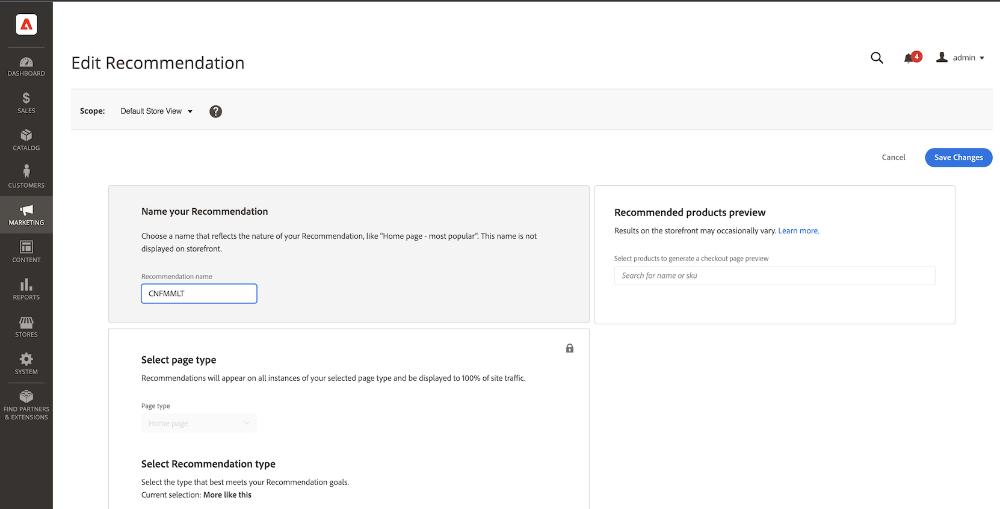

# Editar Recomendação

A página Editar Recomendação oferece a capacidade de ajustar as configurações individuais que compõem a recomendação. Todas as configurações podem ser editadas, exceto o tipo de página e o tipo de recomendação. As seguintes configurações podem ser editadas:

- [Nome da recomendação](#name)
- [Rótulo de frente de loja](#label)
- [Número de produtos](#number)
- [Posicionamento e posição](#placement)
- [Filtrar produtos](#filters)

A visualização no lado direito da página mostra como a recomendação com as configurações atuais pode aparecer na loja. O _Visualização de produtos recomendados_ O permanece visível para referência, à medida que você rolar a página para baixo. A visualização exibe uma imagem miniatura do produto, o nome do produto, SKU, preço e tipo de resultado para cada produto retornado. O tipo de resultado indica se há dados comportamentais primários suficientes para gerar a recomendação ou se está usando dados comportamentais de backup.

## Editar uma recomendação

1. No _Administrador_ barra lateral, vá para **Marketing** > _Promoções_ > **Recommendations do produto**.

1. Selecione a recomendação que deseja editar.

1. Clique em **Editar**. Em seguida, siga as instruções abaixo para fazer as alterações necessárias.

1. Ao concluir, clique em **Salvar alterações**.

### Nome da recomendação {#name}

Escolha um nome descritivo que indique a finalidade da recomendação. O nome é para referência interna e não é exibido na loja.

### Rótulo de frente de loja {#label}

Insira o texto que você deseja usar como rótulo para a unidade de recomendação na loja.

### Número de produtos {#number}

Ajuste o controle deslizante para exibir até 20 produtos na unidade de recomendação.

### Posicionamento e posição {#placement}

1. Escolha o local da página onde a unidade de recomendação deve aparecer na loja.

   - Na parte inferior do conteúdo principal
   - Na parte superior do conteúdo principal

   

1. Para alterar a ordem das recomendações incluídas na unidade, use o **Mover**  para arrastar as recomendações para a posição.

   

### Filtrar produtos {#filters}

Quaisquer alterações feitas ao produto [filtros](filters.md) são refletidas na variável _Visualização de produtos recomendados_. Somente os produtos que correspondem aos filtros de inclusão podem ser recomendados. Produtos que correspondem a filtros de exclusão não são recomendados.

O _Inclusões_ e _Exclusões_ As guias listam os filtros disponíveis de cada tipo. Na lista, cada filtro ativo é marcado com um ponto azul.

- Para exibir os detalhes de cada filtro, clique no nome do filtro.
- Para alterar o status do filtro, defina a variável **Ativar filtro** alternar para a `on` ou `off` posição.

As configurações de filtro descrevem os produtos a serem incluídos ou excluídos na unidade de recomendação. Por exemplo, a variável _Categoria_ as configurações de inclusão de filtro informam ao sistema para incluir produtos somente das categorias selecionadas.

