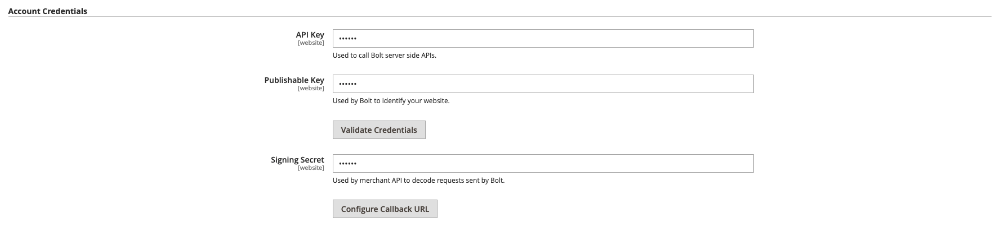

# [!DNL Quick Checkout] Integração

Para começar a usar o [!DNL Quick Checkout] para a extensão do Adobe Commerce, você deve concluir algumas etapas de integração para conectar sua instância com nossa funcionalidade de check-out.

1. [Obter extensão](#get-extension).
1. [Criar uma conta de comerciante de produção ou sandbox com [!DNL Bolt]](#create-account-with-bolt). Forneça todas as informações necessárias para verificar sua identidade.
1. [Forneça a [!DNL API Key] e [!DNL Publishable Key]](#obtain-api-credentials) gerado em [!DNL Bolt].
1. [Configure um provedor de serviço de pagamento no [!DNL Bolt] account](#configure-payment-providers).
1. [Selecione Ativar lista suspensa como Sim](#enable-extension) para ativar a extensão.
1. [Definir as configurações do serviço](#complete-admin-configuration) para configurar o [!DNL Quick Checkout] extensão.
1. [Clique em Salvar configuração](#enable-live-quick-checkout) botão para ativar a extensão.
1. Alternar escopo para **Site principal** e [clicar no URL de retorno de chamada](#check-shopper-valid-account) botão.

Se o Gainsight estiver ativado, ele acionará o **Faça o tour** botão no seu [!DNL Quick Checkout] Painel de administração sobre [!DNL Quick Checkout] Adobe Commerce:

1. No _Admin_ barra lateral, vá para **[!UICONTROL Stores]** > **[!UICONTROL Configuration]** > Avançado:

   

Se o Gainsight não estiver ativado, continue com as etapas de integração.

Consulte a [[!DNL Quick Checkout] Painel de administração](../quick-checkout/admin-panel.md) para obter mais informações.

>[!NOTE]
>
> Se você não configurar suas [!DNL Bolt] contas que você não pode configurar seus ambientes de sandbox ou produção.

## Pré-requisitos

Para utilizar a variável [!DNL Quick Checkout], você deve ter o seguinte disponível para [!DNL Bolt]:

- Provedores de pagamento suportados
- Comerciante e conta de Produção no [!DNL Bolt]
- API e [!DNL Publishable key] gerado em [!DNL Bolt]

Consulte a [pré-requisitos](../quick-checkout/prerequisites.md) para obter mais informações.

Consulte [Credenciais da API](#obtain-api-credentials) para saber como criar ou acessar seu [!DNL API keys] para sua instância.

## Obter extensão

Consulte a [instalar](../quick-checkout/install.md) tópico para obter informações detalhadas sobre como obter a extensão.

## Criar conta com [!DNL Bolt]

Antes de configurar o [!DNL Quick Checkout] No administrador do Adobe Commerce, é necessário criar um [sandbox](https://merchant-sandbox.bolt.com/register?platform=magento2){target="_blank"} and [production](https://merchant.bolt.com/register?platform=magento2){target="_blank"}  contas do comerciante em [!DNL Bolt]. Forneça todos os detalhes necessários para criar uma conta no [!DNL Bolt].

Consulte a [testar e validar](../quick-checkout/testing.md) para obter mais informações.

## Obter credenciais de API

Para usar o [!DNL Quick Checkout] você precisa [!DNL Bolt] chaves exclusivas e [!DNL signing secret]. Obtenha o seguinte [!DNL API keys] navegando até **Desenvolvedores** > **API** > **Chaves** no **Parafusar Painel do Comerciante**.

- [!DNL API key]: uma chave privada usada pelo back-end para interagir com o [!DNL Bolt] APIs.
- [!DNL Publishable key]: uma chave usada pelo front-end para interagir com o [!DNL Bolt] APIs.
- [!DNL Signing secret]: usado para verificação de assinatura em solicitações recebidas do [!DNL Bolt].

   

Consulte a [[!DNL Bolt] detalhes do ambiente](https://help.bolt.com/developers/references/environment-details/#about-keys){target="_blank"} página para saber mais sobre chaves e segredo de assinatura em [!DNL Bolt] para o [!DNL Quick Checkout] extensão.

>[!CAUTION]
>
> Você deve criar [!DNL API keys] para ambientes de sandbox e produção.

## Configurar provedores de pagamento

Para conectar seu provedor de serviços de pagamento, siga as etapas descritas na [configuração do processador](https://help.bolt.com/integrations/adobe-quick-checkout/set-up/){target="_blank"} desenvolvedor [!DNL Bolt] página.

## Habilitar extensão

1. No _Admin_ barra lateral, vá para **Lojas** > _Configurações_ > **Configuração**.
1. No painel esquerdo, expanda **Vendas** e selecione **Check-out**.
1. No [!DNL Quick Checkout] exibir, definir **Ativar** para `Yes`.

>[!CAUTION]
>
> Os campos de check-out rápido só ficam visíveis quando **Ativar** está definida como `Yes`.

1. Selecione o método (Sandbox ou Produção) a ser usado.

   - Sandbox para fins de teste e desenvolvimento
   - Produção para processar transações com o processador de pagamento em tempo real

1. Validar credenciais após fornecer sua API exclusiva e [!DNL Publishable keys].

Consulte a [Configurações](../quick-checkout/settings-quick-checkout.md) tópico para obter mais informações sobre as opções de configuração do [!DNL Quick Checkout] para a extensão do Adobe Commerce.

>[!CAUTION]
>
> Você deve fornecer API exclusiva e [!DNL Publishable] chaves antes de habilitar a extensão; caso contrário, os clientes verão um formulário de pagamento e não poderão fazer um pedido.

## Concluir configuração de administração

1. No _Admin_ barra lateral, navegue até **Lojas** > **Configuração** > **Check-out** para acessar a página de configuração geral do Administrador de check-out.
1. No _Configurações do serviço_ forneça todos os detalhes necessários para ativar a extensão.
1. Definir _Ação de pagamento_ para qualquer uma das opções:

   - `Authorize`: Não capturar a transação automaticamente após a autorização.
   - `Authorize and Capture`: Capturar transação automaticamente após autorização.

Para obter mais informações sobre as opções de check-out padrão do Adobe Commerce, consulte a [check-out](https://docs.magento.com/user-guide/configuration/sales/checkout.html) tópico.

## Ativar check-out rápido ao vivo

Para ativar o [!DNL Quick Checkout] para a extensão do Adobe Commerce:

1. Verifique se [!UICONTROL Enable] a lista suspensa está definida como **Sim** para ativar a extensão.
1. Clique em **Salvar configuração**.

## Verificar conta válida do comprador

Para verificar se o comprador tem uma [!DNL Bolt] conta:

1. Alternar o escopo para **Site principal**.
1. Clique em **Configurar URL de retorno** botão. Isso permite [!DNL Bolt] para determinar se o comprador tem uma conta. Se isso acontecer, a janela pop-up OTP será exibida.

   >[!CAUTION]
   >
   > Alternar o escopo para o **Site principal** A garante que o URL adequado seja definido. Cada site pode ter vários domínios.

Consulte a [Escopo do site, armazenamento e exibição](https://experienceleague.adobe.com/docs/commerce-admin/start/setup/websites-stores-views.html#scope-settings){target="_blank"} tópico para obter mais informações sobre escopos no Adobe Commerce.

## Definir Configurações de Serviço

1. Definir **Ativar o rastreamento de check-out** para `Yes`.

   >[!CAUTION]
   >
   > Desativar essa opção afetará os relatórios, pois a Adobe Commerce não tem permissão para compartilhar informações de rastreamento de check-out com o Bolt.

1. Selecione o **Próxima etapa após o logon** opção para alterar o fluxo de navegação depois que o cliente fizer logon. Por padrão, é definido como **Pagamentos** página.
1. Definir se [!DNL Quick Checkout] permite a **logon automático** durante o check-out. Por padrão, está habilitado para fazer logon automaticamente na [!DNL Bolt] rede.

   >[!NOTE]
   >
   > Consulte [Documentação de ativação do logon automático da Bolt](https://help.bolt.com/products/embedded/direct-api/auto-login/) para obter mais informações.

## Obter ajuda

O processo de integração foi projetado para orientá-lo pelas etapas necessárias para configurar e habilitar o [!DNL Express Checkout] funcionalidade.

Entre em contato com o Suporte da Adobe Commerce por meio da [Centro de ajuda do Adobe Commerce](https://experienceleague.adobe.com/docs/commerce-knowledge-base/kb/help-center-guide/magento-help-center-user-guide.html) para obter assistência.

Consulte a [testar e validar](../quick-checkout/testing.md) para obter mais informações.
