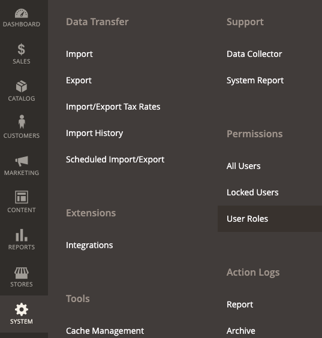

# [!DNL Quick Checkout] Configuração de usuário

[!DNL Quick Checkout] O fornece ao painel Administrador todas as informações necessárias para iniciar a integração usando a extensão ou incluir recursos como o acesso a documentos, [!DNL Bolt] painel do comerciante ou notas de versão.

Para acessar o [!DNL Quick Checkout] Painel de administração:

1. No _Admin_ barra lateral, navegue até **[!UICONTROL Sales]** > **[!UICONTROL Quick Checkout]**.

   

Consulte a [integração](../quick-checkout/onboarding.md) tópico para obter mais informações sobre como configurar a variável [!DNL Quick Checkout] para Adobe Commerce.

Para permitir que o usuário acesse e visualize a [!DNL Quick Checkout] Painel de administração, é necessário verificar se o usuário tem a função adequada que os recursos concederam:

1. No _Admin_ barra lateral, vá para **[!UICONTROL System]** > Permissões > **[!UICONTROL User Roles]**.

   

1. No _Funções_ clique em **Adicionar nova função**
1. Selecione o [!DNL Quick Checkout] recursos:

   

1. Clique em **Salvar Função**.

Consulte a [Funções do usuário](https://docs.magento.com/user-guide/system/permissions-user-roles.html) para obter mais informações sobre como definir uma atribuição ou designar uma atribuição a um usuário.
