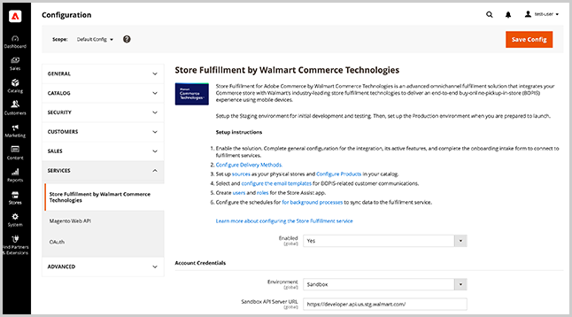

# Serviço de armazenamento e configuração de vendas

Configurar[!DNL Store Fulfillment] para habilitar a extensão, especifique as configurações de extensão, defina as configurações de segurança para os usuários do aplicativo Store Assist e defina as opções para métodos de entrega.

>[!IMPORTANT]
>
>A configuração do serviço de Atendimento à loja se aplica somente após a conexão da instância do Adobe Commerce e do [!DNL Store Fulfillment] aplicativo. Consulte [Atendimento da loja de conexões](connect-set-up-service.md).

Defina as configurações dos serviços de Entrega da loja no menu Configuração da loja de administração no Adobe Commerce.

Acesse as configurações para habilitar a extensão, definir as configurações globais e especificar as opções de segurança para as conexões e contas de usuário do aplicativo de Assistência da Loja selecionando **[!UICONTROL Stores > Configuration > Services > Store Fulfillment by Walmart Commerce Technologies]**.

Acesse as configurações para configurar os métodos de delivery selecionando **[!UICONTROL Store > Configuration > Sales > Delivery Methods > In-Store Pickup]**.

## Configurações básicas

<table>
<thead>
<tr>
<td><strong>Campo</strong></td>
<td><strong>Descrição</strong></td>
<td><strong>Escopo</strong></td>
<td><strong>Obrigatório</strong></td>
</tr>
</thead>
<tbody>
<tr>
<td><strong>[!UICONTROL Price]</strong></td>
<td>O preço que você cobra ao cliente pela retirada na loja. O padrão é zero.</td>
<td>Site</td>
<td>Não</td>
</tr>
<tr>
<td><strong>[!UICONTROL Search Radius]</strong></td>
<td>O raio, em quilômetros, a ser usado quando um comprador procura por um local de retirada de loja no check-out da loja. Os resultados da pesquisa retornam somente armazenamentos localizados no raio de pesquisa especificado.</td>
<td>Site</td>
<td>Não</td>
</tr>
<tr>
<td><strong>[!UICONTROL Displayed error message]</strong></td>
<td>Uma mensagem que é exibida quando um cliente seleciona a retirada na loja, mas o método de delivery não está disponível. Você pode personalizar o texto padrão, se necessário.
</td>
<td>Exibição da loja</td>
<td>Não</td>
</tr>
</tbody>
</table>

>[!NOTE]
>
>O [!UICONTROL Search Radius] será usada somente se você tiver configurado a variável [localização da loja e configuração de mapeamento](store-location-map-provider-setup.md) para Adobe Commerce.

## Ativar a solução de preenchimento da loja

Ative o [!DNL Store Fulfillment] solução para adicionar os recursos de retirada na loja e em curbside às experiências de compra e check-out na loja da Adobe Commerce.

<table>
<thead>
<tr>
<td><strong>Campo</strong></td>
<td><strong>Descrição</strong></td>
<td><strong>Escopo</strong></td>
<td><strong>Obrigatório</strong></td>
</tr>
 </thead>
 <tbody>
<tr>
<td><strong>[!UICONTROL Enabled]</strong></td>
<td>Ative ou desative a solução. Quando habilitado, configure e use os recursos de Entrega da loja e estabeleça a conexão entre a loja da Adobe Commerce e os serviços de Entrega da loja. Quando desativado, todos os recursos de Entrega de loja são desativados e não há comunicação entre o Adobe Commerce e os serviços de Entrega de loja. As informações do pedido não podem ser processadas ou recebidas.</td>
<td>Global</td>
<td>Sim</td>
</tr>
</tbody>
</table>

## Adicionar credenciais de conta

<table>
<tr>
<td><strong>Campo</strong></td>
<td><strong>Descrição</strong></td>
<td><strong>Escopo</strong></td>
<td><strong>Obrigatório</strong></td>
    </tr>
<tr>
<td><strong>[!UICONTROL Environment]</strong></td>
<td>Selecione um <i>Sandbox</i> ou <i>Produção</i>   A sandbox se comunica com os serviços de cumprimento em um teste.A produção se comunica com um ambiente vivo. Use <strong>only</strong> em produção.  Você recebe um conjunto de credenciais para cada ambiente e pode gerenciar ambos os conjuntos na mesma instalação.   Salve as credenciais antes de validar a conexão.</td>
<td>Global</td>
<td>Sim</td>
    </tr>
<tr>
<td><strong>[!UICONTROL API Server URL]</strong></td>
<td>O URL para o endpoint da API de disponibilização da Loja Walmart. Esse deve ser o URL totalmente qualificado fornecido a você durante o processo de integração. Os clientes do Store Fulfillment recebem sandbox e URL de produção. Certifique-se de copiar/colar o URL completo, incluindo a barra à direita "/".</td>
<td>Global</td>
<td>Sim</td>
    </tr>
<tr>
<td><strong>[!UICONTROL Token Auth Server URL]</strong></td>
<td>O URL para o ponto de extremidade de Autenticação de Cumprimento de Loja Walmart. O valor deve ser o URL totalmente qualificado fornecido a você durante o processo de integração. Você recebe um sandbox e um URL de produção. Certifique-se de copiar/colar o URL completo, incluindo a barra à direita `/`".</td>
<td>Global</td>
<td>Sim</td>
    </tr>
<tr>
<td><strong>[!UICONTROL Merchant Id]</strong></td>
<td>Sua ID exclusiva de comerciante (locatário) fornecida a você durante o processo de integração. Sua ID é usada para encaminhar seus pedidos e garante que suas lojas de merchant estejam recebendo esses pedidos.</td>
<td>Global</td>
<td>Sim</td>
    </tr>
<tr>
<td><strong>[!UICONTROL Consumer Id]</strong></td>
<td>Sua ID de integração exclusiva. Isso é fornecido a você durante o processo de integração. Não muda. É usado para autenticar todas as comunicações com os serviços de atendimento.</td>
<td>Global</td>
<td>Sim</td>
    </tr>
<tr>
<td><strong>[!UICONTROL Consumer Secret]</strong></td>
<td>Sua chave de integração exclusiva. Isso é fornecido a você durante o processo de integração. É usado para autenticar todas as comunicações com os serviços de atendimento.</td>
<td>Global</td>
<td>Sim</td>
    </tr>
</table>

Após configurar as Credenciais da Conta, selecione <strong>[!UICONTROL Validate Credentials]</strong> para verificar e estabelecer uma conexão com o serviço da Web de cumprimento pela primeira vez.

## Configurar o registro

Quando o registro é ativado, o arquivo de log pode expandir rapidamente. Para evitar problemas de tempo de resposta em ambientes de produção, tenha cuidado ao ativar o registro e ative o por um curto período de tempo, quando necessário.

Solicite ao administrador do sistema que configure seus ambientes para permitir o tratamento de exceções, de modo que as exceções relacionadas à API possam ser capturadas pelo firewall ou cache. Você também pode pedir ao administrador do sistema para configurar a rotação de log neste arquivo para minimizar o tamanho.

<table>
<thead>
<tr>
<td><strong>Campo</strong></td>
<td><strong>Descrição</strong></td>
<td><strong>Escopo</strong></td>
<td><strong>Obrigatório</strong></td>
</tr>
</thead>
<tbody>
<tr>
<td><strong>[!UICONTROL Debug Mode]</strong></td>
<td>O Modo de depuração é usado para aumentar a atividade registrada na integração. Quando desativado, nenhuma informação de depuração é registrada. Quando ativado, todas as informações de depuração são registradas em log. Todos os dados registrados podem ser encontrados no arquivo : `var/log/walmart-bopis.log`</td>
<td>Global</td>
<td>Não</td>
</tr>
</tbody>
</table>

## Gerenciar a sincronização do pedido

Configure as configurações para gerenciar o tratamento de erros para sincronização de pedidos, atributos de catálogo a serem usados para a varredura de código de barras durante a escolha de pedidos e configurar os tamanhos de lote de pedidos para a fila de atendimento da loja.

Você pode visualizar detalhes sobre as operações de sincronização de pedidos no painel Gerenciamento da fila de atendimento da loja no Administrador (
<strong>[!UICONTROL System > Tools > Store Fulfillment Queue]</strong>).

### Gerenciamento de Erros de Sincronização

<table>
<tr>
<td><strong>Campo</strong></td>
<td><strong>Descrição</strong></td>
<td><strong>Escopo</strong></td>
<td><strong>Obrigatório</strong></td>
</tr>
<tr>
<td><strong>[!UICONTROL Retry Critical Error]</strong></td>
<td>Especifica as tentativas de repetição de uma operação de sincronização de registro após ocorrer um erro crítico.  Erros críticos ocorrem sempre que a integração não obtém uma resposta positiva do serviço de cumprimento. Isso pode ocorrer quando o serviço está inativo ou quando há um erro nos dados do pedido que estão sendo enviados.  Quando o limite de repetição é atingido, o item permanece em uma fila, mas não é processado novamente. Exibir todos os itens com erros de <strong>[!UICONTROL System > Tools > Store Fulfillment Queue]</strong> Gerenciamento no Administrador. Para solucionar problemas consistentemente de itens com falha, entre em contato com seu Gerente de conta.</td>
<td>Global</td>
<td>Não</td>
</tr>
<tr>
<td><strong>[!UICONTROL Enable Error Notification Email]</strong></td>
<td>Ative as notificações de erro para receber um email quando a função [!UICONTROL Retry Critical Error Threshold] é acessado para um pedido. A notificação inclui todos os detalhes disponíveis sobre o erro.</td>
<td>Global</td>
<td>Não</td>
</tr>
<tr>
<td><strong>[!UICONTROL Send Error Notification Email To]</strong></td>
<td>Uma lista delimitada por vírgulas de endereços de email de destinatários para notificações de erro.</td>
<td>Global</td>
<td>Não</td>
</tr>
<tr>
<td><strong>[!UICONTROL Order Sync Exception Email Template]</strong></td>
<td>Especifica o template de email usado para notificar os recipients sobre erros de sincronização de pedidos. Um template padrão é fornecido. Ele não oferece suporte à personalização.</td>
<td>Exibição da loja</td>
<td>Não</td>
</tr>
</table>

### Sincronização de pedidos

<table>
<thead>
<tr>
<td><strong>Campo</strong></td>
<td><strong>Descrição</strong></td>
<td><strong>Escopo</strong></td>
<td><strong>Obrigatório</strong></td>
</tr>
</thead>
<tbody>
<tr>
<td><strong>[!UICONTROL Barcode Source]</strong></td>
<td>O atributo de catálogo que armazena o código que pode ser verificado para os itens correspondentes em seus locais do comerciante.  Se você tiver apenas um local comercial existente, é provável que use códigos UPC, enquanto seu canal de comércio eletrônico identifica produtos por SKU. Se este for o seu cenário, selecione o atributo de catálogo que contém o código UPC.  Essa configuração garante que os pedidos enviados para suas lojas listem itens com o identificador correto para que os associados da loja possam verificar os itens com precisão durante o processo de separação.  Se não tiver certeza, verifique com seus associados de atendimento no departamento de Entrega e Separação para determinar qual atributo deve ser enviado. Talvez seja necessário adicionar o atributo apropriado ao conjunto de atributos do produto Adobe Commerce se o atributo não estiver incluído no banco de dados.</td>
<td>Site</td>
<td>Sim</td>
</tr>
<tr>
<td><strong>[!UICONTROL Barcode Type]</strong></td>
<td>O atributo de catálogo que armazena a fonte do código de barras para os itens correspondentes em seus locais de merchant.  Essa configuração garante que os pedidos enviados para suas lojas listem itens com o identificador correto para que os associados da loja possam verificar os itens com precisão durante o processo de separação. As opções incluem - SKU, UPC, GTIN, UPCA, EAN13, UPCE0, DISA, UAB, CODABAR, Preço incorporado na UPC.  Se não tiver certeza, selecione a opção que mais se assemelha aos valores contidos em [!UICONTROL Barcode Source] atributo. As associações de armazenamento ainda podem corresponder aos itens manualmente da lista de separação.</td>
<td>Site</td>
<td>Sim</td>
</tr>
<tr>
<td><strong>[!UICONTROL Max Number of Items]</strong></td>
<td>O número máximo de itens para enviar da fila de atendimento da loja de uma vez.  As ordens BOPIS são enviadas ao serviço de atendimento em lotes, em intervalos regulares. Esta configuração permite controlar o tamanho do lote.  O valor padrão é 100 itens. Dependendo do volume e da capacidade do seu pedido, talvez seja necessário ajustar esse valor para cima ou para baixo.</td>
<td>Global</td>
<td>Não</td>
</tr>
</tbody>
</table>

## Ativar as opções de entrega do Cumprimento da Loja

Configure as opções de envio da Loja de Atendimento que determinam a disponibilidade das opções de coleta na loja e de entrega doméstica para suas lojas Adobe Commerce.

### Entregar para Armazenamento

<table>
<thead>
<tr>
<td><strong>Campo</strong></td>
<td><strong>Descrição</strong></td>
<td><strong>Escopo</strong></td>
<td><strong>Obrigatório</strong></td>
</tr>
</thead>
<tbody>
<tr>
<td><strong>[!UICONTROL Enable Ship To Store]</strong></td>
<td>A configuração de entrega para loja é baseada em seus recursos existentes de entrega para loja. Se você usar o Inventory management, ou se puder aceitar e atender pedidos em locais comerciais sem inventário por meio de transferências de inventário de armazenamento para armazenamento, defina essa opção como "Sim".  Se não for possível oferecer suporte à opção de entrega para loja ou se não quiser oferecê-la, defina como "Não". Quando desativado, os itens no catálogo com inventário zero de uma loja de merchant ou os itens que estão abaixo dessa localização [!DNL Out of Stock Threshold], não são oferecidas com opções de retirada na loja.  Esta é uma configuração global que pode ser ajustada por localização do comerciante.</td>
<td>Global</td>
<td>Não</td>
</tr>
</tbody>
</table>

### Entregar do Armazenamento

<table>
<thead>
<tr>
<td><strong>Campo</strong></td>
<td><strong>Descrição</strong></td>
<td><strong>Escopo</strong></td>
<td><strong>Obrigatório</strong></td>
</tr>
</thead>
<tbody>
<tr>
<td><strong>[!UICONTROL Enable Ship From Store]</strong></td>
<td>Ativa ou desativa a opção Entrega inicial em suas lojas de merchant. Quando ativadas, as localizações da loja de merchant são consideradas agregadas a outras fontes atribuídas no estoque associado ao seu site.  Nos serviços padrão da Inventory management, a variável [!DNL Ship from Store] é inerente e não pode ser desativado. Com a solução Store Fulfillment, você pode ativá-la ou desativá-la.  Esta é uma configuração global. Também é possível ajustar essa configuração por localização do comerciante e produto.</td>
<td>Global</td>
<td>Não</td>
</tr>
</tbody>
</table>

## Gerenciar contas e permissões de uso do aplicativo de preenchimento da loja

Defina as configurações para a conta de usuário e a segurança de senha do aplicativo de preenchimento da loja e a autenticação de dois fatores.

### Segurança do aplicativo

<table>
<thead>
<tr>
<td><strong>Campo</strong></td>
<td><strong>Descrição</strong></td>
<td><strong>Escopo</strong></td>
<td><strong>Obrigatório</strong></td>
</tr>
 </thead>
 <tbody>
<tr>
<td><strong>[!UICONTROL User Session Lifetime]</strong></td>
<td>O período, em segundos, em que uma sessão de usuário associada da loja permanece ativa antes do logout automático. Os valores válidos variam de 60 a 31536000.</td>
<td>Global</td>
<td>Não</td>
</tr>
<tr>
<td><strong>[!UICONTROL Maximum Login Failures to Lockout Account]</strong></td>
<td>Especifica o número de tentativas de logon com falha permitidas antes que um associado de loja seja bloqueado para fora de sua conta.  Para desativar o bloqueio da conta, defina o valor como 0.</td>
<td>Global</td>
<td>Não</td>
</tr>
<tr>
<td><strong>[!UICONTROL Lockout Time (minutes)]</strong></td>
<td>Número de minutos para bloquear uma conta após uma falha de logon.</td>
<td>Global</td>
<td>Não</td>
</tr>
<tr>
<td><strong>[!UICONTROL Force Password Change]</strong></td>
<td>Determina se é necessária uma alteração da senha do usuário.  "Sim": Exigir que o usuário altere sua senha após a configuração da conta."Não": Recomenda que o usuário altere a senha após a configuração da conta.</td>
<td>Global</td>
<td>Não</td>
</tr>
<tr>
<td><strong>[!UICONTROL Password Lifetime]</strong></td>
<td>O número de dias em que uma senha permanece válida antes de uma alteração de senha necessária. Deixe em branco para desativar essa opção.</td>
<td>Global</td>
<td>Não</td>
</tr>
</tbody>
</table>

### Autenticação de dois fatores

<table>
<thead>
<tr>
<td><strong>Campo</strong></td>
<td><strong>Descrição</strong></td>
<td><strong>Escopo</strong></td>
<td><strong>Obrigatório</strong></td>
</tr>
 </thead>
 <tbody>
<tr>
<td><strong>[!UICONTROL APP User 2FA]</strong></td>
<td>Ative ou desative a autenticação de dois fatores para os associados da loja. Quando ativado, o associado da loja é solicitado a fornecer uma senha única gerada por um provedor de autenticação.</td>
<td>Global</td>
<td>Não</td>
</tr>
<tr>
<td><strong>[!UICONTROL APP 2FA Policy]</strong></td>
<td>Define a política de aplicação para autenticação de dois fatores.  <strong>[!UICONTROL Optional]</strong>: O associado da loja pode ignorar a autenticação de dois fatores se nenhum provedor estiver definido.  <strong>[!UICONTROL Mandatory]</strong>: O associado da loja é necessário para concluir a autenticação de dois fatores.</td>
<td>Global</td>
<td>Não</td>
</tr>
<tr>
<td><strong>[!UICONTROL 2FA Providers]</strong></td>
<td>Selecione um ou mais serviços de provedor de autenticação para oferecer associações de loja. Para configurar a autenticação de dois fatores e a autenticação, os associados da loja devem instalar o aplicativo de autenticação de um dos provedores disponíveis instalados em seus dispositivos móveis.</td>
<td>Global</td>
<td>Não</td>
</tr>
</tbody>
</table>

## Métodos de delivery

A opção Armazenar Cumprimento funciona ao estender o Adobe Commerce nativo [!DNL In-Store Delivery] recursos.
Depois de instalar a extensão, opções adicionais de configuração do administrador estarão disponíveis para métodos de entrega na loja. Configure essas opções adicionais no Administrador selecionando <strong>[!UICONTROL Stores > Configuration > Sales > Delivery Methods > In-Store Pickup]</strong>.

Nas configurações de Atendimento à loja, você pode configurar os seguintes métodos de entrega para pedidos de retirada na loja.

- **Aquisição na loja**—Opções de oferta para entrega na loja durante o processo de finalização Este é o cenário de entrega mais comum para pedidos BOPIS.

- **Coleta de lado**-Ofereça opções para que os clientes estacionem em um local de loja e tenham seu pedido entregue a eles por um associado de loja.

>[!NOTE]
>
>Para obter mais informações sobre como configurar opções de entrega na loja, consulte [Entrega na loja](https://docs.magento.com/user-guide/shipping/shipping-in-store-delivery.html) no Guia do usuário do Adobe Commerce.

### Configuração de métodos de delivery

Com o método de delivery na loja, o cliente pode selecionar uma fonte a ser usada como um local de retirada durante o check-out.

<table>
<thead>
<tr>
<td><strong>Campo</strong></td>
<td><strong>Descrição</strong></td>
<td><strong>Escopo</strong></td>
<td><strong>Obrigatório</strong></td>
</tr>
 </thead>
 <tbody>
<tr>
<td><strong>[!UICONTROL Enable In-Store Pickup]</strong></td>
<td>Ative ou desative a opção de retirada na loja disponível durante o check-out para clientes que escolhem a retirada da loja. Quando a retirada na loja está desativada, a opção não é exibida.  Essa configuração global se aplica a todos os locais da loja de varejo. Quando ativado, você pode desativá-lo seletivamente no local da loja de varejo.</td>
<td>Site</td>
<td>Não</td>
</tr>
<tr>
<td><strong>[!UICONTROL Enable Curbside Pickup]</strong></td>
<td>Ative ou desative a opção de coleta de lado da borda durante o processo de finalização para clientes que escolhem a retirada da loja.  Essa configuração global se aplica a todos os locais da loja de varejo. Quando ativado, você pode desativá-lo seletivamente no local da loja de varejo.</td>
<td>Site</td>
<td>Não</td>
</tr>
</tbody>
</table>

### Configuração do Título do Método de Entrega

<table>
<thead>
<tr>
<th><strong>Campo</strong></th>
<th><strong>Descrição</strong></th>
<th><strong>Escopo</strong></th>
<th><strong>Obrigatório</strong></th>
</tr>
</thead>
<tbody><tr>
<td><strong>Título da entrega inicial</strong></td>
<td>Especifica o título a ser exibido para a opção Entrega inicial nas áreas de produto, carrinho e check-out. O delivery doméstico refere-se aos recursos de envio padrão do Adobe Commerce — de um depósito, por uma operadora ou diretamente para o endereço de envio fornecido pelo cliente.  Este rótulo não afeta a transportadora selecionada nem os rótulos disponíveis do método de entrega.</td>
<td>Exibição da loja</td>
<td>Não</td>
</tr>
<tr>
<td><strong>Descrição da entrega inicial</strong></td>
<td>Uma descrição opcional que é exibida sempre que o Título da entrega inicial é exibido aos clientes. Na maioria das vezes, a descrição é uma mensagem estática para comunicar suas promessas de delivery. Alguns exemplos: <code>Same-day shipping on orders by 4</code>  <code>Ships within 2 business days</code></td>
<td>Exibição da loja</td>
<td>Não</td>
</tr>
<tr>
<td><strong>Título da retirada da loja</strong></td>
<td>Quando um cliente é apresentado com opções de entrega e a retirada na loja está disponível, esse rótulo é mostrado.  Você pode personalizar esse rótulo, que é exibido nas áreas de produto, carrinho e check-out.</td>
<td>Exibição da loja</td>
<td>Não</td>
</tr>
<td><strong>Descrição da retirada da loja</strong></td>
<td>Sempre que o Título da retirada da loja for exibido, você poderá incluir uma descrição. Essa mensagem estática ajuda a melhorar as comunicações do cliente relacionadas à experiência de retirada da loja. Alguns exemplos:  <code>Get it today for free!</code>  <code>Ready for pickup in an hour!</code></td>
<td>Exibição da loja</td>
<td>Não</td>
</tr>
<tr>
<td><strong>Título da retirada na loja</strong></td>
<td>Quando a retirada na loja está ativada, esse título é exibido aos clientes como a opção de entrega de retirada da loja. Você pode personalizar seu rótulo.</td>
<td>Exibição da loja</td>
<td>Não</td>
</tr>
<tr>
<tr>
<td><strong>Título da retirada do lado do cursor</strong></td>
<td>Quando a Seleção de lado é ativada, a opção é exibida para os clientes como um tipo de opção de entrega Seleção de loja. Você pode personalizar o rótulo aqui.</td>
<td>Exibição da loja</td>
<td>Não</td>
</tr>
<tr>
<td><strong>Instruções de retirada na loja</strong></td>
<td>Quando um pedido está pronto para ser recebido em suas lojas de varejo, o cliente é notificado por e-mail. Se o cliente tiver selecionado [!DNL In-Store Pickup] durante o checkout, você pode personalizar as instruções de coleta aqui.  Esta é uma configuração global que se aplica a todos os locais da loja de varejo. Você também pode personalizar as instruções no nível de local da loja de varejo.</td>
<td>Exibição da loja</td>
<td>Não</td>
</tr>
<tr>
<td><strong>Instruções de retirada do lado do cursor</strong></td>
<td>Especifica instruções personalizadas de coleta de ordem para incluir em notificações por email do cliente para ordens de retirada de lado da curva.  Esta é uma configuração global que se aplica a todos os locais da loja de varejo. Você também pode personalizar as instruções no nível de local da loja de varejo.</td>
<td>Exibição da loja</td>
<td>Não</td>
</tr>
<tr>
<td><strong>Lead Time de retirada estimado</strong></td>
<td>O número de minutos necessários antes que um pedido seja recebido, realizado e pronto para ser selecionado. Essas informações são mostradas ao cliente ao selecionar um local de loja de varejo para a opção de entrega de retirada da loja.  Esta é uma configuração global e se aplica a todos os locais da loja de varejo. Você também pode personalizar o lead time no nível de local da loja de varejo.</td>
<td>Exibição da loja</td>
<td>Não</td>
</tr>
<tr>
<td><strong>Rótulo de Tempo de Coleta Estimado</strong></td>
<td>Exibe o tempo estimado até que um pedido esteja disponível para retirada do cliente. Essas informações são mostradas aos clientes quando eles selecionam um local de loja de varejo para a opção de entrega de retirada da loja.  Ao personalizar esse rótulo, você pode usar o código <code>%1</code> para inserir o seu <strong>Lead Time de retirada estimado</strong>.Por exemplo:  <code>Ready for Pickup in %1 minutes.</code>  Esta é uma configuração global que se aplica a todos os locais da loja de varejo. Você também pode personalizar o lead time no nível de local da loja de varejo.  <code>Ready for Pickup in %1 minutes.</code>  </td>
<td>Exibição da loja</td>
<td>Não</td>
<tr>
<td><strong>Aviso de isenção de tempo de retirada</strong></td>
<td>O conteúdo exibido na página do produto na dica de ferramenta que lista as horas de armazenamento, feriados, fechamentos inesperados e assim por diante</td>
<td>Exibição da loja
</td>
<td>Não
</td>
</tr>
</tbody></table>

### Configuração de Títulos de Disponibilidade de Estoque

<table>
<thead>
<tr>
<th><strong>Campo</strong></th>
<th><strong>Descrição</strong></th>
<th><strong>Escopo</strong></th>
<th><strong>Obrigatório</strong></th>
</tr>
</thead>
<tbody><tr>
<td><strong>n-Stock</strong></td>
<td>Quando um cliente está usando o localizador de loja de varejo, a disponibilidade do inventário para itens não mais atuais é mostrada para cada local.  Você pode personalizar o rótulo de status "em estoque" aqui.</td>
<td>Exibição da loja</td>
<td>Não</td>
</tr>
<tr>
<td><strong>Produto esgotado</strong></td>
<td>Quando um cliente está usando o localizador de loja de varejo, a disponibilidade do inventário para quaisquer itens atuais é mostrada para cada local.</td>
<td>Exibição da loja</td>
<td>Não</td>
</tr>
<tr>
<td><strong>Parcialmente em estoque</strong></td>
<td>Quando um cliente está usando o localizador de loja de varejo, a disponibilidade do inventário para quaisquer itens atuais é mostrada para cada local.  Você pode personalizar o rótulo de status "parcialmente em estoque" aqui.</td>
<td>Exibição da loja</td>
<td>Não</td>
</tr>
</tbody></table>
